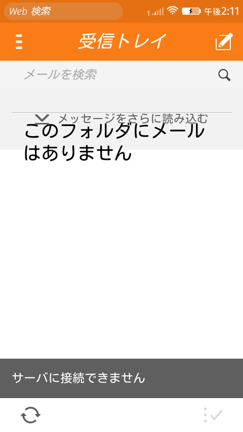

Firefox OS 2.2 Nightlyで、原因は不明ですが、メールの手動設定が正常に動かない状態になってしまいました。 Yahoo!メールを手動設定したあとに、メールを受信しようとすると、こんな画面になってしまいます。前回ビルドしたときはこれで動いていたのですが。  Gmailは自動設定になりますが、こちらは全く問題ありませんでした。 まあ、Nightlyなのでこういうバグらしきものがでてくるのは仕方ないことです。 何か解決するヒントはないかなと、ビルド環境を見ているとメールの自動設定の定義ファイルがあったので、それをYahoo!メール用に書き直してみました。 メールの自動設定の定義ファイルはビルド環境の以下のディレクトリにあります。 [B2G/gaia/apps/email/autoconfig](https://github.com/mozilla-b2g/gaia/tree/master/apps/email/autoconfig "Github") ここに各メールプロバイダー用の設定が並んでいますので、それを参考にして次のようなテキストファイルを作り、ファイル名 yahoo.co.jpでautoconfigのディレクトリに置きました。

```

yahoo.co.jp
Yahoo!JAPAN Mail
Yahoo!JAPAN

imap.mail.yahoo.co.jp
993
SSL
%EMAILLOCALPART%
password-cleartext

smtp.mail.yahoo.co.jp
465
SSL
%EMAILLOCALPART%
password-cleartext

```

あとは、./build.sh gaia　をして、./flash.shで書き込みです。 さてこんな適当に作って試してよいのかという感じですが、そこは[Flame](http://www.mozilla.jp/firefox/os/devices/flame/ "Firefox OS Flame")なので。 メールアプリでYahoo!メールを設定したところ、全く問題なく自動設定ができてしまいました。 これでメールの手動設定の手間が省けるようになりました。
