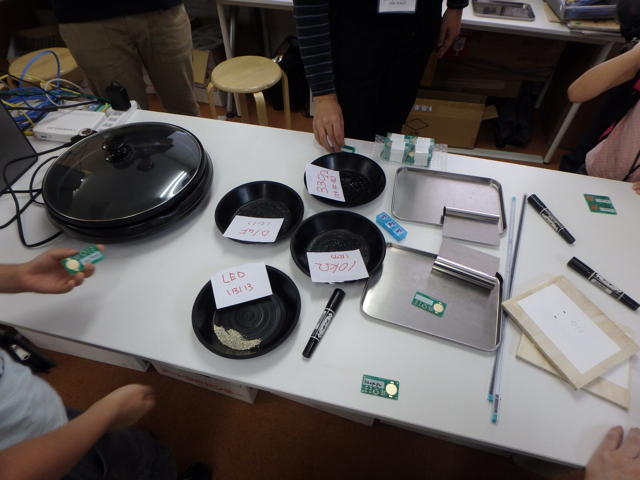
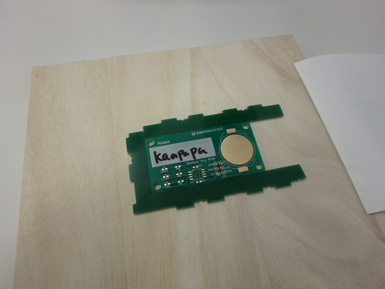
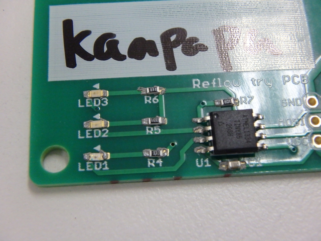
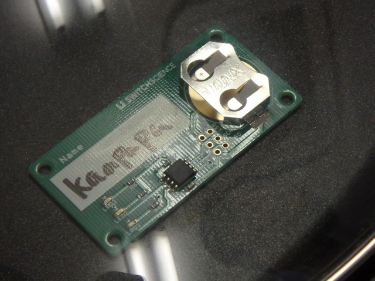
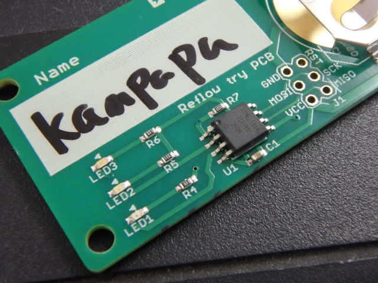
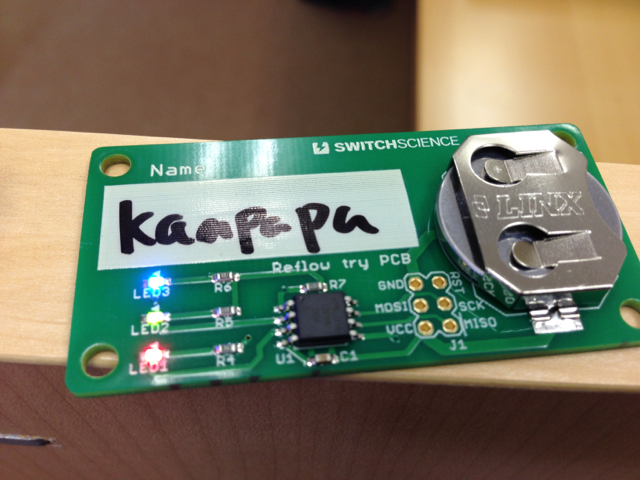

スイッチサイエンスさんのオープンハウスに行ってきました。

そのときにリフロー体験をしてきました。クリームはんだを使うのは今回が初めてですが、うまくできるのでしょうか・・・。

作業場所はこんな感じ。チップ部品とホットプレートが並んでいます。

今回リフローを行う基板は、マイコンとLEDと抵抗、コンデンサ、ボタン電池ホルダーを実装するようになっています。すべて表面実装の部品になります。

まず基板を固定する台に載せます。右側に見える紙がポイントです。

紙を載せると、穴が開いていてちょうど銅はく面が見えるようになっています。

ここでクリーム半田をへらでたっぷり塗ったあとに、へらを垂直にして銅はくの部分だけにクリーム半田がのるようにします。

ここで紙をゆっくり剥がすと、銅はく面だけにクリーム半田がついた状態になっていることがわかります。

ここにチップ部品をピンセットで載せていきます。位置決めを慎重に行い、位置が決まったらピンセットで上から少し押しておきます。

いよいよホットプレートで加熱します。

加熱するとクリーム半田が普通の半田の銀色にかわっていきます。

見た目は問題ないようなのでボタン電池を取り付けたところ一発で動作しました。

思ったよりは簡単にできましたが、これはあらかじめ準備が整っていたためで、個人で行う場合は型紙や固定台の作成が難関になると思います。

ちなみに、スイッチサイエンスさんではチップパーツの取り付けはこんな機械で行っていました。すごいですね。

<figure>

<figcaption>

OLYMPUS DIGITAL CAMERA

</figcaption>

</figure>

貴重な体験をさせていただいたスイッチサイエンスさんに感謝です。
