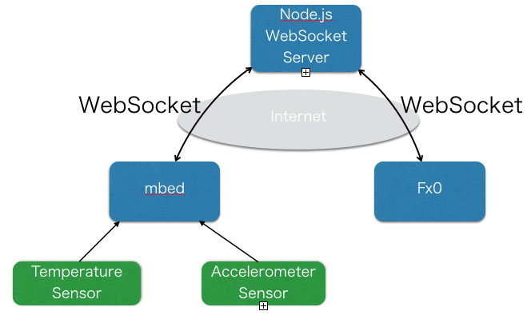

今週末はいよいよ[Firefox OS WoTハッカソン](https://atnd.org/events/61749 "Firefox OS WoTハッカソン")です。

[mbed](http://mbed.org/ "mbed.org")はこれまでいろいろ使っていて慣れているのですが、mbedからスマホへのリアルタイム通信は経験がありません。少しは勉強しておかなければとWebsocketについて試してみました。

Websocketのサーバはmbedでも提供されているのですが、今回はNode.jsを自分のVPSにインストールしてWebSocketサーバーをたちあげました。

mbedのデベロッパーサイトに[Websocketのサンプルプログラム](http://developer.mbed.org/cookbook/Websocket-and-Mbed "Websocket-and-Mbed")があるので楽勝と考えていたのですが、私の環境だと、このサンプルプログラムではNode.jsと通信できたり、できなかったりで非常に不安定でした。コンパイル後のメモリをみてみるとRAMが120%ぐらいになっていて、mbed-rtosを使うとメモリが厳しいのかもしれません。いろいろ探していたらSuga koubouさんの[テストプログラム](http://developer.mbed.org/users/okini3939/notebook/node_websocket/ "node_websocket")だとNode.jsのサーバに安定して接続できることが確認できました。

これで以下のような環境ができました。

mbedアプリケーションボードに実装されている加速度センサーと温度センサーの情報を読み出し、WebSocketでNode.jsのサーバーからブロードキャストして、Fx0に通知し、Fx0のHTML5アプリケーションで表示するものを作りました。

WebSocketとかCANVASとかは初めてでしたが、あちこちのプログラム例を参考にしてなんとか形にできました。

この仕組みをハッカソンで使うかどうかはわかりませんが、良い経験ができたと思います。
