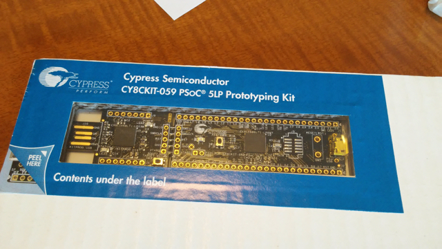
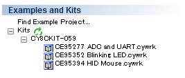
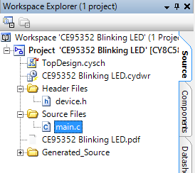
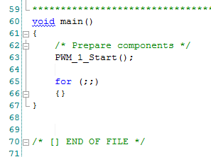

少し前に秋月電子で購入しておいたサイプレス社の[PSoC 5LP Prototyping Kit](http://akizukidenshi.com/catalog/g/gM-09432/ "PSoC 5LP Prototyping Kit")を動かしてみました。

実はPSoCという名前は知っていますが、これまで一度も使ったことはありません。

<!--more-->

まずはパッケージ裏面にあるURLから開発ツールをダウンロードして、手元のThinkPad X220(Windows 10 Preview)にインストールしました。

ユーザーズガイドを適当にみながら、まずはLチカを試すべく、PSoC Creatorをいじっていたところ、Start PageのExample and KitsにこのPrototyping Kitの型番であるCY8CKIT-059がありました。

この中のBlinking LED.cywrkがLチカだろうとクリックしたらProjectの場所を指定する画面が出てきたので適当にフォルダを指定したところ、そのフォルダにProjectが作成されました。

早 速Buildをしたところ、ビルドは正常に完了したのですが、Targetにプログラムしようとしたら書き込めませんでした。この原因はこのボードの書き 込み部であるKitProgのドライバのインストールをしていなかったためで、ドライバをインストールしたらTargetに書き込むことができました。

あたらめてProjectのソースをみていきます。

一番先頭にあるTopDesign.cyschをクリックしたところ、次のような図面が表示されました。

PWMと書かれている箱をクリックすると、PWMのパルス幅を設定する画面が表示されました。これで自由自在にデューティー比を設定できるようです。

ま た、PWMにClockが供給されていますが、このclockの波形の箱をクリックすると周波数を設定することができました。サンプルではClockは 100Hzとなっており、PWMの設定で1sでLEDが点滅するようになっています。試しにこのclockを1000Hzに変更したところ、Lチカが 100msの高速点滅になりました。

もちろんコンポーネントの設定だけではなく、当然プログラムも書くこともできます。

main.cを開いてみたところ・・・

え、これだけですか・・・。PWMをスタートしたらあとは無限ループです。

こ のようにPSoCには様々なコンポーネントが用意されており、自分が使いたいコンポーネントを選んでシステムとしてデザインし、コンポーネントの設定を変 更するとそれがプログラムやデータに自動的に反映される仕組みなのでしょう。デザインやコンポーネントの設定画面もビジュアル的でわかりやすく、PSoC はなかなか奥が深そうです。

Lチカが終わったところでもう一つのサンプルであるADC and UARTを試してみることにします。
