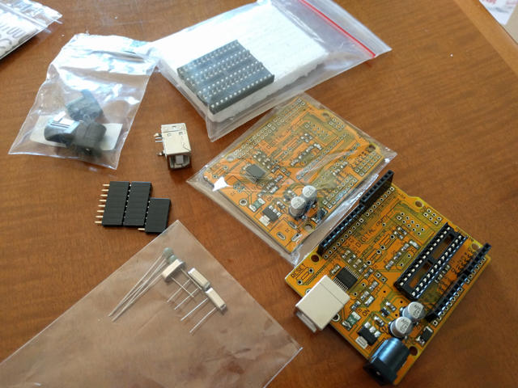
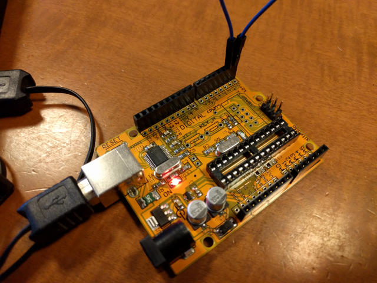
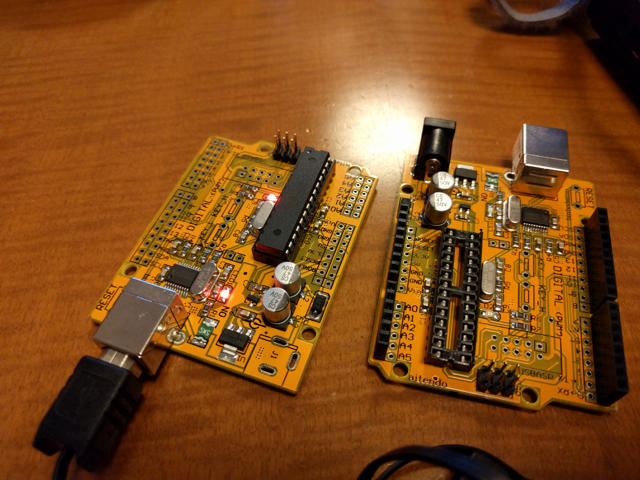

2016年のaitendoさんの福袋ADを購入しました。そのなかに入っていた「びんぼうでいいの」をまず組み立てました。

「びんぼうでいいの」は半完成品の基板で必要なパーツだけ取り付ければArduino Unoと同等に使えるものです。手持ちのパーツを確認したところ１台は組めそうでした。

ただし、この考えが甘かったのです。

<!--more-->

とりつけられる部品をはんだづけし10分ぐらいで完成しました。

ブートローダーはArduino IDEの標準メニューにあるAVRISP mkIIを使って書き込みました。

ここまでは順調に進みました。これでびんぼうでいいのの完成です。

早速、Windows10 PCに接続したところ、USBシリアルも正常に認識され、COMポートが見えました。

Arduino IDEで、ボードをArduino Unoにし、ポートを認識されたCOMポートに設定し、Lチカのスケッチで動作確認をしようとしたのですが、なぜかスケッチが書き込めずエラーになってしまいます。そこでCSP（ICSP）端子を使って、AVRISP mkIIでスケッチを書き込んだところこちらは動きます。ブートローダー自体は動いているようです。

さらに問題の切り分けを行うために、USBシリアルチップCH340Tが正常に動作しているかを確認するためにループバックテストを行いました。ATmega328Pを取り外し、D0(RX)とD1(TX)をジャンパー線でショートします。

この状態でPCでターミナルソフトを起動し、COMポートに対して文字を入力すると、入力した文字がターミナル画面に表示されました。送信した文字が受信できているわけで、この時点でUSBシリアルチップは正常に動作していることが確認できました。

あとはスケッチを書き込む直前にリセットスイッチを押すと書き込めることがありますので、それを試そうとしたのですが、基板に合うタクトスイッチの手持ちがありません。どうせもう１台組み立てるので、不足しているパーツを買いにAitendoさんに出かけました。

パーツが揃ったところで、２台めのびんぼうでいいのを組み立てました。前回の反省もあり、今回は動作確認に必要な最低限のパーツ（XTAL２個、USBコネクタ、ICソケット、RESETスイッチ）のみをはんだ付けしました。

念のためブートローダーをAitendoさんのページに紹介されているoptifixで書き込んでみました。書き込むための接続方法はCLさんのページを参考にすると簡単なICSP接続で書き込めます。

[「びんぼうでいいの」に生AVRマイコンを載せたままArduino化（ICSP）](http://cl.hatenablog.com/entry/arduino-binbodeiino-icsp "「びんぼうでいいの」に生AVRマイコンを載せたままArduino化（ICSP） ")

また最近のArduino IDEでは、optifixはソースコードを修正しないとコンパイルエラーになります。この対応方法についてはJUNさんのページにまとめられています。

[【Arduino 1.6.3】 Arduino UnoでATmega328P-PUにブートローダを書き込む](http://ijmp320.hatenablog.jp/entry/2015/05/16/121922 "【Arduino 1.6.3】 Arduino UnoでATmega328P-PUにブートローダを書き込む") 

ブートローダーを書き込んだ２台目のびんぼうでいいのをPCに接続し、Lチカのスケッチを書き込んだところ一発で動作しました。

１台目のびんぼうでいいのは書き込む直前にRESETスイッチを押すことでスケッチを書き込むことができました。何らかの個体差のようです。

これで２台とも動作確認ができたと思ったのですが、また問題発生です。

MacOSXのArduino IDEで使おうとしたところ、AitendoさんのページにあるUSBシリアルドライバをインストールしても、USBシリアルがどうしても認識されません。それに対する答えは以下のページにありました。

[CH340 CH341 serial adapters fix for El Capitan OS X](http://tzapu.com/making-ch340-ch341-serial-adapters-work-under-el-capitan-os-x/ "CH340 CH341 serial adapters fix for El Capitan OS X")

こちらにリンクされているSigned CH340 Driverを使えばMacOS X El Capitanでも正常に認識できました。

さすがAitendoさんの福袋です。びんぼうでいいのだけでここまで楽しめるとは思いませんでした。他のパーツもまだありますので、試してみようと思います。
