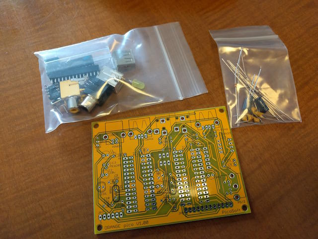

BASIC言語が動くちいさなコンピュータとして[IchigoJam](http://ichigojam.net/ "IchigoJam")がありますが、最近[ORANGE pico](http://www.picosoft.co.jp/orange/index.html "ORANGE pico")という同様のコンピュータがあることを知りました。モニター版を実費で配布しているということで私も申し込んでみました。

ORANGE picoの特徴としてはPIC32MXマイコンを使っていることと、拡張性を重視した設計になっていることです。将来的にはUSBメモリもつなげる計画のようです。

モニター版のパーツ一式はこのような内容でした。

プリント基板をみると、部品の位置や抵抗値、極性などがかなり細かく印刷され、組み立てやすいように作っているなと感じました。

新年早々はんだ付けを行いORANGE picoを組み立てました。

完成した基板がこちらです。PS/2キーボード用のコネクタは部品には含まれていませんでしたので、手持ちの部品をはんだ付けしました。

使いかたですが、IchigoJamと同様にPS/2キーボードを接続し、ビデオ出力をテレビに接続します。音声出力もありますのでこれもテレビに接続できます。IchigoJam本体には音声出力端子はありませんので、この点は良い設計だと思います。電源は標準USB-Bコネクタから供給します。モニター版は製作しやすさとコスト面から標準USB-Bコネクタを採用したと思われますが、最近はスマートフォンでマイクロUSBコネクタが多く利用されていますので、製品版ではマイクロUSBコネクタが採用できるとさらに良いと思います。

電源を投入すると、無事起動画面が表示されました。

ORANGE BASICはグラフィック機能やひらがな表示機能なども含まれていてIchigoJamとは一味違う仕上がりになっています。言語仕様の詳細は[ORANGE picoのホームページ](http://www.picosoft.co.jp/orange/index.html "ORANGE pico")に掲載されています。

製作した直後に２回ほどファームウェアのバージョンアップがあったので、手持ちのPICkit3でアップデートしました。基板上にPICkit3を接続する端子もありますのでアップデートも容易です。

アップデート後はバージョンが0.04になりました。

  
[Facebookの公開グループ](https://www.facebook.com/groups/763271073812914/ "ORANGE pico Facebookグループ")でも活発な議論がされていますので、興味のあるかたは参加してはいかがでしょうか。
