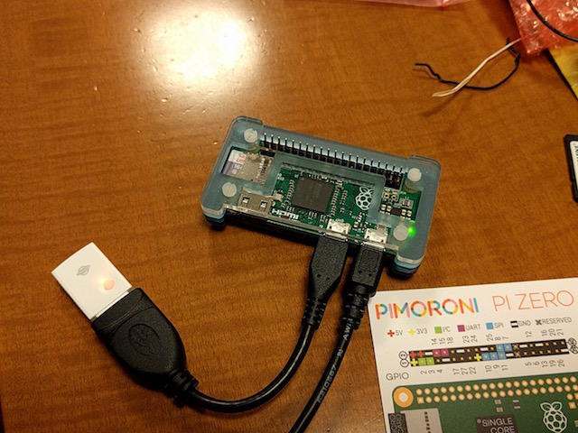

Raspberry Pi Zeroの設定をしようとしたところ、手持ちのHDMIケーブルがmicroHDMIしかありませんでした。しかたがないのでUSBシリアルをRaspberry Pi Zeroに接続してコンソールとして使い、セットアップをしてみました。

Raspberry Pi ZeroとUSBシリアル変換ボード(3.3v)を次のように接続します。

 <!--more-->

次にRaspianをインストールしたmicroSDカードを準備します。私は[Raspbian Jessie Lite](https://www.raspberrypi.org/downloads/raspbian/ "Raspbian")を使いました。あとで手持ちのWi-Fi USBドングルを接続して足りないものはネットワーク経由でインストールします。Razpberry Pi ZeroとWi-Fi USBドングルはOTGケーブルで接続します。


USBシリアル変換ボードはUSBケーブルでPCに接続して、ターミナル（Teratermなど）で115200bpsにセットしておきます。

microSDカードをセットしてRaspberry Pi Zeroの電源を投入すると、ターミナル画面にブートしている様子が表示されます。

```
Uncompressing Linux... done, booting the kernel.
[    0.000000] Booting Linux on physical CPU 0x0
[    0.000000] Initializing cgroup subsys cpuset
  :
```

ログインプロンプトが表示されたら pi / raspberry でログインします。

```
Raspbian GNU/Linux 8 raspberrypi ttyAMA0

raspberrypi login: pi
Password: 
Linux raspberrypi 4.1.13+ #826 PREEMPT Fri Nov 13 20:13:22 GMT 2015 armv6l

The programs included with the Debian GNU/Linux system are free software;
the exact distribution terms for each program are described in the
individual files in /usr/share/doc/*/copyright.

Debian GNU/Linux comes with ABSOLUTELY NO WARRANTY, to the extent
permitted by applicable law.
pi@raspberrypi:~$ 

```

あとは通常のLinuxの設定と同様です。Wi-FiのUSBドングルが認識されているかを確認します。

```
pi@raspberrypi:~$ lsusb
Bus 001 Device 002: ID 2019:ab29 PLANEX GW-USMicro300
Bus 001 Device 001: ID 1d6b:0002 Linux Foundation 2.0 root hub
pi@raspberrypi:~$

```

Wi-Fi USBドングルが[PLANEX GW-USIMicro300](https://www.planex.co.jp/product/wireless/gw-usmicro300/ "PLANEX GW-USMicro300") と認識されているので、ネットワーク設定も確認してみます。

```
pi@raspberrypi:~$ ifconfig 
lo        Link encap:Local Loopback  
          inet addr:127.0.0.1  Mask:255.0.0.0
          inet6 addr: ::1/128 Scope:Host
          UP LOOPBACK RUNNING  MTU:65536  Metric:1
          RX packets:192 errors:0 dropped:0 overruns:0 frame:0
          TX packets:192 errors:0 dropped:0 overruns:0 carrier:0
          collisions:0 txqueuelen:0 
          RX bytes:15552 (15.1 KiB)  TX bytes:15552 (15.1 KiB)

wlan0     Link encap:Ethernet  HWaddr 00:22:cf:51:b2:37  
          inet6 addr: fe80::60eb:ddf5:2434:d163/64 Scope:Link
          UP BROADCAST MULTICAST  MTU:1500  Metric:1
          RX packets:0 errors:0 dropped:0 overruns:0 frame:0
          TX packets:0 errors:0 dropped:0 overruns:0 carrier:0
          collisions:0 txqueuelen:1000 
          RX bytes:0 (0.0 B)  TX bytes:0 (0.0 B)

pi@raspberrypi:~$ 

```

ばっちりwlan0で認識されていますが、この時点ではWi-Fiのアクセスポイントの設定をしていないのでネットワークに接続できていません。/etc/wpa\_supplicant/wpa\_supplicant.confにWi-Fiのアクセスポイントの情報を設定すれば起動と同時にネットワークに接続されます。

ここまでできればUSBシリアルコンソールは不要です。Raspberry Pi Zeroに電源が入っていれば無線LAN経由でsshログインができます。



今のところは安定して動いているようですので、ちょっとしたサーバにしてみようかと思います。
