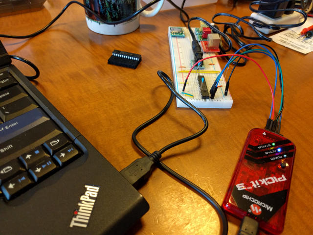
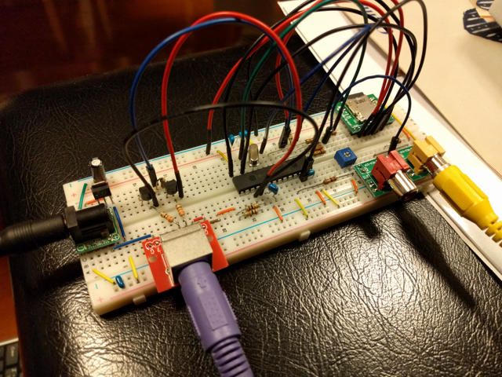
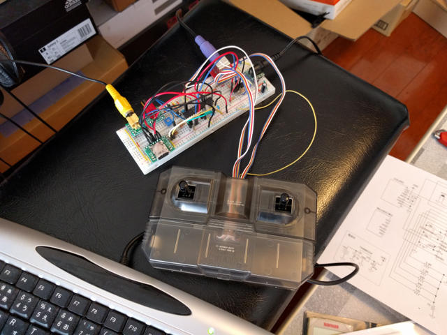

最近はマイコンにBASICを載せてテレビにつなぐもの（[IchigoJam](http://ichigojam.net/ "IchigoJam")、[ORANGE pico](http://www.picosoft.co.jp/orange/ "ORANGE pico")等）が流行っていますが、その１つである[MachiKania](http://www.ze.em-net.ne.jp/~kenken/machikania/index.html "BASIC搭載カラーテレビゲームシステムMachiKania")を組み立ててみました。

MachiKaniaが他と大きく異なるのは、マイコンにはブートローダーだけを組み込んであり、BASICシステム本体やアプリケーションはSDカードに載せていることです。これによりBASICシステムやアプリケーションはPCで手軽に入れ替えることができ、昔のMZシリーズ（クリーンコンピュータ）のような構造になっています。またシステムはハードもソフトもオープンになっているので、マイコンの勉強をしたい人にも適しているのでないでしょうか。

ハードウェアはパーツも少なく、ブレッドボードに実装して試すことができます。また、カラー表示やサウンド機能も実装されており、テレビゲームの実装には最適かもしれません。

<!--more-->

部品を集めてくみたてるのは簡単ですが、PICにブートローダーを書き込む必要があります。マイクロチップ純正の書込ツールである[PICkit3](http://akizukidenshi.com/catalog/g/gM-03608/ "PICkit3")の使いかたもマニュアルに詳しく書かれていて、この機会に書込ツールを揃えるのも良いと思います。

まずは、PICにブートローダーを書き込みます。私は手持ちのPICkit3で書き込みました。

次にブレッドボードを使ってハードウェアを組みました。シンプルな構造です。

BASICシステムとサンプルアプリをmicroSDカードに書き込み、サンプルBASICプログラムを実行したところ、このようにカラー表示されました。この写真では色がにじんでいますが部品配置を少し変更したらよくなりました。

あと、４方向のスイッチをつけないといけないのですが、ブレッドボードにはそのようなスペースはありません。別のブレッドボードでスイッチをつけようかと思いましたが、ジャンク箱に[タミヤのリモコンボックス](http://www.tamiya.com/japan/products/70106_4ch_box/index.htm "タミヤ 4チャンネル リモコンボックス")があるのを思いだしました。

これをMachiKania専用のコントローラーに改造し、ブレッドボードに接続したところ無事動きました。このコントローラーでは本来単１電池２本をいれるスペースが丸々空いていますので、ここにユニバーサル基板に載せ替えたMachiKania本体を収めることもできそうです。今度ケースに実装するためのパーツを買って組み込んでみようと思います。

サンプルプログラムのパックマンで遊んでいる様子です。なかなかの操作性です。ゲーム音もよいですね。
