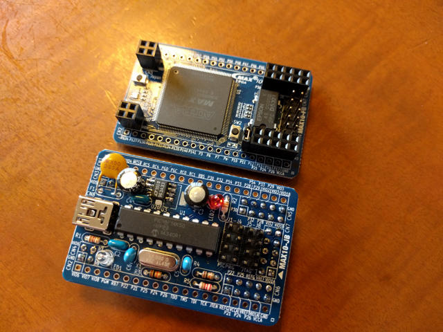
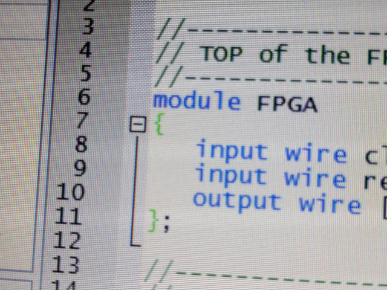
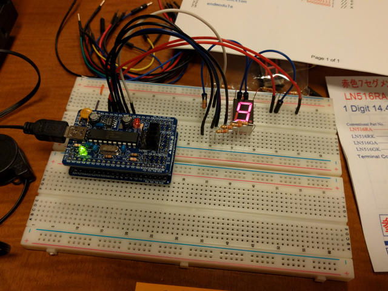
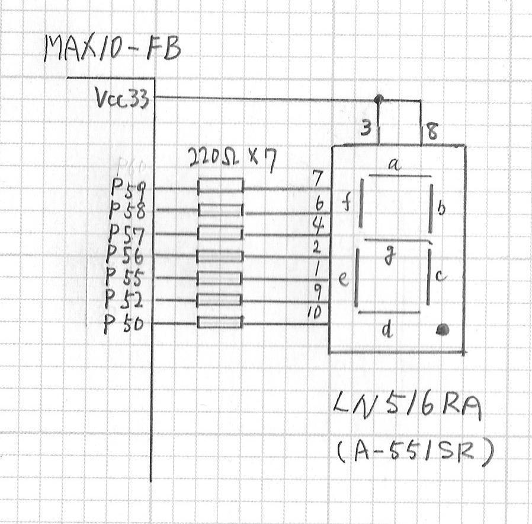

トランジスタ技術増刊で「[FPGA電子工作スーパーキット](http://www.cqpub.co.jp/hanbai/books/mtr/mtrz201604.htm "FPGA電子工作スーパーキット")」が発売されたので買ってみました。MAX10基板、ライター基板、DVDがついています。

早速手持ちのパーツと少々のパーツを購入して組み立てました。

 <!--more-->

完成したところで、MAX10-FB基板とMAX10-JB基板を組み合わせ、MAX10-JB基板のPICへの書き込みも無事完了したようです。

DVDからThinkPad X220にインストールした開発環境を使って、LEDチカチカ回路のVerilog HDLを入力しましたが、いきなり構文エラーです。おかしいなと調べていたら、小かっこを中かっこで入力していました。こういう構文だとつい中かっこを入力してしまいがちです。

その後は順調に論理記述の解析と合成、外部端子への信号割り当てと進み、コンフィグレーションファイルを生成後、FPGAにライター経由で書き込むと無事Lチカができました。

ここまではMAX10-FB基板だけでの動作確認になりますが、せっかくブレッドボードに信号が引き出せるようになっているので、何かを接続して動かしてみたいところです。

手持ちのパーツに7セグメントLEDがありましたので、これを接続して表示してみようと思いつきました。Verilog HDLもLチカのサンプルをベースにすればなんとか書けそうです。

MAX10-FB基板はブレッドボードの幅をいっぱいに使ってしまい、配線は基板の下を通す必要がありますが、私の場合はブレッドボードを２枚並べて配線を引き出しやすくしてみました。

7セグメントLEDとの接続は回路図のようにしました。

7セグメントLEDは手持ちのLN516RA（アノードコモン）を使いましたが、秋月電子の[A-551SR](http://akizukidenshi.com/catalog/g/gI-00212/ "A-551SR")でも同じように使えると思います。

この状態でVerilog HDLを書き、FPGAにライター経由で書き込むと無事7セグメントLEDを点灯させることができました。

今回作成したVerilog HDLのソースは[github](https://github.com/kanpapa/max10/blob/master/PROJ_SEG7/FPGA7seg.v "FPGA7seg.v")に置きましたので参考にしてください。

7セグメントLEDを表示している動画はYouTubeにもアップしておきます。

まだまだ初歩のVerilog HDLしか書けませんがもう少し遊んでみたいと思います。
