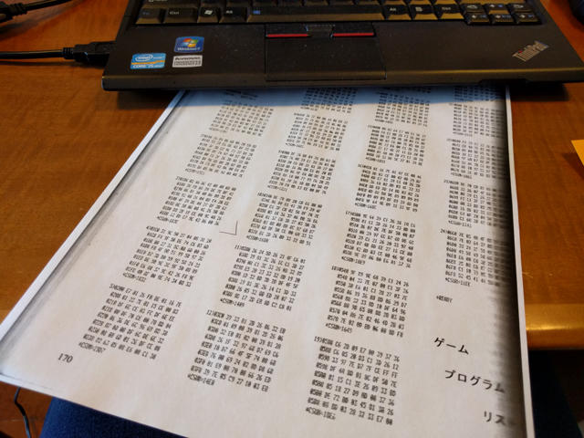
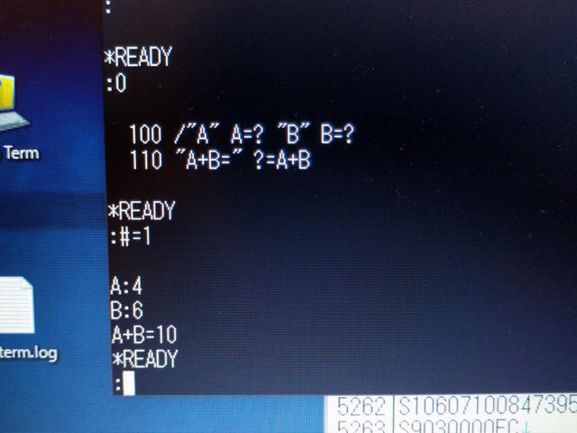
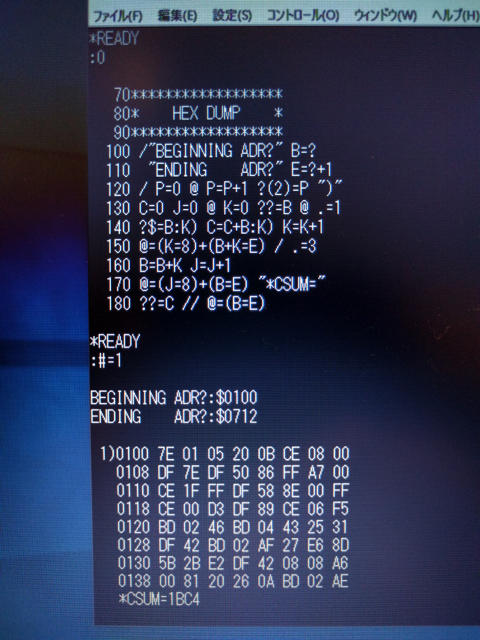

ELIS68は6800用のあらゆるソフトを走らせるために作られたスーパーマシンです。MIKBUG 2.0だけ動かして終了というわけではありません。ELIS68のマニュアルにはGAME（ここではGAMEIII）というインタプリター言語を動かすための手順が載っています。

GAMEは大西 博氏が開発し、月刊アスキーの1978年7月号から10月号まで連載されていました。たまたま手元にあるエンサイクロペディアアスキーVolume2にも掲載されていました。

GAMEは文法的にはVTL(Very tiny language)に近く、機能的にはTiny BASICにASCII文字や16進数の処理やメモリアクセスの機能が加わったインタープリター言語です。CPUが非力でメモリ空間が小さい昔の8ビットマイコンにおいては、このような小さい言語が活躍していました。GAME言語でゲームを書くようなこともしていました。

月刊アスキーで発表されたGAMEは6800用に書かれており、GAME本体は1ページのダンプリストで掲載されました。

このダンプリストをMIKBUGで黙々と打ち込み、メモリに書いていくわけです。ダンプリストは$100〜$6FDの1533バイトです。これを間違いなく入力するためにダンプリストは64バイトづつに区切られて、チェックサムが記載されています。これで誤入力を検知するわけです。チェックサムが一致するまで何度も何度も見直して入力誤りを見つけます。

ELIS68のマニュアルにはこのチェックサムを表示するプログラムも掲載されており、64バイト入力した時点でチェックサムを確認し、次の64バイトを入力することを繰り返します。今回1533バイトですが、結局3時間ぐらい入力にかかりました。

MIKBUGで入力を完了後にSフォーマットで出力して保存しておきます。その後、$100番地から実行すると、「\*READY」という文字が表示され、「:」の入力待ちプロンプトが表示されました。

この状態でGAMEプログラムを入力します。

「0」はLIST（入力したプログラムの表示）のことで、入力したソースプログラムが表示されます。「#=1」はRUN（実行）になります。

このようにコマンドもソースコードも極力簡略化することで、CPU処理を軽く、メモリ使用量を少なくしています。

次にメモリダンププログラムを入力してみました。これはアスキー誌に掲載されていたGAMEのダンプリストを作成するためのものです。

このようにダンプリストとチェックサムが表示されました。

GAMEIIIには6800用2パスアセンブラとか、逆アセンブラなどのGAMEアプリケーションも公開されていましたので、国会図書館で過去の月刊アスキーの記事を探して試してみようと思います。（[続く](https://kanpapa.com/2016/05/elis68-6802-game.html "6802ワンボードコンピュータELIS68を動かしてみた（５）GAME動作編")）
