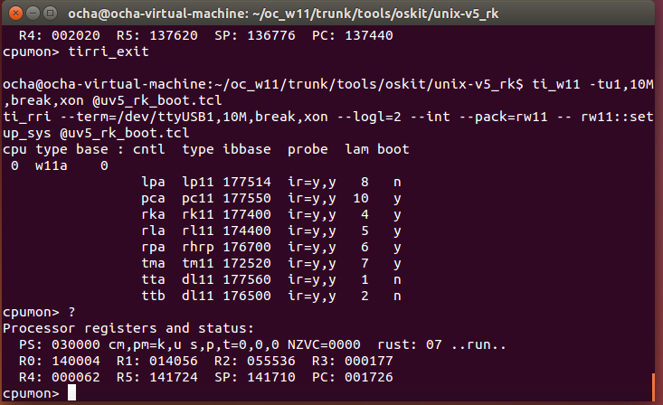

これまでの作業でARTY FPGAボードはPDP-11になったと思われるのですが、やはりアプリケーションを動かさないとよくわかりません。

PDP-11のソースツリーでは各種UNIXを動かすキットが含まれています。ARTY FPGAボードではUNIX V5が動くようですので、これを動かすことで、PDP-11になっていることを確認してみます。

## unix-v5のディスクセットを用意する

PDP-11用のUNIX V5のイメージデータが用意されていますので、これをソースツリーに持ってきます。

```
$ cd $RETROBASE/tools/oskit/unix-v5_rk
$ wget http://www.retro11.de/data/oc_w11/oskits/unix_v5_rkset.tgz
$ tar -xzf unix_v5_rkset.tgz
```

## ターミナルを立ち上げる

UNIX V5のコンソールとなるターミナルウィンドウを立ち上げておきます。

```
$ cd $RETROBASE/tools/oskit/unix-v5_rk
$ console_starter -d DL0 &
```

<!--more-->

## unix-v5をbootする

ti\_w11というツールを使ってUNIX V5を立ち上げます。このあたり仕組みはよくわかっていないので、あとでソースを追ってみようかと思います。

最初に立ち上げたところ、/dev/ttyUSB1に書き込めなかったので、誰でも書き込めるようにパーミッションを設定していますが、もしかしたら別の方法があるかもしれません。

```
$ sudo chmod o+rw /dev/ttyUSB1
$ ls -l /dev/ttyUSB1
crw-rw-rw- 1 root dialout 188, 1  6月  5 07:45 /dev/ttyUSB1
$ cd $RETROBASE/tools/oskit/unix-v5_rk
$ ti_w11 -tu1,10M,break,xon @uv5_rk_boot.tcl
ti_rri --term=/dev/ttyUSB1,10M,break,xon --logl=2 --int --pack=rw11 -- rw11::setup_sys @uv5_rk_boot.tcl
cpu type base : cntl  type ibbase  probe  lam boot
 0  w11a    0
                 lpa  lp11 177514  ir=y,y   8   n
                 pca  pc11 177550  ir=y,y  10   y
                 rka  rk11 177400  ir=y,y   4   y
                 rla  rl11 174400  ir=y,y   5   y
                 rpa  rhrp 176700  ir=y,y   6   y
                 tma  tm11 172520  ir=y,y   7   y
                 tta  dl11 177560  ir=y,y   1   n
                 ttb  dl11 176500  ir=y,y   2   n
cpumon> ?
Processor registers and status:
  PS: 000344 cm,pm=k,k s,p,t=0,7,0 NZVC=0100  rust: 07 ..run..
  R0: 000100  R1: 136046  R2: 136046  R3: 000000
  R4: 002020  R5: 137620  SP: 136776  PC: 137444
cpumon>
```

?を入力するとPDP-11のレジスタらしきものが表示されました。



## ターミナルからログインする

最初に立ち上げておいたターミナル画面からENTERキーを押すと、@の表示がでてきます。

```
enter q or <^D> to quit, otherwise hit  to reconnect:
Trying 127.0.0.1...
Connected to localhost.
Escape character is '^]'.

connect on port 8000 for tta0

@
```

ここでunixと入力します。すると、

```
@unix

login:
```

ログインプロンプトが表示されます。ユーザ名はrootでログインすると、

```
@unix

login: root
#
```

無事、シェルプロンプトが表示されました。


## unixを停止する

UNIXを停止する場合は、ti\_w11を立ち上げたウィンドウで以下のように入力します。

```
cpumon> tirri_exit

$
```

コンソールターミナルも終了と同時に切断されます。
