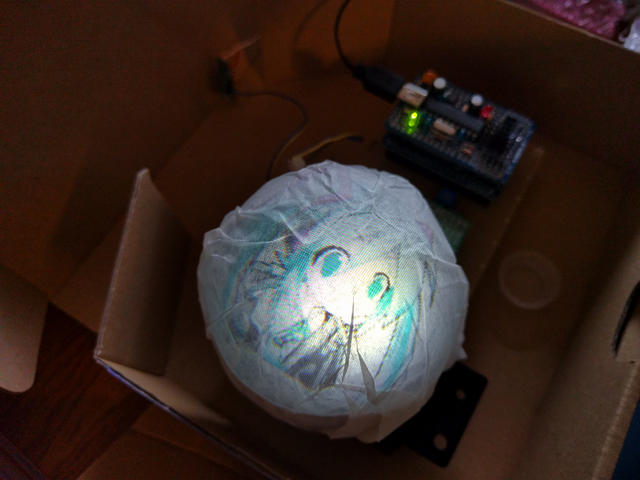
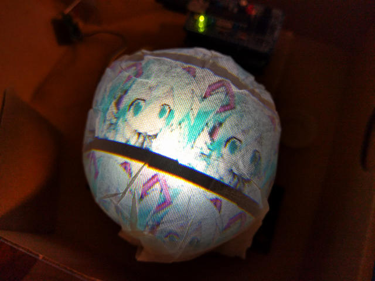

[秋月電子の球体液晶ユニットの実験](https://kanpapa.com/2016/07/akizuki-globe-lcd.html "秋月電子の球体液晶ユニットを動かしてみた")の続きです。前回はRGBデータを固定で与えることでカラーストライプまで表示できることを確認しました。

やはり何らかの画像を表示してみたいと思い、いろいろ調べたところFPGAで液晶に画像を表示しているこちらの記事を参考にさせていただきました。

- [秋月のTFT液晶モジュールで画像を表示してみた](http://qiita.com/kkumt93/items/0bbdaf2eda8ec8c72c9a "秋月のTFT液晶モジュールで画像を表示してみた")

MAX10にもSRAMがありますので、MAX10のSRAM上にROMの領域を作成し、画像データをそちらに格納して表示させることにします。画像データはROMの初期化ファイル（.mifファイル）として作成しますが、これはUbuntuにopencvをインストールして作成しました。

液晶モジュールは196×196ピクセルで各色6ビットの深度です。このままのデータだとSRAMに収まらないのでやむなく各色3ビットに落としてデータを作成し、LCDに色データを与えるルーチンを書き換えてミクさんの画像が表示できました。

画像は確認できましたが、各色3ビットなので512色しか表示できないので色がイマイチです。

よくよく考えたら小さい画像にすれば深度をあげてもそんなにデータサイズは大きくならないのではと思い付き、RGB各色6ビットにして60×60の画像データを作成して並べて表示するようにしました。

データ処理に手抜きをしているので、黒線がでてしまっていますが、色をオリジナルに近づけることができました。

さらにVSYNCをカウントして表示開始アドレスをずらすことでミクさんを動かすこともできました。

https://youtu.be/oJZ3B0lmKRU

今回使っているドームスクリーンですが、仕様書通りに作りなおしたものです。スクリーンはクッキングシート、丸い形は野球のボールで形を作り、少し厚めの紙を円筒にしたものにスクリーンをセロテープで貼り付けました。これで以前よりは安定して表示できるようになりました。

本当はSDRAMを使って画像データを扱えるようにしたいと思ったのですが、NiosIIがなかなか難解でもう少し先になりそうです。

しばらくはFPGAの機能だけで遊んでみます。
