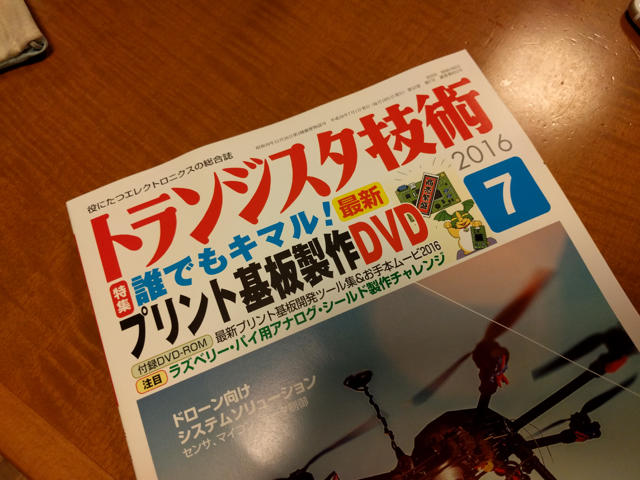
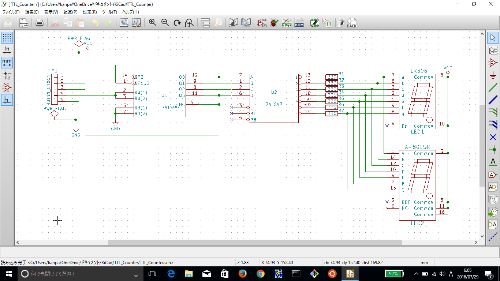
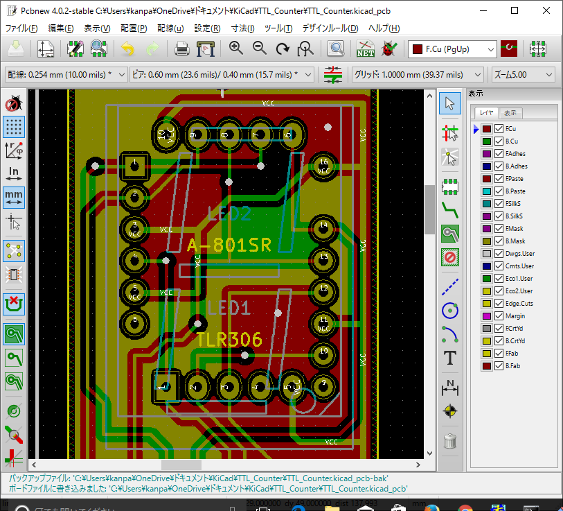
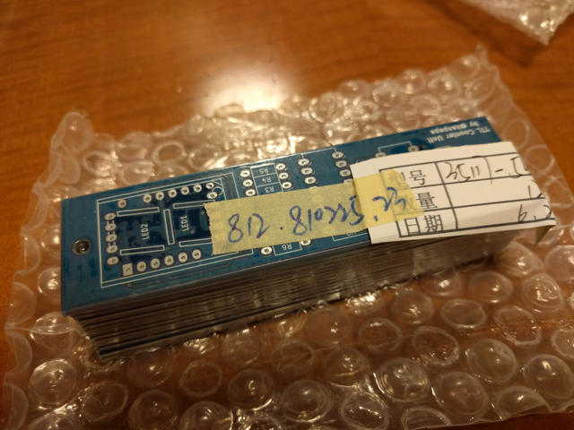

私は小学生ぐらいの時に[NHK みんなの科学 「たのしい実験室」](https://www.nhk.or.jp/archives/hakkutsu/news/detail.html?id=024 "NHK みんなの科学 たのしい実験室")を毎週見ていました。確か毎週木曜日の夕方だったでしょうか。

この番組では電子工作もよく取り上げられ、特にTTL-ICと7セグメントLEDを使って、電子サイコロ、ストップウォッチ、デジタル時計といったものを作るシリーズがありました。このシリーズは大変興味がありNHKに返信用封筒を送って回路図をいただいたりとか、秋葉原のお店に見積もりを取って通信販売で部品を入手して組み立てていました。そのおかげでデジタルICや電子工作のノウハウを身につけることができました。

今でもこれらの記事は大切に保管しているのですが、つい先日CQ出版社のトランジスタ技術でKiCadをつかった基板製作の特集があり、付録DVDに作業の様子が動画で収録されていました。これを見たおかげでKiCadでのいろいろなテクニックを知ることができました。

実はまだ一度も基板を起こしたことがなく、良い機会なので一度簡単な回路で基板を作ってみようと、「たのしい実験室」で作ったことがあるTTL-ICをつかったカウンタユニットの基板を起こすことにしました。基板を発注すると10枚ぐらい作ることになるので、複数枚組み立てれば桁数を増やすこともできます。回路は非常にシンプルでTTL-ICの74LS47と74LS90、7セグメントLEDのTLR-306だけです。パスコンすら入っていません。

<!--more-->

DVD を見ながらKiCadで起こしたパターンはこんな感じです。基板の大きさは95mm×25mmで当時配布されていた専用基板とサイズも合わ せました。最初は当時と同じように片面基板で作っていたのですが、片面と両面で基板の製作コストは変わらないことがわかり、途中から両面基板（２層基板） に変更しました。

当時使用されていた7セグメントLEDのTLR-306は入手が困難ですので、秋月電子の[7セグメントLED A-801SR](http://akizukidenshi.com/catalog/g/gI-00216/ "A-801SR")も使えるようにしました。トラ技のDVDでユーザグリッドの使い方がよくわかったので、フットプリントの作成もデータシートを見ながらサクサクできるようになりました。

さらに手直しをして、GNDベタもいれて電源ラインを太くしました。ここまで来ると本物の基板のようです。

この状態で最終版のガーバーデータを作成し、念のため他のガーバービューアー([gerbv](http://gerbv.geda-project.org/ "gerbv - A Free/Open Source Gerber Viewer"))でも確認しました。

たぶん問題なさそうなので、2016/6/19にElecrowさんに発注しました。

待つこと２週間。特に問題なく製造工程のステータスが進んでいき、2016/7/1に到着した基板はこんな感じです。

外観では特に問題なさそうでしたが、念のためテスターでも導通チェックを行いました。

届いた基板に部品を実装します。今でも74LS47や74LS90は入手可能ですが、さすがにTLR-306は販売されていません。私は小学生のときから大切に保管していたものも持っていますが、今回はヤフオクで購入したものを使いました。

実際に動かしている様子をYouTubeにアップしておきました。

これで基板の作り方は一通りは理解できましたので、今度はもう少し複雑な基板にもチャレンジしてみようと思います。
