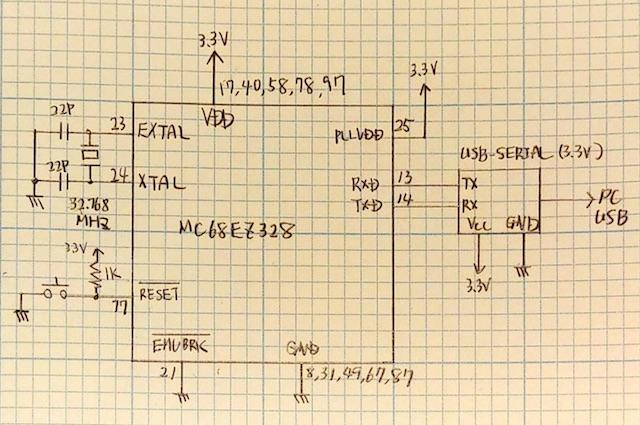
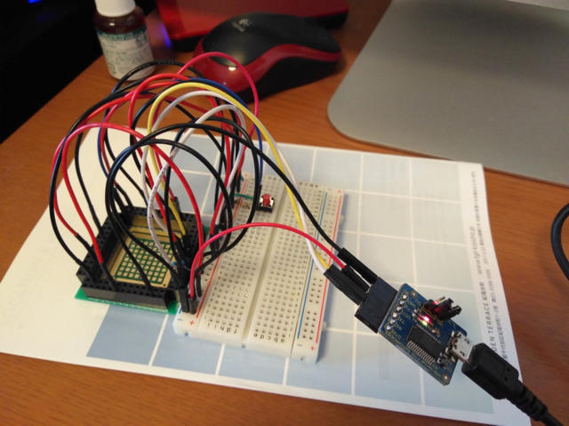
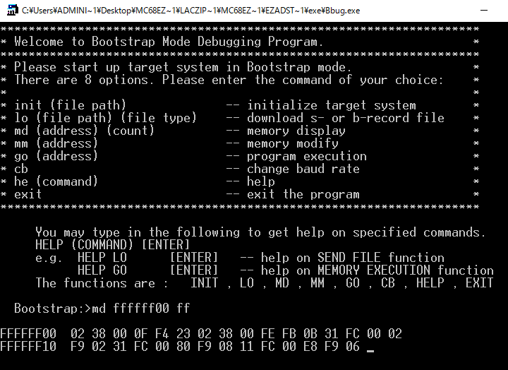

ひょんなところからMC68EZ328(DragonBall-EZ)を手にいれました。昔Palm PDAで使用されていた68KのCPUです。

このCPUはブートストラップモードがあり、CPUに水晶をつなぐだけで、シリアルポートにPCを接続して、BBUG.EXEというDOSプログラムを使ってメモリの表示、メモリの変更、プログラムのロード、および実行を行うことができます。外付けメモリが全く無くても動くのが面白いところです。まずはCPU単体を動かし、メモリを接続し、プログラムをロードして実行するまでがシリアルポートとBBUG.EXEだけで済んでしまうのです。大掛かりな開発ツールや専用の開発用機器は不要です。

BBUG.EXEはMC68EZ328ADSTOOLS2\_0.zipというファイルに含まれています。[www.](http://www.nxp.com/ "NXP Semiconductors")[nxp.com](http://www.nxp.com/ "NXP Semiconductors")のサイトで検索すれば見つかります。

DragonBall-EZのユーザーズマニュアルやドキュメントもwww.nxp.comから入手することができます。

BBUG.EXEを動かすための回路図は以下の通りです。簡単です。

まずはCPUを秋月電子のQFP100変換基板に実装し、ブレッドボードを使い32.768MHzの水晶とリセットスイッチ、USB-シリアル変換ボードを接続しました。電源は3.3Vですが、USB-シリアル変換ボードから50mAまでは取れるのでこれをつかいました。

写真のように実装は非常にシンプルなものになります。

ただし、水晶はなるべく短い配線にすべきなのでピンソケットにそのまま差し込める形で実装しています。

この状態でPCを接続し、32bitモードのWindowsでBBUG.EXEを動かします。

BBUG.EXEで画面に表示される説明をみながらメモリダンプを行なってみました。

表示スピードは遅いのですが、CPUに内蔵されているメモリの情報が見えています。

このブートストラップモードはシステムのRAMにプログラムやデータをロードするのが目的ですが、CPU単体でここまでのことができると、とりあえず外部メモリをつけてみたくなりました。

（続く）
