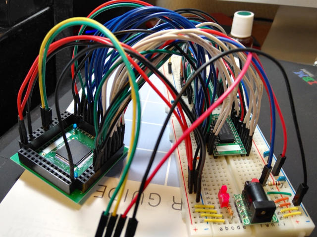

DragonBall-EZ(MC68EZ328)のブートストラップモードとBBUG.EXEを使うことで、メモリダンプやプログラムを実行する機能は使えるようになりましたが、肝心なプログラムを置くためのメモリがありません。

プログラムを動かすためにはCPUに何らかの外部メモリ（SRAMやDRAMやフラッシュメモリ）を接続する必要があります。

3.3Vで動くメモリはないかなと探したところ、手元に秋月電子で販売されている[3.3V電源で使える256Kbit(32K×8bit)のSRAM](http://akizukidenshi.com/catalog/g/gI-01461/ "SRAM 256K SRM2B256SLMX55")がありましたのでこれをDragonBallに接続してみました。

このSRAMを２個使うことで16bitバスとします。１個が下位8ビット、もう１個は上位8ビットとなります。メモリ空間は0x0000〜0xFFFFの64KByteとなります。

 <!--more-->

DragonBall-EZのユーザーズマニュアルをみながら書いてみたのが以下の回路図です。（クリックすると拡大します。）

本当にこれで正しいか自信がなかったのでまずはブレッドボードに実装してみました。データバスが16本、アドレスバスが15本、その他制御信号がありますので、相当な量の配線になりました。

配線が終わったあとに動作チェックをしたのですが、BBUG.EXEの動きが不安定になってしまいました。

Feedback Errorとなって、コマンドが正常に完了しないことがあるのです。

そこで秋月の変換基板のパターンを効果的に使って、CPUの電源ラインとパスコンを強化し、水晶もなるべく短い距離になるようにハンダ付けしました。

あと、CPUとSRAMの配線が長いのが原因なのかもと思ったのですが、この状態で何とか動いてくれました。

書き込んだ値が正しく保存されていることがわかります。

次は実際にプログラムを動かしてみます。

（続く）
