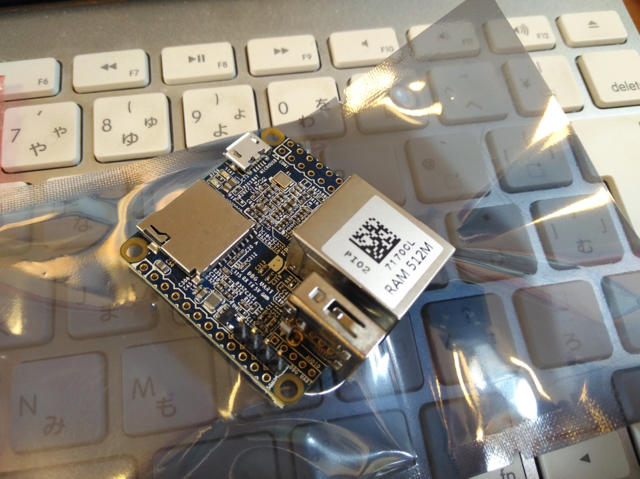

[Nano Pi NEO](http://akizukidenshi.com/catalog/g/gM-12301/ "Nano Pi NEO 512MB")が秋月電子さんで発売になったので試しに買ってみました。

仕様は[NanoPi NEOのWiki](http://wiki.friendlyarm.com/wiki/index.php/NanoPi_NEO "NanoPi NEO")にありますが、非常にコンパクトにまとまっています。かわいいです。



ネットワークには100Mbpsの有線LANが直接接続できます。また、コンソール用のUARTはピンヘッダが最初からハンダ付けされていますので、手持ちのUSBシリアル変換基板を接続してコンソールとして使えます。私はスイッチサイエンスさんのUSBシリアル変換基板を接続して、Windows PCのTeratermでコンソールとしました。電源は5V2Aとのことですので、microUSBコネクタに5V2Aが供給できる電源を接続しました。

なお、Raspberry Piとは異なりHDMI出力はありません。そのぶんシンプルになっていると思います。私はコンソールからログインできれば十分なので、これでまったく問題ありません。

<!--more-->

まずは、microSDカードにNano Pi NEO用のOSをインストールしなければなりません。

私は[NanoPi NEOのWiki](http://wiki.friendlyarm.com/wiki/index.php/NanoPi_NEO "NanoPi NEO")にリンクされているnanopi-neo\_ubuntu-core-xenial\_4.11.2\_20170705.img.zipをダウンロードし、toolsにあるwin32diskimagerを使ってmicroSDカードに書き込みました。

microSDカードをセットして、電源を入れてみたところ、問題なくブートしました。


シリアルコンソールにカラフルなロゴが表示されたあと、自動的にログインしシェルコマンド待ちになりました。OSのバージョンやCPUの温度とかも表示されてカッコいいですね。この状態だとrootユーザではありませんが、sudoも使えますし、su で rootになることができます。もちろんDHCPでIPアドレスも問題なく割り当てられていました。sshが最初から起動していますのでネットワーク経由でログインすることもできます。

CPUに負荷がかかっていないアイドル状態だと、CPUの温度は23〜30度ぐらいで、ほんのり暖かい程度です。これであれば[別売のヒートシンク](http://akizukidenshi.com/catalog/g/gP-12303/ "Nano Pi NEO用ヒートシンク")も使わなくても良いかもしれません。（念のため私は買いましたが）

[NanoPi NEOのWiki](http://wiki.friendlyarm.com/wiki/index.php/NanoPi_NEO "NanoPi NEO")をみながら、まずはOSのアップデートを行いました。このあたりは通常のubuntuと同じです。

```
pi@NanoPi-NEO:~$ sudo apt-get update
```

[NanoPi NEOのWiki](http://wiki.friendlyarm.com/wiki/index.php/NanoPi_NEO "NanoPi NEO")にはUSBカメラを接続してストリーミングができるようなことが書かれていたので、早速Nano Pi NEOのUSBコネクタに手持ちのUSBカメラを接続しました。

 [NanoPi NEOのWiki](http://wiki.friendlyarm.com/wiki/index.php/NanoPi_NEO "NanoPi NEO")の手順通りにデモプログラムをコンパイルして実行し、ポート8080にアクセスしたら、すぐビデオストリーミングができてしまいました。これだけでも使えそうですね。


ただ、ストリーミング中はCPUがかなり発熱しているように思えます。

[NanoPi NEOのWiki](http://wiki.friendlyarm.com/wiki/index.php/NanoPi_NEO "NanoPi NEO")にはモニタリング機能についても書かれています。ポート8888にブラウザでアクセスすると、モニタリング画面が表示されます。


これでみると44.7℃まで上昇しています。このような使いかたであればヒートシンクをつけておくのが安心でしょう。

今回はNano Pi NEOのWikiを見ながら遊んでみましたが、基板にはGPIOやI2CとかのI/Oも出ていますので、こちらも使ってみたいと思います。
