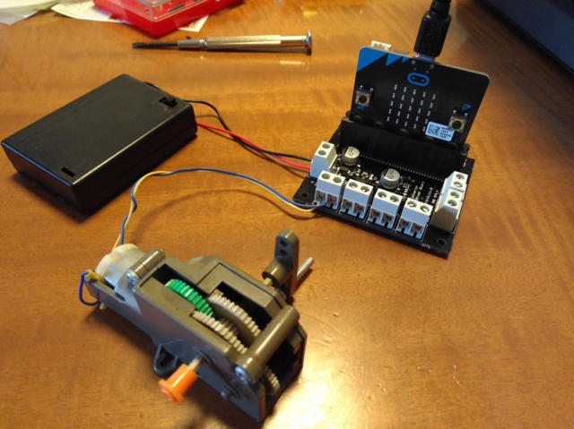

Maker Faire Tokyo 2017で[micro:bit](http://microbit.org/ja/ "micro:bit")が大々的に紹介されていましたが、そのときに[micro:bit用モータードライバ](https://www.switch-science.com/catalog/3229/ "micro:bit用モータードライバ V2")を購入したので、モーターを動かしてみました。

micro:bit用モータードライバの電源は4.5V〜6Vで、micro:bitにも電源を供給してくれます。今回は電源は単3電池で4.5Vとしました。モーターは3V用のマブチモーターです。

接続は半田付けも不要でネジ止めですみます。基板にもシルク印刷でわかりやすく書かれています。

<!--more-->

次はmicro:bitのプログラムです。今回はAボタンを押すと正転、Bボタンを押すと逆転、AボタンとBボタンを同時に押すと停止するようにしてみました。

非常に簡単にプログラムを書くことができます。

実際に動かしてみました。

プログラム通りに動いてくれました。
