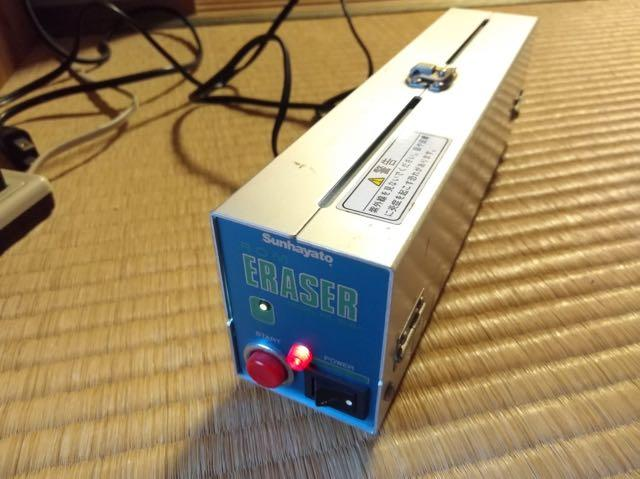

前回の[解析編](https://kanpapa.com/2017/10/mic68k-schematic.html "MIC68k解析編")でこのMIC68Kのメモリマップがわかりましたので、実際にプログラムを動かしてみます。68000のアセンブラは[DragonBall-EZ(MC68EZ328)](https://kanpapa.com/2017/04/dragonball-ez-program1.html "MC68EZ328")で遊んだときに使った[EASy68K](http://www.easy68k.com/ "EASy68K")を使いました。


このMIC68Kはリセット時はROMが$000000に配置されます。なぜこのような動きになっているのでしょう。68000CPUはリセット時に$000000-$000003の32bitをSSP(Supervisor Stack Pointer)に設定し、$000004-$000008の32bitをPC(Program Counter)に設定して動き出します。

つまりROMの最初に４バイトのスタックポインタの値、次の４バイトにプログラムの開始アドレスの値を書き込んでおけば、リセット時にその値が読み込まれ、指定された開始アドレスからプログラムが実行されます。MIC68KはRAMは$000000-$00FFFF、ROMは$A00000から配置されていますので、スタックポインタはRAMエリアを指すようにし、開始アドレスはROMエリアを指せばよいことになります。

<!--more-->

まずは動作確認用にシンプルなプログラムを書いてみます。単純にシリアルポート(ACIA1)に文字列を連続して出力するものです。（追記：ソースは[github](https://github.com/kanpapa/mic68k/blob/master/hellomic68k.x68 "hellomic68k.x68")に置きました。）

```
*-----------------------------------------------------------
* Program    :Hello World
* Written by :@kanpapa
* Date       :10/09/2017
* Description:Test Program 1 for MIC68K board
*-----------------------------------------------------------

;
; Memory map
;
; $000000-$00ffff RAM (32K x 2)
; $a00000-$a0ffff ROM (32K x 2)
; $f00009         ACIA1
; $f20009         ACIA2
; $f40009         PIA
; $f60009         PTM
;

; Terminal port
ttyst    equ    $f00009
ttyd     equ    $f0000b

; System stack
stack    equ    $00fff0

; Reset Vector   
         org    $A00000
         dc.l   stack      ;system stack
         dc.l   start      ;initial pc

start:   move.b #$03,ttyst ;setup ports (Master Reset)
         move.b #$15,ttyst ;8Bits + 1Stop Bits, div 16

         move.l #stack,a0  ;Set Stackpointer
         move.l a0,usp

loop:    lea.l  message.l,a3
         bsr    wstr
         bra    loop

;
; a3 Pointed to first byte
; end with 0
wstr:    move.b (a3)+,d0
         cmp.b  #0,d0
         beq    wstr1
         bsr    writ
         bra    wstr
wstr1:   rts

;
; Generalized write facility writes 1 byte
; passed in d0 to tty.
;
writ:    btst   #$1,ttyst  ;sample control register till done
         beq    writ
         move.b d0,ttyd    ;write the character to port
         rts

;
; Messages data
;
cr       equ    $0d        ;ASCII code for Carriage Return
lf       equ    $0a        ;ASCII code for Line Feed
message  dc.b   'HELLO WORLD',cr,lf,0

         end    start
```

これをEASy68Kでアセンブルして、モトローラSフォーマット形式のバイナリデータを作ります。

```
S021000036384B50524F47202020323043524541544544204259204541535936384B6D
S224A000000000FFF000A0000813FC000300F0000913FC001500F00009207C0000FFF04E6043
S224A0002047F900A000506100000460F4101BB03C0000670000086100000660F04E750839F1
S222A00040000100F0000967F613C000F0000B4E7548454C4C4F20574F524C440D0A00E2
S804A0000853
```

このデータをROMに書きこみます。ここでは当時使われたであろうレガシーなUV-EPROMを使います。手持ちに27C256が２つありましたのでこれを使いました。

UV-EPROMは紫外線で消去するため、チップの上にガラスの丸窓があります。ここに紫外線をあてるとすべてのデータが$FFになります。あとはEPROMライターで必要な値を書き込むわけです。

まずは紫外線でROMを消去するために、ROMイレーサーにUV-EPROMをセットします。


紫外線を直視すると目を傷めるのでROMイレーサーは紫外線が漏れないような構造になっています。紫外線を照射しているかの確認は、小さなアクリル棒で紫外線光を拾い外から確認できる仕組みになっています。



ROMの消去が終わったら、いよいよROMライターで書き込みます。私は[PECKER-11](https://kanpapa.com/2012/04/avalrom-pecker-112732a.html "PECKER-11")を使っています。先ほど作成したモトローラSフォーマットのデータをシリアル通信で読み込ませて、ROMに書き込みます。27C256は8bit I/Oですので、ROMを２つ使って16bit I/Oにします。このため、ROMのデータは偶数(EVEN)番地と奇数(ODD)番地に分けて書き込みます。PECKER-11は一度にODDとEVENの書き込みができるので便利です。

PECKER-11にEPROMを２個セットして書き込みます。間違えないようにEVEN側のEPROMにシールを目印として貼っています。


書き込んだEPROMをMIC68Kに取り付け、シリアルポートにターミナルを接続し、電源を投入してリセットをしたところ・・・

<figure>


<figcaption>

dav

</figcaption>

</figure>

見事に「HELLO WORLD」の文字が表示されました！

これでこのマイコンボードのROM、RAM、シリアルポート(ACIA1)を使えるようになりました。残るACIA2、PIA、PTMなどの周辺デバイスの動作確認を行いたいところですが、プログラムを試すたびに毎回EPROMを消したり書いたりするのは大変です。

そこで次のステップとしてモニタプログラムという小さいプログラムを動かします。一般的なモニタプログラムはメモリへの読み書き、メモリダンプ、バイナリデータの読み込み、プログラムの実行といった基本的な動作を行うことができます。モニタが動き出せば毎回EPROMを焼く必要は無くなるわけです。

次回は[モニタプログラムの開発](https://kanpapa.com/2017/10/mic68k-monitor.html "MIC68Kモニタ編")を行っていきます。
