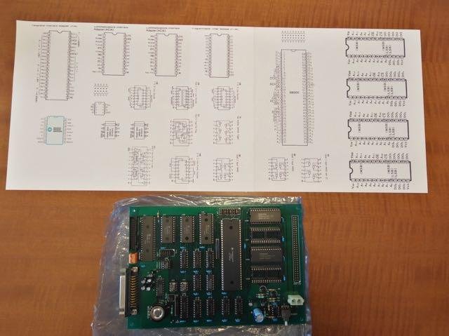
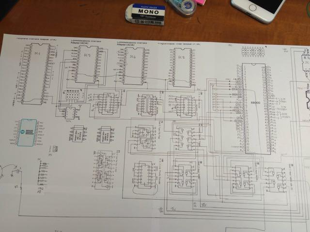
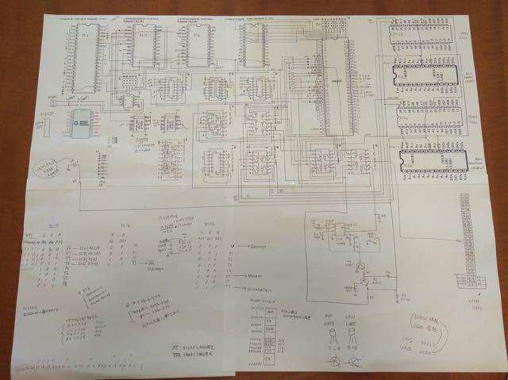

前回の[調査編](https://kanpapa.com/2017/10/mic68k-Investigation.html "MIC68K調査編")である程度の構造は把握できましたが、MIC68Kを実際に動かすためには、ROM/RAM/周辺デバイスがどのアドレスに配置されるのかを調べなければなりません。よく基板上にアドレスが書かれていることがありますが、この基板にはそのような情報はありませんでした。それを知るためにはプリント基板の配線を追って回路図を起こすことになります。ただし、すべてを回路図に起こすのは時間がかかりますので、知りたいところを優先して解析します。

例えば、以下のことだけがわかれば、ある程度のプログラムを動かすことができます。

- ROM/RAM/周辺デバイスのCS(Chip Select)信号やOE(Output Enable)信号が、どのアドレスでEnableになるのか。

- ２つあるROM/RAMのどちらが偶数バス、奇数バスに接続されているのか。（CPUのD0信号につながっているのはどっち？）

- 全体のメモリマップはどのようになっているのか。

まずは回路図を書くために、各デバイスのピン配置をデータシートから抜き出して、基板のICの配置に合わせて大きめの紙に貼り付けます。今回データシートはCQ出版で公開されている['86年度版 主要IC端子接続早見表【PDF版】](http://cc.cqpub.co.jp/lib/system/doclib_item/1036/ "'86年度版 主要IC端子接続早見表【PDF版】")を使って写真のように切り貼りしました。



これを元にプリント基板のパターンを追って、回路図を書いていきます。基板の表面と裏面を見比べながら、ICチップで見えないところはある程度想像しながら、最終的にはテスターで導通を確認していきます。

１つ１つ調べてどんどん書き込んでいきます。特に各ICのCS信号, OE信号とアドレスデコーダとみられる74HC138, 74HC139周辺を優先して調べます。



紙が狭くなったら別の紙を貼って継ぎ足します。メモもどんどん書き込んでいきます。

最低限必要な部分の配線を書き込んだ回路図が次の写真になります。



この解析の結果メモリマップは以下のようになっていると推測できました。

```
$000000-$00FFFF RAM
$A00000-$A0FFFF ROM  ※ただしリセット時は$000000に配置される。
$F00009 ACIA1
$F20009 ACIA2
$F40009 PIA
$F80009 PTM
```

次はこのアドレスが合っているかどうかを確かめるため、ROMを焼いてテストプログラムを動かしてみます。

続きは[Hello World編](https://kanpapa.com/2017/10/mic68k-helloworld.html "MIC68KHelloWorld編")で。
