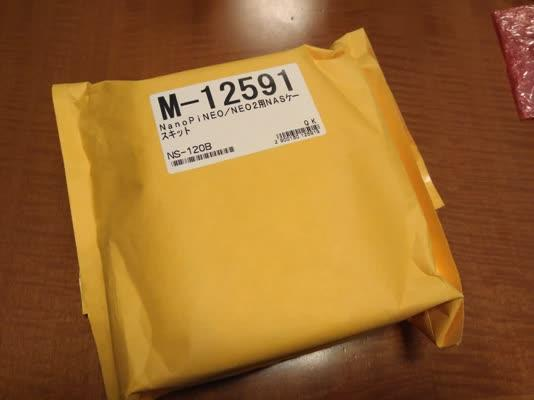
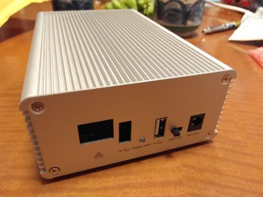
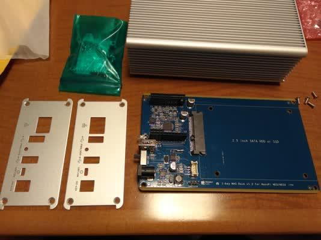
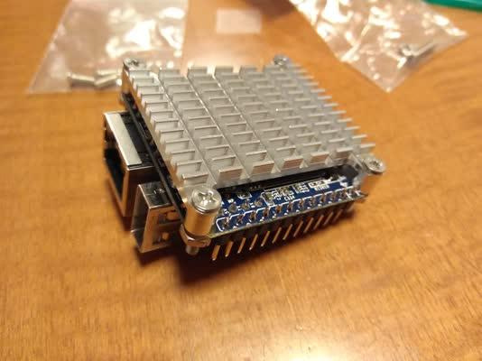
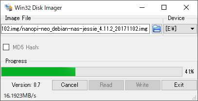
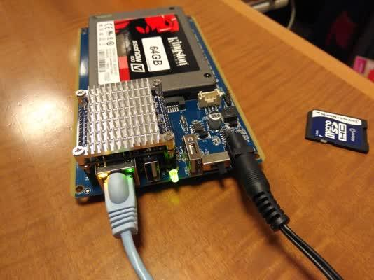
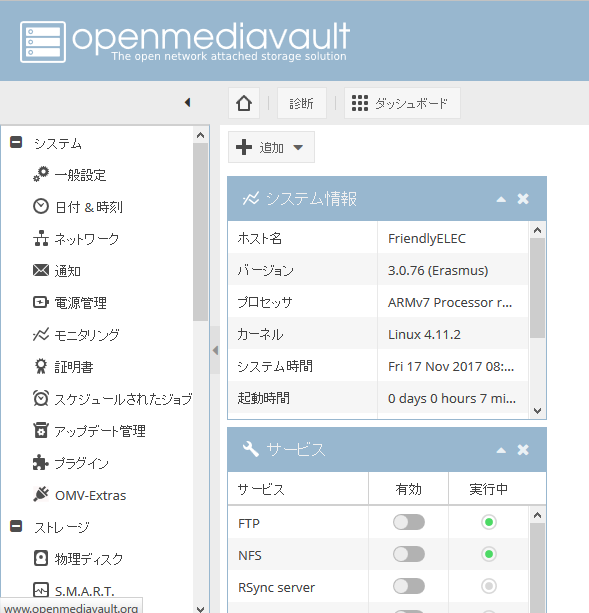
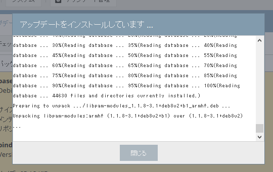
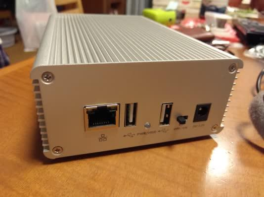

[秋月電子](http://akizukidenshi.com/ "秋月電子通商")さんで[Nano Pi NEO](http://akizukidenshi.com/catalog/g/gM-12301/ "Nano Pi NEO 512MB")用のNASケースの販売が始まったようです。

- [Nano Pi NEO/NEO2用NASケースキット (2,180円)](http://akizukidenshi.com/catalog/g/gM-12591/ "Nano Pi NEO/NEO2用NASケースキット")

Nano Pi NEOでどんなNASができるのか、試しに購入してみました。

到着したパッケージはこんな感じでした。思ったより大きいです。

 <!--more-->

パッケージを開けるとケースがでてきました。なかなかしっかりした作りのケースに見えます。

この中に基板と付属部品が格納されていましたので、とりだしてみました。

NAS基板に加えて、Nano Pi NEO用とNano Pi NEO2用のパネルが付属していて選べるようになっています。また、ヒートシンクも付属されています。

早速手持ちのNano Pi NEO 512MBにピンヘッダをはんだ付けして、ヒートシンクを取り付けます。

これを、NAS基板に取り付けます。ストレージは手持ちの64GB SSDをとりつけました。

次は、ファームウェアの準備です。[マニュアルページ](http://wiki.friendlyarm.com/wiki/index.php/1-bay_NAS_Dock_v1.2_for_NanoPi_NEO/NEO2 "1-bay NAS Dock v1.2 for NanoPi NEO/NEO2")にあるファームウェアと書き込みツールをダウンロードしてmicroSDカードに書き込みます。

書き込んだmicroSDカードをNano Pi NEOに取り付けて準備は完了です。

手持ちの12Vの電源アダプタを接続し、電源を投入してみます。

LEDが点灯し、LANコネクタのLEDがちかちか点灯しているので、無事動いているように見えます。

セットアップはWebブラウザから行うようですが、IPアドレスがわからなかったのでルーターで割り当てられたと思われるIPアドレスを探しました。ブラウザで接続するとログイン画面が表示されます。日本語が指定できるようなので、日本語を指定し、adminでログインしたところ無事設定画面が表示されました。それもきちんとした日本語でカッコいい画面です。

 [openmediavault](https://www.openmediavault.org/ "openmediavault")というOSSのNASソフトをdebian上で動かしているようです。少し触ってみましたが、NASとしての完成度は高いようです。

設定画面の中にsshという設定がありましたので、sshでログインしてみました。Nano Pi NEOのrootアカウントで試したところ、あっさりログインできてしまいました。

もちろんsshの設定でrootでログインできないようにもできます。

次にソフトウェアのアップデートを行ってみました。これもNASの設定画面から行えます。

まさにdebianのアップデートですね。

無事動作確認も行えましたのでケースに収納して完成です。

Nano Pi NEOの特徴は小型であり、機器に組み込みやすい大きさになっていることですが、このNASへの応用は良い事例だと思います。こんなに手軽に低価格なNASを作ることができるのは素晴らしいですね。また、大容量のストレージが接続できているので、カスタマイズすればちょっとしたサーバとしても使えるのではと思います。ぜひお試しください。
