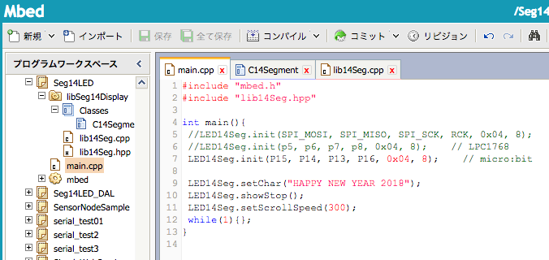

あけましておめでとうございます。昨年は[TK-80互換機で書き初め](https://kanpapa.com/2017/01/zk-80-newyear2017.html "ZK-80 mini (PIC32MX１チップTK-80互換機)で書き初めをしてみた")をしましたが、今年の新春初プログラミングはmbedでした。

micro:bitにGhz2000さんの[SPI接続14セグメントLED表示器](http://ghz2000.dip.jp/wordpress/?p=665 "SPI接続14セグメントLED表示器")を接続して、新年のメッセージを表示させました。

https://youtu.be/06iEs5ViAPc

プログラムはこんな感じです。

[mbed用のライブラリ](https://developer.mbed.org/users/ghz2000/code/libSeg14Display/ "libSeg14Display")が提供されていますので、micro:bitのSPIポートに接続するだけで動作しました。

では、本年もよろしくお願いします。
