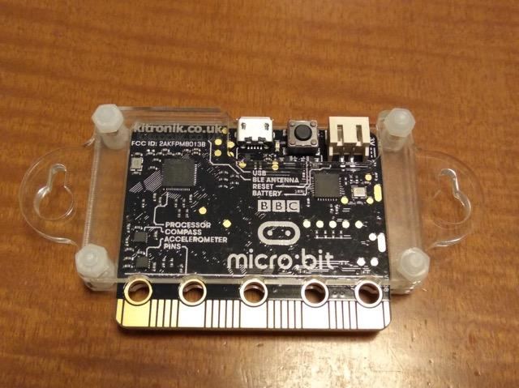
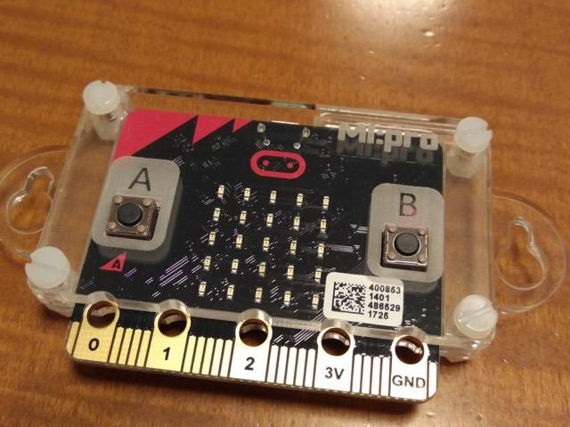
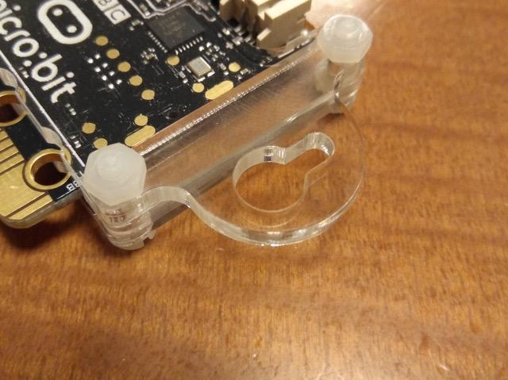

この記事は[microbit Advent Calendar 2017](https://qiita.com/advent-calendar/2017/microbit "microbit Advent Calendar 2017")の13日目の記事です。

最近[micro:bit](https://www.switch-science.com/catalog/3380/ "micro:bit")を取り扱うお店が増えてきたように思います。少し前に３台目のmicro:bitを購入したのですが、その時に[MI:pro](https://www.switch-science.com/catalog/3388/ "MI:pro")というケースも買ってみました。

  

micro:bitにとりつけると、こんな感じになります。透明アクリルで内部の視認性は高いです。

<figure>

<figcaption>

dav

</figcaption>

</figure>

LEDの表示面も見やすいです。ボタンの名前が彫り込んであるのも良いですね。

<figure>

<figcaption>

dav

</figcaption>

</figure>

このケースはよくできていて、例えば耳の部分は、ネジで止めやすい形になっています。引っ掛けて使うこともできそうです。

<figure>

<figcaption>

dav

</figcaption>

</figure>

また、特徴的な５つの接続穴のところも、穴の周りが干渉しないように少し削ってあります。ちょっとしたことですが使う上では重要です。

<figure>

<figcaption>

dav

</figcaption>

</figure>

また、このケースをつけたままでも、手持ちのモーターシールドにも取り付けることができました。もしかするとシールドによっては干渉するかもしれませんが。

<figure>

<figcaption>

dav

</figcaption>

</figure>

このケースはmicro:bitの基板を保護する上でもオススメだと思います。ケースをつけても使い勝手がかわりません。それにカッコいいですしね。
