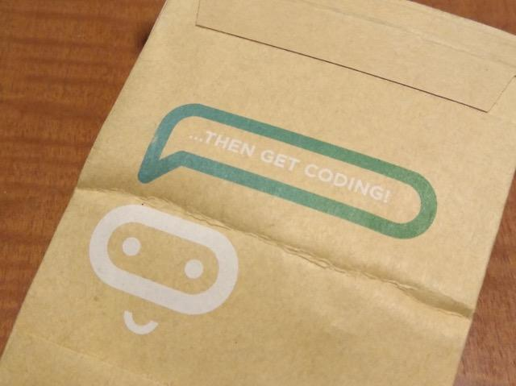

この記事は[microbit Advent Calendar 2017](https://qiita.com/advent-calendar/2017/microbit "microbit Advent Calendar 2017")の19日目の記事です。

今、micro:bitを購入すると、綺麗な化粧箱で、micro:bit本体も静電防止袋に入っていると思います。

店頭でもよくみかける箱ですね。

でも、私が一番最初に手に入れたmicro:bitは丈夫な紙袋のパッケージにはいっていました。

非常にシンプルな作りで針金入りの留め具で袋の口が止まっているだけです。

静電防止袋にもはいっておらず、micro:bit本体がそのまま入っていました。

この袋には、こう書かれています。

「THEN GET CODING!」

「FIND ME IN HERE...」

学校で配布されたそうなので、簡素なパッケージだったのでしょうが、必要十分だなと感じました。

これを受け取った子供達はワクワクしたのかなと思いながら、私もワクワクしながら封を開けたものです。
