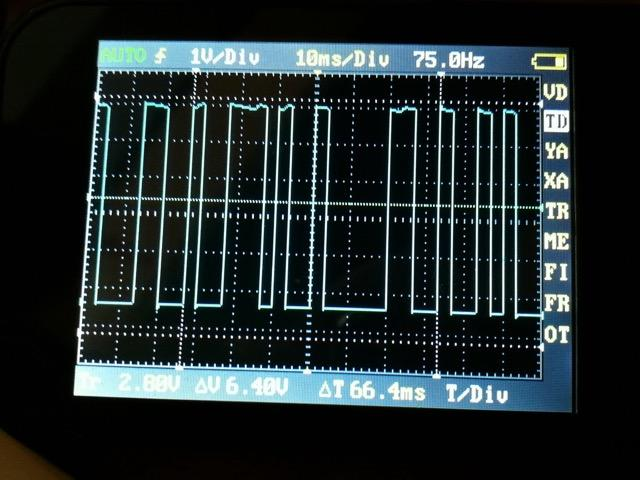
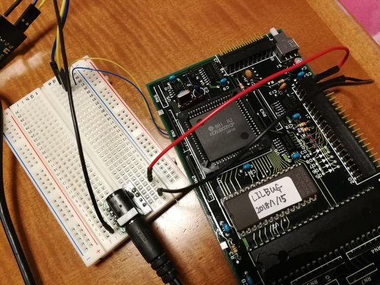
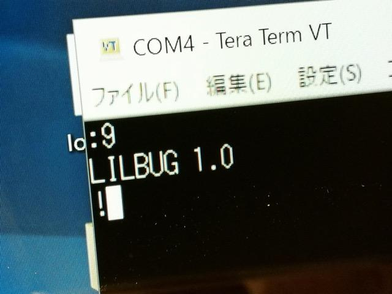

前回までの解析でメモリマップがわかりました。次はこのマイコンボードにモニタを実装して、自由にプログラムが動かせるマイコンボードにしてみます。

### 63B03用モニタプログラムの準備

まずは63B03用のモニタを探します。検索したところ以下のモニタがみつかりました。

- [MC6801L1UM\_LILbug\_Monitor\_for\_the\_MC6801L\_Aug80.pdf](ftp://bitsavers.informatik.uni-stuttgart.de/components/motorola/6801/MC6801L1UM_LILbug_Monitor_for_the_MC6801L_Aug80.pdf "MC6801L1UM_LILbug_Monitor")

モトローラ純正のMC6801用のモニタのようです。PDFファイルにソースリストが載っていますが、ソースファイルもLILBUG.ASMで検索すると見つけることができました。

このモニタはコンパクトにできていて、$F800-$FFFFに配置するため、今回のマイコンボードに載せるにも都合が良いです。

### クロスアセンブラの準備

次にこのLILbugをアセンブルするためのアセンブラが必要です。今回は株式会社アークピットからフリーソフトウェアとして公開されていたクロスアセンブラ Version 3.1 (00/11/22)を使用します。残念ながら現在は株式会社アークピットのホームページは存在しないのですが、インターネットアーカイブから入手することができます。

- [クロスアセンブラ Version 3.1 (00/11/22)](http://web.archive.org/web/20010202172000/http://arcpit.co.jp:80/xasm_0.htm "クロスアセンブラ Version 3.1")

ただしこのクロスアセンブラはMS-DOS用のプログラムですので、Windows10 64bit環境で起動するとエラーになります。

```
C:\Users\kanpa\Desktop\63B03Dual>x6801
このバージョンの C:\Users\kanpa\Desktop\63B03Dual\X6801.EXE は、実行中の Windows のバージョンと
互換性がありません。コンピューターのシステム情報を確認してから、ソフトウェアの発行元に問い合わせてください。
C:\Users\kanpa\Desktop\63B03Dual>

```

このためMS-DOSの16bitプログラムをWin32-64bit環境で動かすツールMS-DOS Player for Win32-x64を使います。

- [MS-DOS Player for Win32-x64](http://takeda-toshiya.my.coocan.jp/msdos/ "MS-DOS Player for Win32-x64")

このツールを使って今回のクロスアセンブラを動かします。

```
C:\Users\kanpa\Desktop\63B03Dual>msdos x6801

6801 Cross Assembler Version 3.12
   Copyright(C) Arcpit Co.,LTD.1990. All rights reserved.

Source Filename [.TXT] : LILBUG.ASM
Object Filename [LILBUG.S] :
Source Listting [NUL.LST] : LILBUG
Cross Reference [NUL.CRF] : LILBUG
Symbol Table [NUL.MAP] : LILBUG
^L                                     2018- 1-21 6801 Assembler  Page    1
                                                      File:LILBUG.ASM

    1                   ** FOR VDG, SET VDG = 0,
    2                   ** FOR NON-VDG, SET VDG = 1
    3 0001              VDG        EQU      1
    4                   * FOR ON-CHIP IO, SET CHIPIO = 0
　　　　　：
0 Error(s) detected.
LINES : 1671
LABELS : 293
LAST PROGRAM ADDRESS : $FFFD
LAST DATA ADDRESS : $0000
C:\Users\kanpa\Desktop\63B03Dual>
```

このようにWindows10 64bit環境でも問題なくアセンブルすることができます。

### LILbugのアセンブル

LILbugのソースはこのクロスアセンブラに合わせて書き換えました。定数の書き方が若干違うので合わせます。

```
*** LILBUG.ASM.ORG    2018-01-14 12:21:54.573924700 +0900
--- LILBUG.ASM    2018-01-14 22:15:56.603148900 +0900
***************
*** 1606,1622 ****
   FCB 4
  NOCHG FCC /NO CHG/
   FCB 4 EOF
! MTAPE FCB 'S,'1,4
  MEOF FCC /S9030000FC/
   FCB $D,4
  PRTOP FCC /OP-/ PRT FOR TRACE LINE
   FCB 4
! ARRAY FCB 'P,1 ARRAY OF REG AND WRD LEN
!  FCB 'X,1
!  FCB 'A,0
!  FCB 'B,0
!  FCB 'C,0
!  FCB 'S,1
  SPACE6 FCC /      / 6 SPACES FOR SHOW HEADER
   FCB 4
   SPC
--- 1606,1623 ----
   FCB 4
  NOCHG FCC /NO CHG/
   FCB 4 EOF
! MTAPE FCC /S1/
!  FCB 4
  MEOF FCC /S9030000FC/
   FCB $D,4
  PRTOP FCC /OP-/ PRT FOR TRACE LINE
   FCB 4
! ARRAY FCB 'P',1 ARRAY OF REG AND WRD LEN
!  FCB 'X',1
!  FCB 'A',0
!  FCB 'B',0
!  FCB 'C',0
!  FCB 'S',1
  SPACE6 FCC /      / 6 SPACES FOR SHOW HEADER
   FCB 4
   SPC

```

以上を修正することで、正常にアセンブルでき、生成されたアセンブルリストもLILbugのドキュメントと同じ内容になっていることを確認しました。

### 63B03デュアルCPUマイコンボードへの移植

次に今回のマイコンボードに合わせてソースリストを書き換えます。このモニタではCPUのクロックからシリアル通信のクロックを作るようになっています。標準のシリアルスピードに合わせるために、XTALは4.9152MHzもしくは2.4576MHzを使用することを前提にコーデイングされています。

しかし、このマイコンボードのXTALは8.0000MHzですので、このまま使うと標準的なシリアルスピードになりません。手っ取り早い方法はXTALを8.0000MHzから4.9152MHzに交換すればいいのですが、それでは面白くありません。

他に方法がないかとHD63B03のデータシートをみたところ、内蔵タイマー２を使ってシリアル通信用のクロックを生成できるとあります。この機能が使えるようにLILBugを書き換えてみました。変更点は以下の通りです。通信速度を変更するHYコマンド, Hコマンド は一旦外しています。

```
*** LILBUG.ASM    2018-01-14 22:15:56.603148900 +0900
--- LILBUG2.ASM    2018-01-14 22:27:12.363140000 +0900
***************
*** 65,70 ****
--- 65,73 ----
  TRCS EQU $011 TRANSMIT/RECEIVE CNTRL STAT REG
  RECEV EQU $012 READ REG
  TRANS EQU $013 TRANSMIT REG
+ * ON-CHIP IO ADD BY KANPAPA
+ TCSR3 EQU $01B
+ TCONR EQU $01C 12:4800bps,25:1200bps,207:300bps
  * MODE SELECT WORD
  MODE EQU $03 UPPER 3 BITS = MODE
  * DEFAULT ADDRESS FOR PTM
***************
*** 180,191 ****
   FCB 4 *
   FCC /R/
   FDB REGSTR
!  FCB 5
!  FCC /HI/
!  FDB S120
!  FCB 5
!  FCC /HY/
!  FDB HY
   FCB 4 *
   FCC /T/
   FDB TRACE
--- 183,194 ----
   FCB 4 *
   FCC /R/
   FDB REGSTR
! * FCB 5
! * FCC /HI/
! * FDB S120
! * FCB 5
! * FCC /HY/
! * FDB HY
   FCB 4 *
   FCC /T/
   FDB TRACE
***************
*** 316,323 ****
   SPC
  *************** CION ***************
  * INITIALIZE ON-CHIP SERIAL IO
! CION LDD #$1007 SET PADDING FOR 300
!  BSR S1205 SET RMCR
   LDAA #$0A SET TRCS FOR ON-CHP IO
   STAA TRCS
  * NO ACTION NEEDED BY THESE DEVICES
--- 319,330 ----
   SPC
  *************** CION ***************
  * INITIALIZE ON-CHIP SERIAL IO
! CION LDD #$14CF SET PADDING FOR 300
!  STAA TCSR3
!  STAB TCONR
!  LDD #$1028
!  STAA CHRNL
!  STAB RMCR
   LDAA #$0A SET TRCS FOR ON-CHP IO
   STAA TRCS
  * NO ACTION NEEDED BY THESE DEVICES
***************
*** 355,376 ****
  * HY & HI SET CHRNL FLAG FOR PADDING
  * LOW 2 BITS = NUM NULLS AFTER CHAR
  * HIGH 6 BITS = NUM NULLS AFTER CR
!  SPC
  ************** HI **************
  * SET SPEED FOR 120 CPS
  * SET # NULLS TO PAD CHAR
  * SET BITS FOR 1200 BAUD IN RMCR
! S120 LDD #$4F06
! S1205 STAA CHRNL
!  STAB RMCR SET BAUD RATE
!  RTS
!  SPC
  *************** HY ***************
  * HIGHER YET - 9600 BAUD ON CRT
  * SET PADDING TO ZERO
! HY LDD #$0005 ALSO SET RMCR
!  BRA S1205
!  PAGE
  ********** RESET **********
  * COME HERE FOR MONITOR RESTART
  * INIT IO & FCN TABLE POINTERS
--- 362,383 ----
  * HY & HI SET CHRNL FLAG FOR PADDING
  * LOW 2 BITS = NUM NULLS AFTER CHAR
  * HIGH 6 BITS = NUM NULLS AFTER CR
! * SPC
  ************** HI **************
  * SET SPEED FOR 120 CPS
  * SET # NULLS TO PAD CHAR
  * SET BITS FOR 1200 BAUD IN RMCR
! *S120 LDD #$4F06
! *S1205 STAA CHRNL
! * STAB RMCR SET BAUD RATE
! * RTS
! * SPC
  *************** HY ***************
  * HIGHER YET - 9600 BAUD ON CRT
  * SET PADDING TO ZERO
! *HY LDD #$0005 ALSO SET RMCR
! * BRA S1205
! * PAGE
  ********** RESET **********
  * COME HERE FOR MONITOR RESTART
  * INIT IO & FCN TABLE POINTERS

```

### LILbugモニタROMの書き込み

クロスアセンブラではモトローラSフォーマットのファイルが生成されますので、これをROMライターに読み込み、LILbugのROMを焼きました。


### ハードウェアの調査

これでROMはできましたが、実際に動かすためにはマイコンボードの電源とシリアル出力まわりのハードウェアを確認しなければなりません。テスターを片手にマイコンボードにあるピンヘッダとCPUの接続状況を探ります。


確認した範囲ですと、電源はJ1のピンヘッダに引き出されていましたが、シリアルポートはピンヘッダには接続されていないようでした。搭載されている63B03は3Vでも動くのですが、DP-RAMは5V動作ですので電源は5Vを接続します。

### LILbugモニタの動作確認

まずシリアルクロックが生成されているかを確認するために、先ほど焼いたLILbugのROMをセットし電源を入れました。LILbugモニタプログラムがうまく動いていればP22にシリアルクロックが出力されているはずです。

P22にオシロスコープを接続したところ、写真ではわかりにくいですが、300Hzの矩形波信号が出力されています。


これで300bpsのシリアル通信のクロックができました。次にシリアルポートのTX端子にオシロスコープを接続し、リセットボタンを押したところ、



なにやらシリアル信号ぽいものが見えました。うまく動いているように思えます。

### シリアルターミナルとの接続確認

次はマイコンボードにワイヤーを半田付けしてCPUからシリアルポートを引き出します。そこにシリアル-USB変換ボードを接続しPCに接続します。



この状態でPCでターミナルを立ち上げ、通信速度を300bpsに設定します。再びリセットボタンを押したところ、



来ました。LILbugの起動メッセージです。早速コマンドを入力してみます。


Sフォーマットでの出力やメモリダンプも正常にできるようです。

これで１枚目の63B03基板はモニタが実装され、2KBまでのプログラムを自由に動かせるようになりました。

しばらくはこの１枚目の基板を使って遊んでみようと思います。
