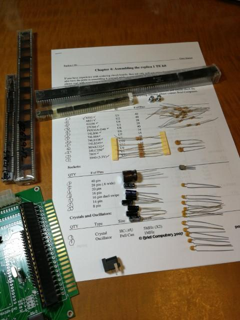
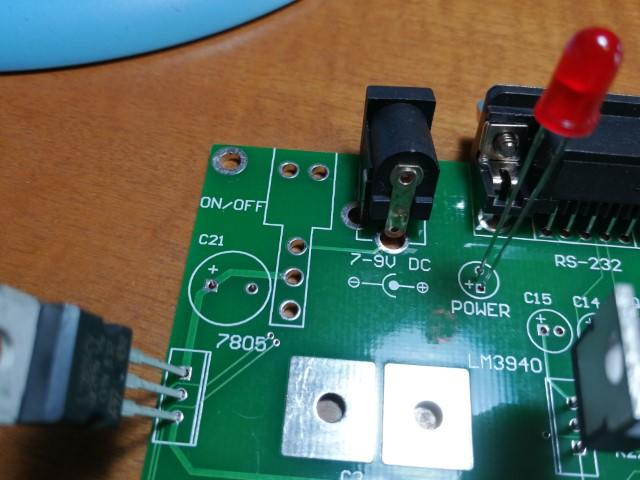
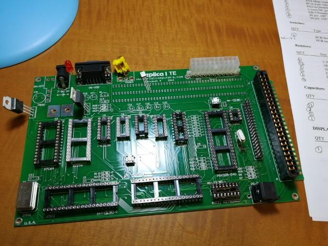

まずはreplica1 TE kitのパーツが揃っているかの確認です。キットの場合はパーツが足りないこともよくあります。

確認したところ、電源コネクタが１つ多く入っていました。

さらに確認したところ、電源スイッチが欠品でした。

基板のパターンを見るとトグルスイッチを横につけるタイプのようです。秋葉原で同じようなスイッチがないか探してみることにしましょう。

とりあえず電源スイッチは使わないで直接リード線でショートすることにします。

他のパーツは問題なくそろっているようです。

早速はんだ付けを始めましょう。
