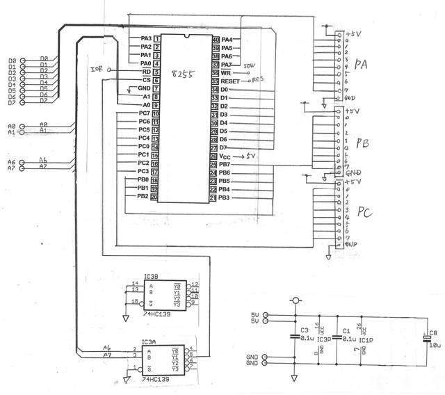
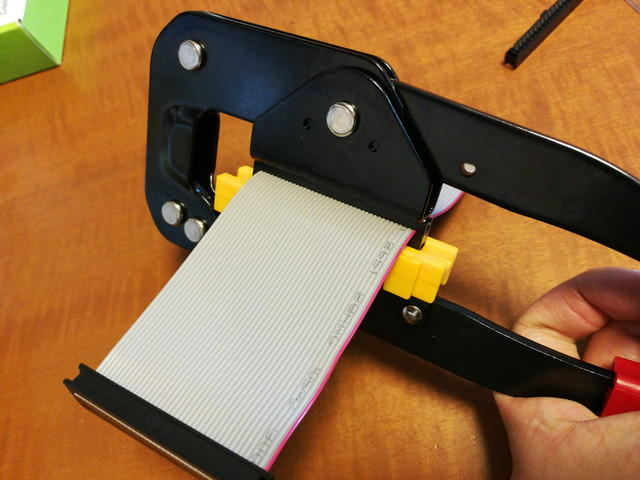
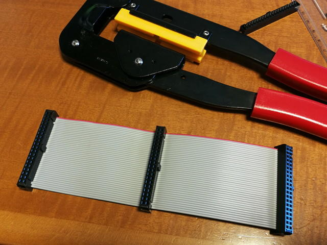
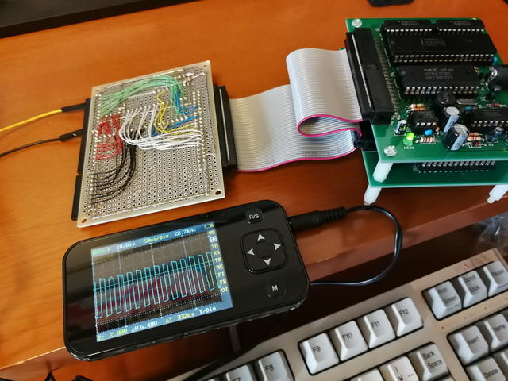
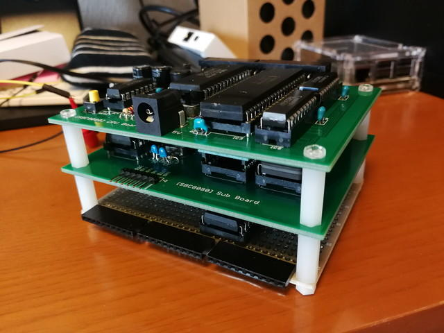

無事[SBC8080ルーズキットが動作した](https://kanpapa.com/2018/07/sbc8080-assembled.html "SBC8080ルーズキットを組み立ててみた")ところで、8255を接続したくなってしまいました。

昔PC-8001をつかっていたのですが、拡張バスからケーブルを引き出して8255を接続していろいろ制御していました。同じことがまたできるかなと。

というわけで早速設計開始です。といっても8080に8255は簡単に接続できます。ざっと書いた回路図は以下の通りです。いつもの切り貼り＋手書き回路図ですのできれいではありません。

すでに、IOポートの00H～3FHはSUBボードの8251で使われているので、ここと重ならないように40Hから割り当てることにしました。

8255はポートA,B,Cを持っています。それぞれが8bitですので、ポート出力は10Pのコネクタとし、8ビットポートの出力と+5VとGNDもコネクタに接続しました。

基板は秋月電子のB基板と同じサイズとのことなので、仮組みをしてみました。

サイズもぴったりでいい感じですね。これで実装イメージがわきました。

<!--more-->

基板の製作に入る前にこの３つのコネクタをバス接続するためのフラットケーブルを作ります。

材料は、秋月電子さんの40Pフラットケーブルと千石電商さんで買った40Pヘッダコネクタです。

ヘッダコネクタをケーブルの中間部分に圧着工具で圧着します。

出来上がりです。このケーブルで3枚の基板がバス接続できます。

次は基板のレイアウト決めです。バスコネクタの位置は先ほどの仮組みのときに決めましたので、あとはICの配置とポートコネクタを配置して配線を行いました。

完成したSBC8080用8255ボードです。右側は別の回路が組めるように空けておきました。

裏側の配線はこんな感じです。ラッピングワイヤを使ってはんだ付けで配線しています。

早速、SBC8080に接続して動作確認を行います。まずは異常な発熱がないかとSBC8080が正常に動作するかの確認です。

特に問題なさそうです。TINY BASICも起動できました。

次にSBC8080のTINY BASICに搭載されているモニタプログラムで8255のテストプログラムを書き込んで実行します。プログラムは以下の通りです。

正常に動作すれば、パルス信号が各ポートから出力されます。LEDをつけてもよかったのですが、手っ取り早くオシロスコープで確認します。

パルス出力が見えました。正常に動作しているようです。

最後に基板をスタックにして完成です。

これでSBC8080にGPIOができました。今後GPIOに何か接続して制御してみようと思います。
