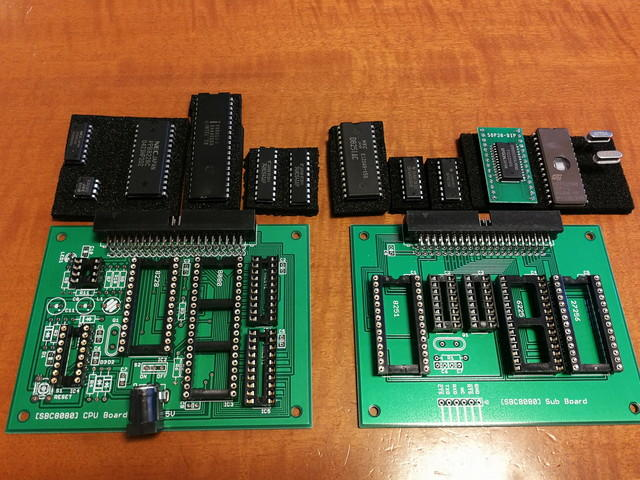
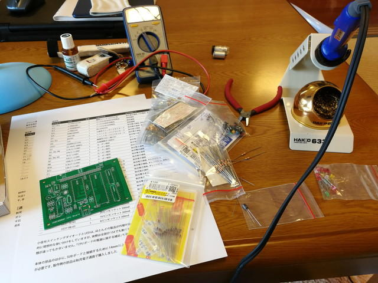
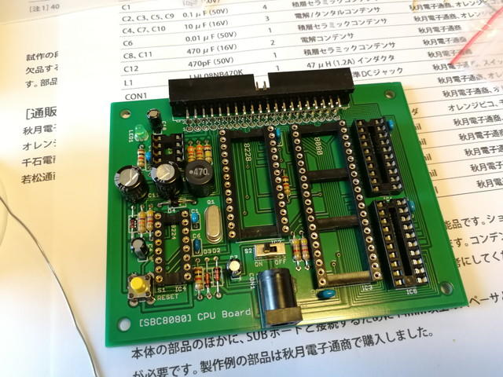
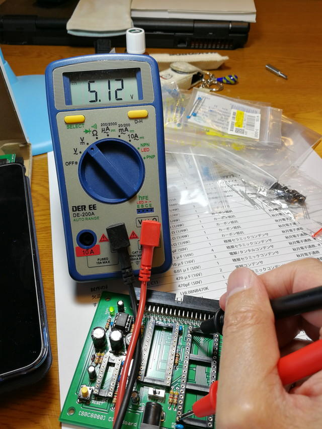
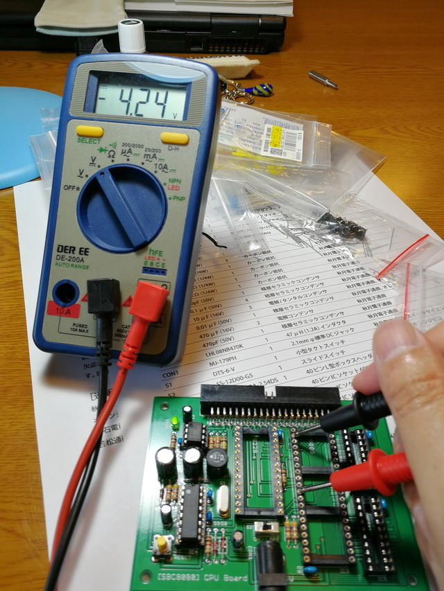
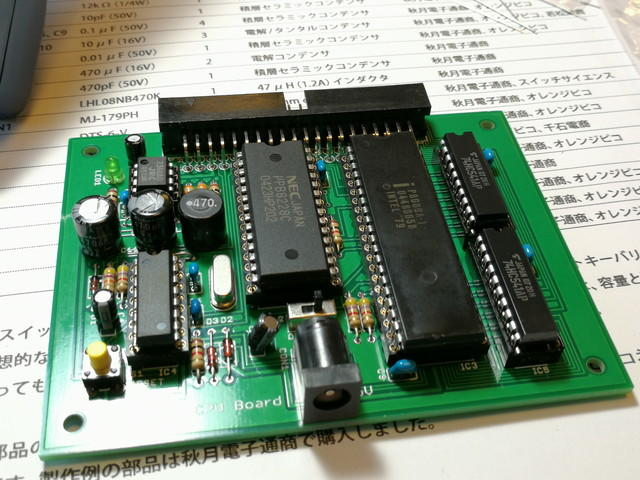
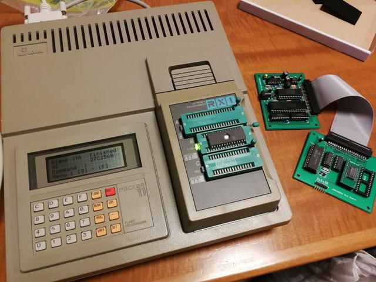
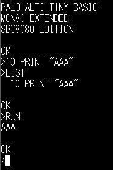

[電脳伝説さんのサイトで公開](https://vintagechips.wordpress.com/2018/06/24/sbc8080-cpu%E3%83%AB%E3%83%BC%E3%82%BA%E3%82%AD%E3%83%83%E3%83%88/ "電脳伝説")されているSBC8080という8080CPUを使ったマイコンボードのパーツがようやく揃ったので組み立ててみました。なお、このサイトで技術資料とデータパックが公開されていますので、専用基板が無くても組み立てることができます。でも、専用基板を使うのがおすすめです。（カッコいいし）

今回、集めた主要部品を並べてみました。

今回は256Kbit RAMは秋月電子のSOPチップをピッチ変換ボードに載せて使っています。

8080CPUはオレンジピコさん、8228、8224は若松通商さん、8251は手持ちです。その他は秋月電子さん、千石電商さんなどで集めました。やはり8080系のチップは取り扱いがなかなか無いですね。

さて製作開始です。

まずはCPUボードから製作開始です。いつものように背の低いパーツからはんだ付けです。

ICを除いたすべてのパーツをはんだ付けしました。

ICを取り付ける前に、ここで電源の確認です。8080CPUは+5V、+12V、-5Vが必要です。このため電源周りが少し複雑になっています。なお、NJM2360で+12Vを生成するのでこのICだけは取り付けました。

+5Vは外部電源がそのまま出ています。ほぼ5Vで問題ありません。

次は+12Vです。こちらも大丈夫です。

最後は-5Vです。マニュアルによると-4Vぐらいだそうですが。

おかしいですね。-3.0mVしかでていません。確認したら8224クロックジェネレーターを使って-5Vを生成していたのでした。早速、8224をとりつけてチェックです。

\-4.24Vです。-5Vには達していませんが、これで動作するとのことですので、問題なしです。

残りのICを取り付けてCPUボードは完成です。

次はSUBボードの製作に入ります。こちらは非常にシンプルな構成なので、すぐ完成です。

SUBボードに実装するROMを焼かなければなりません。いつものようにPECKER-11を準備して、提供されているPTBEXSA.HEXを書き込みます。

書き込んだROMを取り付けて動作確認です。フラットケーブルでCPUボードとSUBボードを接続し、シリアルポートにUSB-シリアル変換ボードを接続します。

この状態で電源をいれてPCでシリアルターミナルを9600bpsで立ち上げたところ、

一発で動作しました。メッセージに書かれているようにTINY BASICが動いています。早速、BASICも試しました。

問題なく動いています。ここでいったん電源を切って基板をスタックにしました。手持ちのスペーサは15mmだったのですが、RAMにSOP変換ボードを使っているので少し当たりそうです。やむなくナットを１つ噛ませて基板の間のスペースを少し広げて固定しました。

完成したSBC8080です。

8080を動かすのは高校でTK-80を使っていたとき以来です。

ここまで動くと8255を接続したくなってしまいました。基板は秋月のB基板と同じサイズだそうですから、もう一枚、[8255の拡張基板を製作して接続](https://kanpapa.com/2018/07/sbc8080-8255board.html "SBC8080ルーズキットに8255を接続してみた")してみます。
