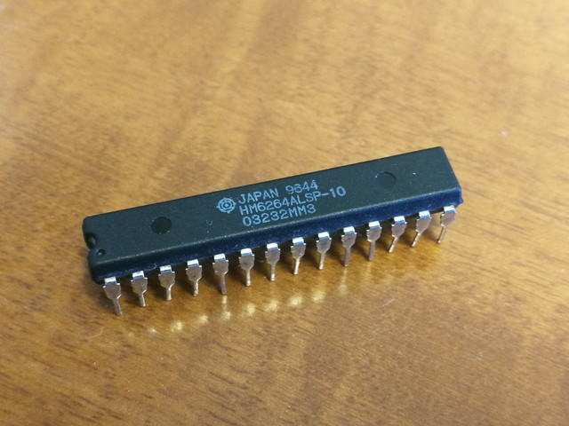
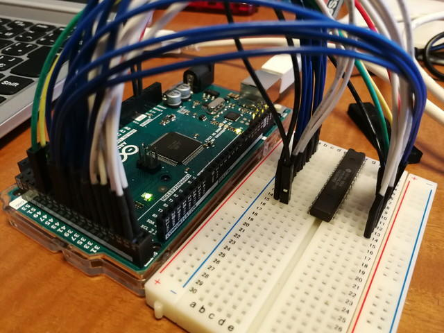
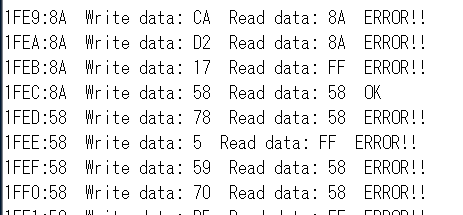

私だけかもしれませんが、最近不良メモリにあたることが多く、マイコンボードの動作不良の原因切り分けに時間がかかることが多くなってきました。レガシーなメモリだと代替品も入手に時間がかかるので交換してテストしたくてもできないことがあります。

そこで問題切り分けが迅速に行えるようにArduino MEGAで簡易的なメモリチェックをおこなってみました。なおアクセスタイムや書き込みパターン、テストアドレスの範囲など意識した厳密なメモリチェックではありませんのでご注意ください。

ターゲットはこのHM6264ALSPです。このメモリは28Pですが幅が狭いパッケージになっています。なかなか売っているものではありません。

6264のピン配置は以下のようになっています。

Arduino MEGAはたくさんのGPIOを持っていますので、それを利用してSRAMの読み出しと書き込みに必要な信号を作ります。接続方法はスケッチに書いておきました。実体配線図は以下のようになります。線は多いですけど順番に接続すれば大丈夫です。チップセレクトは常時イネーブルされている状態にしますので、CS1はGNDに、CS2はVccに接続します。

 <!--more-->

実際の接続の様子です。

スケッチはgithubにあげておきました。[SECCON2017 CTFのz80問題](https://kanpapa.com/2017/12/seccon-ctf-2017-online-write-up.html "SECCON2017 CTF")のスケッチを参考にしています。

- [https://github.com/kanpapa/arduino/blob/master/HM6264TEST/HM6264TEST.ino](https://github.com/kanpapa/arduino/blob/master/HM6264TEST/HM6264TEST.ino "HM6264TEST.ino")

プログラムを実行すると、ランダムな値を書き込んで、読み出します。

正常なメモリでは書き込み値と読み出し値が一致しています。

今回あたってしまった不良メモリを接続して実行すると、書き込み値と読み出し値が一致しません。書き込む前の値のままになっていて、書き込めないように見えます。

これでメモリ不良の切り分けがしやすくなりました。

ついでに値が一致したかを確認して、ERROR、OKを表示するようにしました。

しかし、この不良メモリはどうにもなりませんね・・・。でも、良い勉強になりました。
