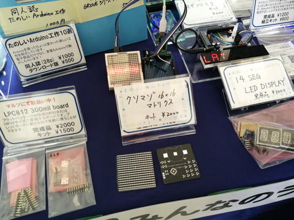
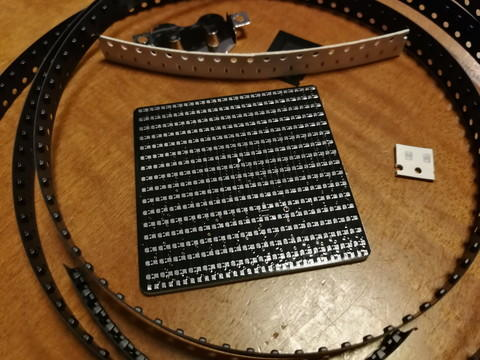
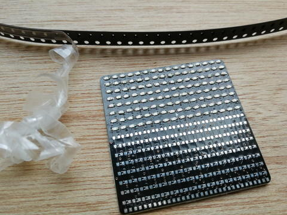
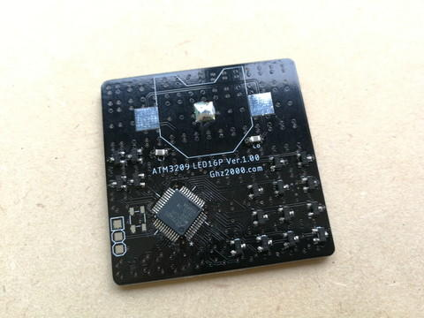
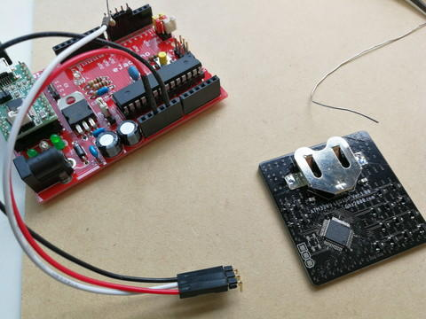

@Ghz2000さんが[クソマゾLEDマトリックス バッヂ](http://ghz2000.com/wordpress/?p=1389 "クソマゾLEDマトリックス バッヂ") をTwitterで紹介されていたので、[Ogaki Mini Maker Faire 2018](https://www.iamas.ac.jp/ommf2018/ "Ogaki Mini Maker Faire 2018")でキットを買ってきました。

なかなか難易度が高そうですが、なぜかQFP版とQFN版の両方を買ってしまいました。

キットの中身はこんな感じです。

まずはQFP版の組み立て開始です。自宅でははんだ付け禁止なので[おおたfab](https://www.ota-fab.com/ "おおたfab")さんで作業させていただきました。

腰痛持ちなので長時間の作業はきつく、休憩をはさみながら少しづつ進めました。

ようやく表面のチップLED(0603)と抵抗の実装が完了しました。

裏面のATMega3209やFETなどはんだ付けして、ようやく実装が完了です。

AVRへの書き込みはGhz2000さんの[記事](http://ghz2000.com/wordpress/?p=1387 "AVR 0-Series UPDI書き込み ATMega3209/4809等")を参考にしましたが、RESET-DTRがジャンパーで切り離せるeJackinoと、書き込み端子に接触しやすくするためにL型のピンヘッダを使って書き込みました。

テストプログラムを書き込んだところ、やはり点灯しないLEDが存在します。

これを１つずつ確認したところ、逆接続が２か所見つかりました。他ははんだ付けをしっかりやることで点灯するようになりました。少し浮いてしまって接触不良だったようです。

テストプログラムで全点灯することと、１ドットずつ制御ができるかの確認も完了です。

サンプルデモプログラムも無事動きました。

サンプルプログラムを見ながら次は何を表示させてみようか考え中です。

@Ghz2000さん、いつも楽しめるキットをありがとうございます。
