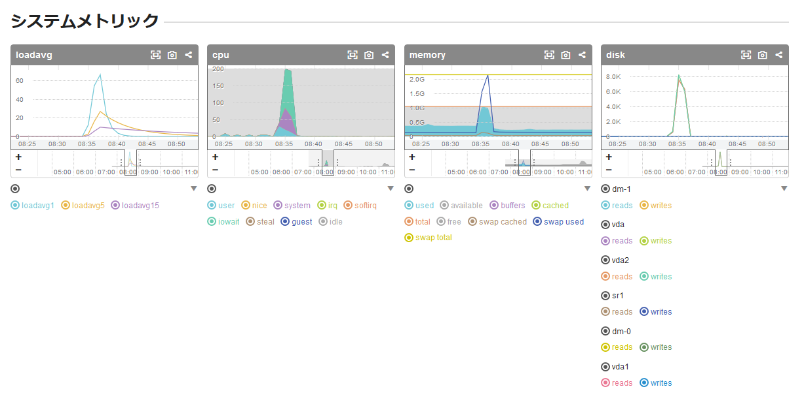
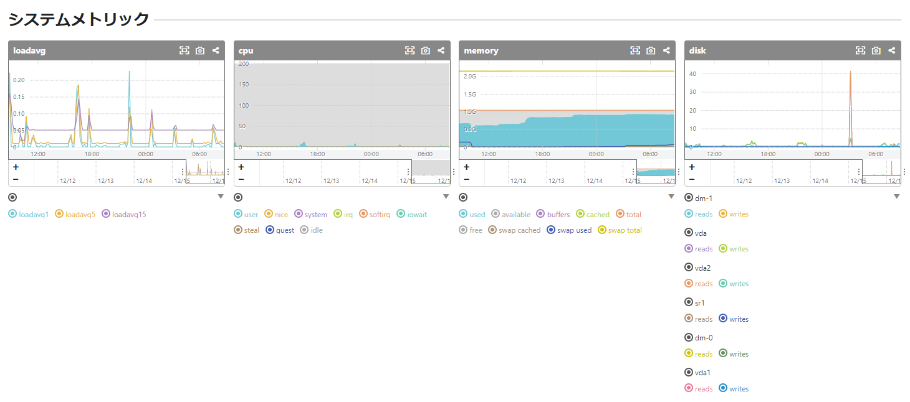

この記事は[ConoHa Advent Calendar 2018](https://qiita.com/advent-calendar/2018/conoha "ConoHa Advent Calendar 2018")の19日目の記事になります。

### はじめに

2013年の[ConoHa](https://www.conoha.jp/ "ConoHa")のサービス開始直後から、これまでずーとApache＋MovableTypeを使用してきました。

大きなトラブルもなく、[旧ConoHaから新ConoHaに](https://kanpapa.com/2015/12/new-conoha-centos7.html "旧ConoHaから新ConoHaにMT環境を移行してみた。")なって**どんどん機能が拡充して頑張ってるなぁ**と思っています。

今回は最近起こったちょっとしたトラブルシューティングの事例をまとめてみました。

<!--more-->

### MySQLがいつの間にか止まっている？

これまで特に問題なく運用してきたのですが、最近なぜかMySQLサーバーが落ちていることがあるのに気が付きました。

MySQLが止まってもWebサーバの検索機能が使えない程度で閲覧には支障がないので、気づいたらMySQLサーバを再起動するようにしていました。

### 誰がMySQLを止めているのか？

ちゃんと調べてみようかとサーバ監視状況を確認したところ、どうやらメモリが枯渇しているように見えました。

使用しているConoHa VPSですが、メモリ1GB、CPU 2コア、SSD 50GBのプランを使っています。

サーバ監視に使用している[mackerel.io](https://mackerel.io/ "mackerel.io")のグラフには、loadavgとCPU負荷が急上昇したあとメモリが枯渇して、その後収束している様子がみえました。



### まずはsyslogをチェック！

syslogにはこのようなものが残っていました。

ログにプロセスの一覧が取得されていますが、httpdとmt-search.cgiが異常なほどに立ち上がっていました。

最終的にはoom-killerによってmysqldがkillされているのがわかります。

```
Oct 13 22:05:38 133-130-xxx-xx kernel: 18920 total pagecache pages
Oct 13 22:05:38 133-130-xxx-xx kernel: 18356 pages in swap cache
Oct 13 22:05:38 133-130-xxx-xx kernel: Swap cache stats: add 123254454, delete 122999324, find 18906180/31953533
Oct 13 22:05:38 133-130-xxx-xx kernel: Free swap = 0kB
Oct 13 22:05:38 133-130-xxx-xx kernel: Total swap = 2097148kB
Oct 13 22:05:38 133-130-xxx-xx kernel: 262044 pages RAM
Oct 13 22:05:38 133-130-xxx-xx kernel: 0 pages HighMem/MovableOnly
Oct 13 22:05:38 133-130-xxx-xx kernel: 8196 pages reserved
Oct 13 22:05:38 133-130-xxx-xx kernel: [ pid ] uid tgid total_vm rss nr_ptes swapents oom_score_adj name
Oct 13 22:05:38 133-130-xxx-xx kernel: [ 470] 0 470 9413 0 23 116 0 systemd-journal
     :
Oct 13 22:05:39 133-130-xxx-xx kernel: [ 7514] 48 7514 63949 0 126 664 0 httpd
Oct 13 22:05:39 133-130-xxx-xx kernel: [ 7515] 48 7515 63949 0 126 671 0 httpd
Oct 13 22:05:39 133-130-xxx-xx kernel: [ 7516] 48 7516 63949 1 126 662 0 httpd
Oct 13 22:05:39 133-130-xxx-xx kernel: [ 7517] 48 7517 63949 0 126 664 0 httpd
Oct 13 22:05:39 133-130-xxx-xx kernel: [ 7518] 48 7518 63949 0 126 663 0 httpd
Oct 13 22:05:39 133-130-xxx-xx kernel: [ 7519] 48 7519 63949 0 126 665 0 httpd
Oct 13 22:05:39 133-130-xxx-xx kernel: [ 7520] 48 7520 63949 0 126 664 0 httpd
Oct 13 22:05:39 133-130-xxx-xx kernel: [ 7525] 48 7525 63916 0 125 657 0 httpd
Oct 13 22:05:39 133-130-xxx-xx kernel: [ 7526] 48 7526 63916 4 125 634 0 httpd
Oct 13 22:05:39 133-130-xxx-xx kernel: [ 7527] 48 7527 63916 57 125 587 0 httpd
Oct 13 22:05:39 133-130-xxx-xx kernel: [ 7528] 48 7528 63916 0 125 638 0 httpd
Oct 13 22:05:39 133-130-xxx-xx kernel: [ 7529] 48 7529 63949 0 125 666 0 httpd
Oct 13 22:05:39 133-130-xxx-xx kernel: [ 7530] 48 7530 63916 0 125 638 0 httpd
Oct 13 22:05:39 133-130-xxx-xx kernel: [ 7532] 48 7532 44606 1106 58 4554 0 mt-search.cgi
Oct 13 22:05:39 133-130-xxx-xx kernel: [ 7533] 48 7533 44606 1120 56 4541 0 mt-search.cgi
Oct 13 22:05:39 133-130-xxx-xx kernel: [ 7534] 48 7534 44606 1518 56 4141 0 mt-search.cgi
Oct 13 22:05:39 133-130-xxx-xx kernel: [ 7535] 48 7535 44606 1191 58 4473 0 mt-search.cgi
Oct 13 22:05:39 133-130-xxx-xx kernel: [ 7536] 48 7536 44606 1187 58 4474 0 mt-search.cgi
Oct 13 22:05:39 133-130-xxx-xx kernel: [ 7537] 48 7537 44606 1162 57 4499 0 mt-search.cgi
Oct 13 22:05:39 133-130-xxx-xx kernel: [ 7538] 48 7538 44672 1320 59 4427 0 mt-search.cgi
Oct 13 22:05:39 133-130-xxx-xx kernel: [ 7539] 48 7539 44606 1407 56 4251 0 mt-search.cgi
Oct 13 22:05:39 133-130-xxx-xx kernel: [ 7540] 48 7540 44606 1245 58 4432 0 mt-search.cgi
Oct 13 22:05:39 133-130-xxx-xx kernel: [ 7541] 48 7541 44606 1113 57 4552 0 mt-search.cgi
Oct 13 22:05:39 133-130-xxx-xx kernel: [ 7542] 48 7542 44804 1524 59 4334 0 mt-search.cgi
Oct 13 22:05:39 133-130-xxx-xx kernel: [ 7543] 48 7543 44606 1224 55 4445 0 mt-search.cgi
Oct 13 22:05:39 133-130-xxx-xx kernel: [ 7544] 48 7544 44639 1317 57 4374 0 mt-search.cgi
Oct 13 22:05:39 133-130-xxx-xx kernel: [ 7545] 48 7545 44639 1219 59 4474 0 mt-search.cgi
     :
Oct 13 22:05:39 133-130-xxx-xx kernel: [ 7554] 48 7554 44606 1398 58 4262 0 mt-search.cgi
Oct 13 22:05:39 133-130-xxx-xx kernel: [ 7555] 48 7555 44606 1200 57 4472 0 mt-search.cgi
Oct 13 22:05:39 133-130-xxx-xx kernel: [ 7556] 48 7556 44738 1424 58 4360 0 mt-search.cgi
Oct 13 22:05:39 133-130-xxx-xx kernel: [ 7557] 48 7557 44606 1123 56 4548 0 mt-search.cgi
Oct 13 22:05:39 133-130-xxx-xx kernel: [ 7558] 48 7558 44606 1220 56 4456 0 mt-search.cgi
Oct 13 22:05:39 133-130-xxx-xx kernel: [ 7565] 0 7565 17194 406 27 1269 0 mackerel-plugin
Oct 13 22:05:39 133-130-xxx-xx kernel: [ 7574] 0 7574 33047 447 27 1211 0 mackerel-plugin
Oct 13 22:05:39 133-130-xxx-xx kernel: Out of memory: Kill process 6892 (mysqld) score 37 or sacrifice child
Oct 13 22:05:39 133-130-xxx-xx kernel: Killed process 6892 (mysqld) total-vm:732720kB, anon-rss:8100kB, file-rss:0kB, shmem-rss:0kB
Oct 13 22:05:39 133-130-xxx-xx kernel: systemd-journal invoked oom-killer: gfp_mask=0x200da, order=0, oom_score_adj=0
Oct 13 22:05:39 133-130-xxx-xx kernel: systemd-journal cpuset=/ mems_allowed=0
Oct 13 22:05:39 133-130-xxx-xx kernel: CPU: 1 PID: 470 Comm: systemd-journal Not tainted 3.10.0-862.14.4.el7.x86_64 #1
Oct 13 22:05:39 133-130-xxx-xx kernel: Hardware name: Fedora Project OpenStack Nova, BIOS 0.5.1 01/01/2011
Oct 13 22:05:39 133-130-xxx-xx kernel: Call Trace:
Oct 13 22:05:39 133-130-xxx-xx kernel: [] dump_stack+0x19/0x1b
Oct 13 22:05:39 133-130-xxx-xx kernel: [] dump_header+0x90/0x229
```

これから次のような原因が推測されます。

1. 何らかの原因でMovableTypeの検索CGIに集中してアクセスが発生。
2. CGIプロセスがどんどん起動されて、次々にメモリが使用され、swapも使い尽くしてメモリが枯渇。
3. システムダウンを防ぐためにカーネルがメモリを消費しているMySQLを止める。
4. MySQLが停止したため、MovableTypeの検索CGIがエラーとなって動かなくなる。
5. CGIプロセスが終了するにしたがって空きメモリが増えて、MySQL以外はそのまま稼働し続ける。

検索CGIへのアクセスはどうやらクローラーらしきものようで。クローラーからのアクセスが来ないようにrobot.txtを書いてはいるのですが、完全ではないようです。クローラーからのアクセスでなくても悪意ある攻撃者がDoS攻撃としてCGIに集中してアクセスする可能性もあります。

### Nginxへの移行開始

ApacheはCGIで大量にリソースを消費することは知っていたので、CGIが大量に起動しないようにApacheのパラメタ調整やIP制限など試してみたのですが、最終的には同じ状況になってしまいました。このためこのタイミングでNginx+PSGI(Perl Web Server Gateway Interface)に移行してみることにしました。

Nginx+PSGIへの移行は次の記事を参考にしました。

- [Movable Type をPSGI/Plack環境で動かす (nginx/Apache)](http://bashalog.c-brains.jp/16/08/08-100000.php "Movable Type をPSGI/Plack環境で動かす (nginx/Apache)") (バシャログ)
- [なぜ、MT5.2ではnginx/PSGIに対応したのか。](https://blog.sixapart.jp/2012-10/mt52-supports-nginx-and-psgi.html "なぜ、MT5.2ではnginx/PSGIに対応したのか。") (six apartブログ)

NginxではCGIには対応していないため、MovableTypeがサポートしているPSGIサーバを内部に立ち上げて、Nginxのリバースプロキシで外からのアクセスをそちらに向けて処理するのだそうです。この部分は設定が少し面倒でしたが、参考にした記事は細かく説明されていて助かりました。

またいきなりNginxに切り替えるのは不安もありましたので、ConoHa VPSをもう一つ立ち上げてそちらで試して問題がないことを確認しながら移行を進めました。こういう時に**ConoHaは従量課金なので、気軽にVPSを立ち上げて短時間利用できるのは魅力**ですね。

### Nginxに移行してよかったこと

Nginxに切り替えて思ったことですが、とにかく軽いですね。MovableTypeでのコンテンツの再構築も速くなったように感じます。

**ConoHaのコントロールパネルには標準でリソースモニタがあります**が、CPUのグラフをみると、Nginxに切り替えたタイミングが一目でわかりますね。


また、SSL Labsの[SSL Server Test](https://www.ssllabs.com/ssltest/index.html "SSL Server Test")でも、Apacheの場合はいろいろ設定をしてようやくAになっていましたが、Nginxでは特に設定を入れなくてもAになっていました。セキュリティの面でも管理が楽になっているのではないでしょうか。


今回問題となっていたメモリ枯渇も全く発生しなくなり安定して稼働しています。もっと早くNginxに移行しておけばよかったと思います。



### まとめ

というわけで、ConoHa VPSでApacheからNginxに移行してパフォーマンスが良くなったというお話でした！

このはちゃん清楚かわいい
