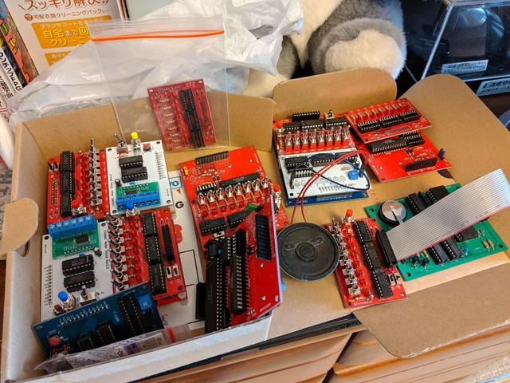

私が利用している[おおたFab](https://ot-fb.com/ "おおたFab")の皆様の勧めで、[Maker Faire Tokyo 2019](https://makezine.jp/event/mft2019/ "Maker Faire Tokyo 2019")に申し込んだところ出展可のご連絡をいただきました。

- [COSMAC研究会　トグルスイッチでCOSMACプログラミング](https://makezine.jp/event/makers-mft2019/m0098/ "COSMAC研究会　トグルスイッチでCOSMACプログラミング")

昨日投稿されたmakezineの告知記事中で私の基板がアイキャッチ画像としても使われていてこちらもびっくりです。

- [Maker Faire Tokyo 2019 ─ 出展者情報公開！](https://makezine.jp/blog/2019/07/maker-faire-tokyo-2019-makers.html "Maker Faire Tokyo 2019 ─ 出展者情報公開！")

これまで製作したCOSMAC CPUボードと各種シールド基板を持ち込んで、いろいろ動かしたいと準備中です。うまくいけばまだ未発表のシールド基板も展示できるかも。

実際にトグルスイッチでプログラミングも体験できるように、操作マニュアルも作成中です。トグルスイッチでプログラムを書き込む機会はそう無いと思いますので、ぜひ16進数のリストをみながら、トグルスイッチで入力してみてください。初心者向けのLチカから上級者向けのLCD表示まで体験できるように取り揃えます。

では、8月3日、4日は会場でお会いしましょう！

