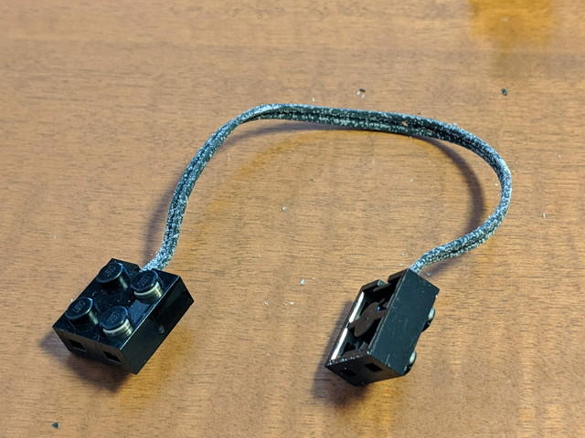
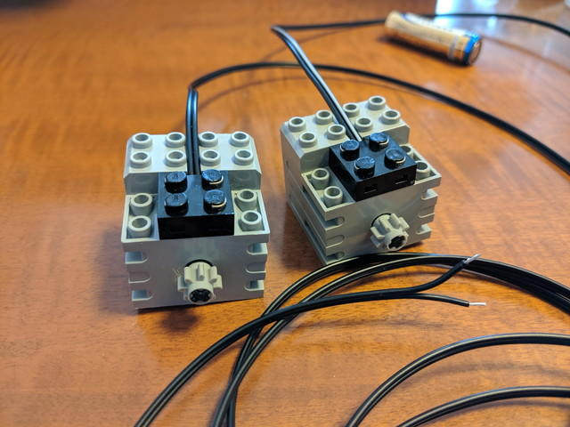

Maker Faire Tokyo 2019に向けて、ひさしぶりに[LEGO MINDSTORMS RCX](https://ja.wikipedia.org/wiki/MINDSTORMS#RCX "LEGO MINDSTORMS RCX")をひっぱりだしてみたところ、RCXの接続に使うケーブルが白くなっていました。

さわるとケーブルの被覆がボロボロ落ちてきます。これではショートして使えません。思い切ってケーブル終端のLEGOブロックを外して、ケーブルを交換してみました。

修復前のケーブルはこんな感じです。被覆が粉を吹いています。さわるとボロボロ崩れます。

ブロックの蓋を固定している爪を外すように、ブロックの隙間にソルダーアシストを差し込み、うまく爪を外してLEGOブロックを分解します。

うまくいくと2つの部品に分かれます。

ブロック内部をよく見ると、ケーブルの被覆を破って銅線に接触させるための爪のようなものがあります。

ケーブルを圧着することで、ブロックと接続しているようです。この部分を爪楊枝や綿棒で綺麗にします。ケーブルが固定される蓋の部分にも古いケーブルの被覆がくっついていますので、これも掃除して綺麗にします。

次に、ケーブルの一部を折り曲げて、蓋の穴に入れて固定します。

ブロックと蓋をもとのように取り付けて、ペンチで締め付けます。直接締め付けるとブロックにダメージを与える可能性があるので段ボールをあてて締め付けました。パチッという音で爪が引っかかればOKです。

圧着が終わったブロックです。見た目は問題なさそうです。

あとは、テスターを使って導通チェックです。問題なく接続できていました。

これで当分はLEGO MINDSTORMSは使えそうです。

