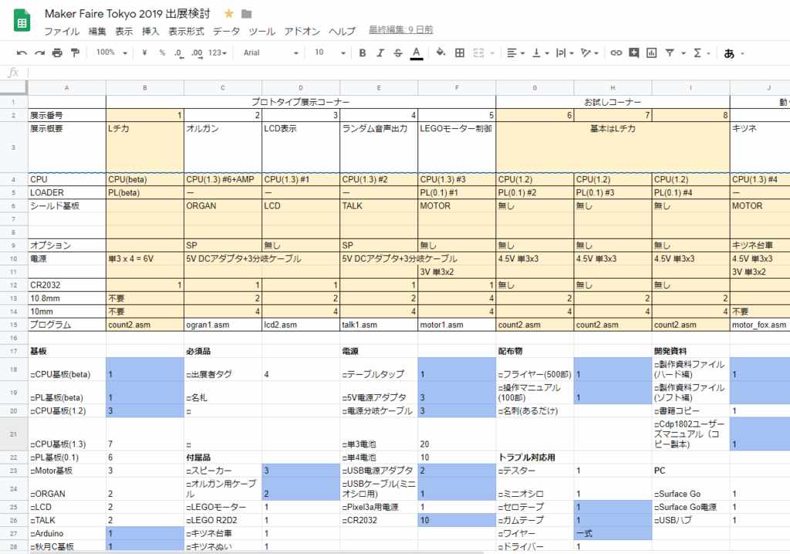
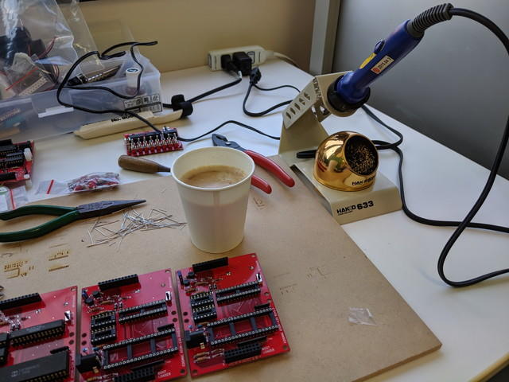
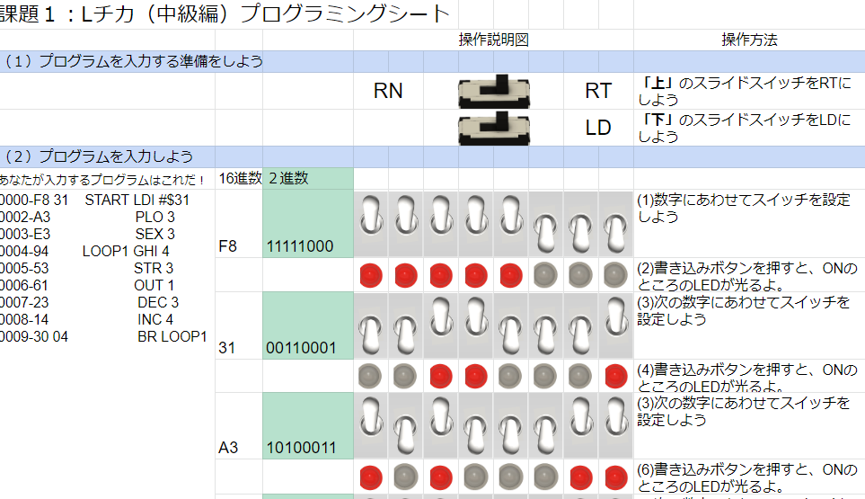
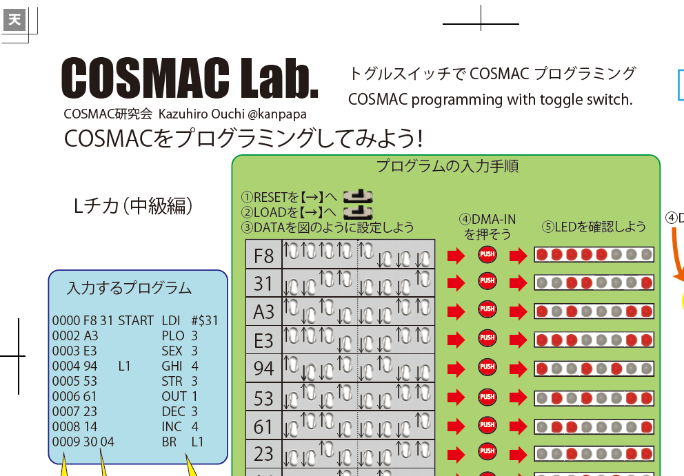
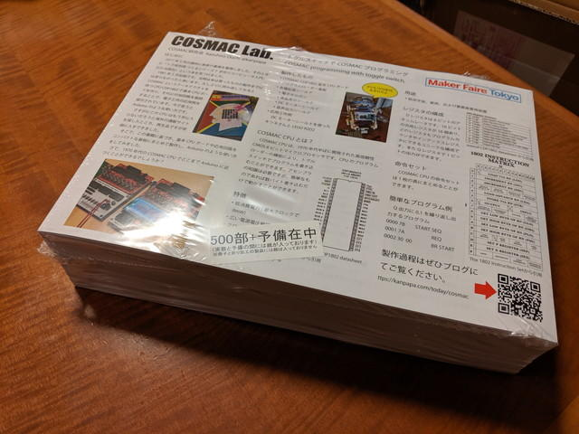
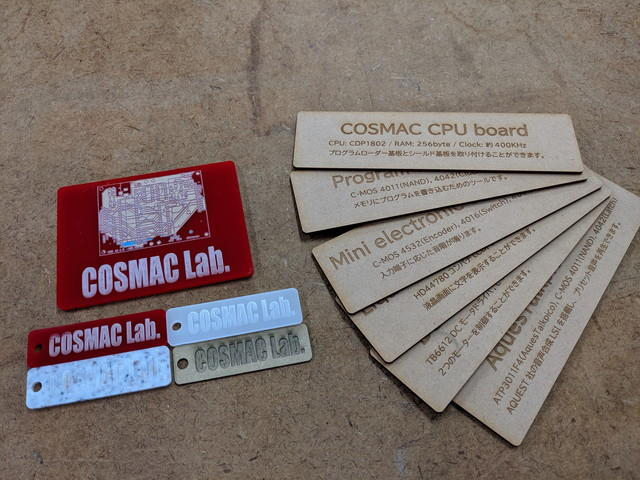
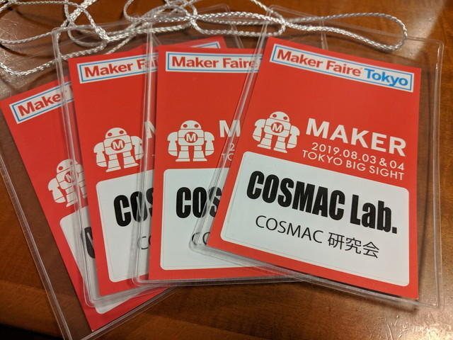
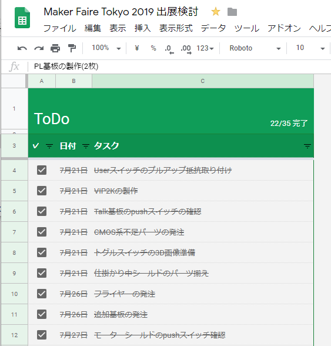

[COSMAC研究会](https://makezine.jp/event/makers-mft2019/m0098/ "COSMAC研究会")で[Maker Faire Tokyo 2019](https://makezine.jp/event/mft2019/ "Maker Faire Tokyo 2019")に出展しました。出展までの準備をまとめておきます。

## 出展申し込み

以下の内容で出展を申し込みました。機材とかは本番では大きく異なるのですが、まずはこれで。

#### 2-01. 作品名またはプロジェクトの名称

トグルスイッチでCOSMACプログラミング

#### 2-03. 出展内容の紹介文

1970年代に開発され、人工衛星の制御にも使われたCOSMACマイコンをご存知ですか？ 実家で見つけた1980年の雑誌に掲載されていたCOSMACマイコンに興味を持ち、パーツを集めてコンパクトな基板にまとめました。トグルスイッチでプログラムを書きこむことで、LEDの点滅、ミニ電子オルガン、液晶表示などが実験できます。ぜひ256バイトの広大なメモリ空間にあなたの手でプログラムを書き込んでみませんか？

#### 2-08. 会場への持ち込み作品・機材

⾼さ10cm×幅10cm 程度の基板\*4点、⾼さ20cm×幅10cm 程度の80年代のCPU基板\*1点、秋月5V電源アダプタ\*2個、単3電池×4本電池ボックス\*2個、ノートPC\*2台、iPad\*1台、ディスプレイ 19インチ\*1台、作品紹介 チラシ200部（予定） など

## 出展準備

### 作品の準備

出展決定の知らせを受けて、まずは展示する作品を決め、Googleスプレッドシート上でまとめていきました。

<!--more-->

このとき予定していた作品は以下の通りです。

#### プロトタイプ展示コーナー

・Lチカ  
・ミニ電子オルガン  
・LCD表示  
・ランダム音声出力  
・LEGOモーター制御

#### お試しコーナー

・Lチカ（少なくとも2台）

#### 動くモノコーナー

・キツネさん  
・R2D2

#### 予備機

・CPU基板＋ローダー基板  
・各種シールド

ざっと数えてCPUボードが10台は必要そうです。急いでCPU基板の追加発注を行い増産を行いました。

### フライヤーの準備

また説明のためのフライヤーも必要です。COSMACは日本ではあまりメジャーではないと思っているのでCOSMACとは何というところをまとめます。

来場者の方にはぜひトグルスイッチでのプログラミングを体験してほしく、そのための操作マニュアルも必要です。最初はGoogleスプレッドシートで作っていたのですが、体裁がいまいちです。

そこで、先日の[おおたFab](https://ot-fb.com/ "おおたFab")さんでのレーザーカッター講習で使い始めた[イラストレーター](https://www.adobe.com/jp/products/illustrator.html "イラストレーター")で作ってみることにしました。いろいろなノウハウがWebに載っているので初めてでもここまできれいにできました。

印刷部数に悩んだのですが、300部も500部も数百円しか変わらないので、思い切って500部にしました。ちなみに500部で6.5cm。4.6kgです。

操作マニュアルは開催直前に原稿が完成したこともあり、お試しをしてくれた方に配布しようと100部にしました。

### 説明パネルの作成

また、作品の説明パネルも必要です。ちょうどおおたFabさんでレーザーカッターの講習を受けたばかりなので、端材をつかってパネルも作ってみました。

### 出展者タグの作成

事務局からとどいたタグにフライヤーで使ったロゴを印刷して糊で貼り付けました。

### ToDoの作成

これらの準備はToDoを作って進めていきました。

[前日編](https://kanpapa.com/cosmac/blog/2019/08/cosmac-maker-faire-tokyo-2019-3.html "前日編")に続きます。
