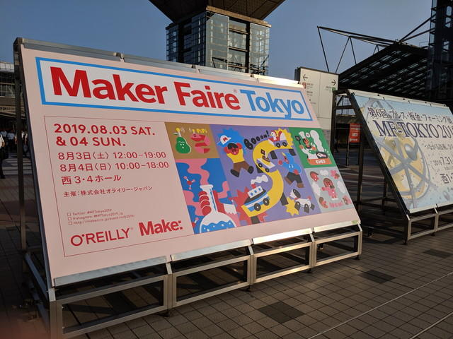
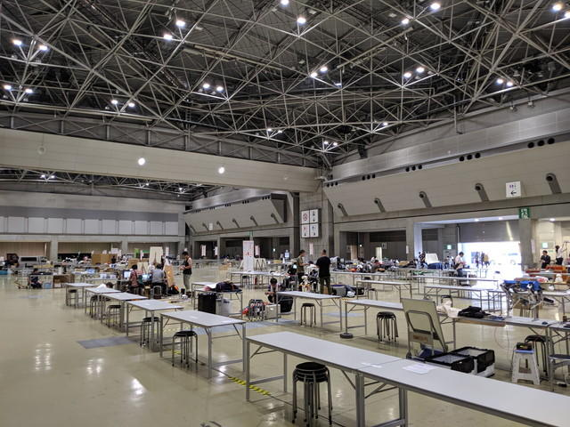
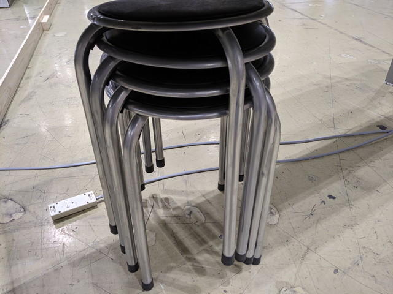
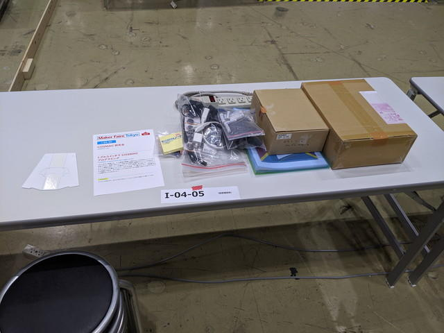

Maker Faire Tokyo 2019は前日の15:00から搬入ができましたので、重たいフライヤーを持って東京ビックサイトに行ってみました。

## 出展前日の搬入

荷造りはこんな感じ。ブースにかける布も忘れずに。

ビックサイトに到着です。Maker Faire Tokyo 2019の看板も出ていました。

搬入中の会場はこんな感じ。

COSMAC研究会のブースにはスタンド看板の材料が置いてありました。

電源も椅子もありました。

サクッと荷物を置いて。

布をかけて帰りました。

この日はこれでおしまいです。

いよいよ明日は[1日目](https://kanpapa.com/cosmac/blog/2019/08/cosmac-maker-faire-tokyo-2019-4.html "1日目")です。
