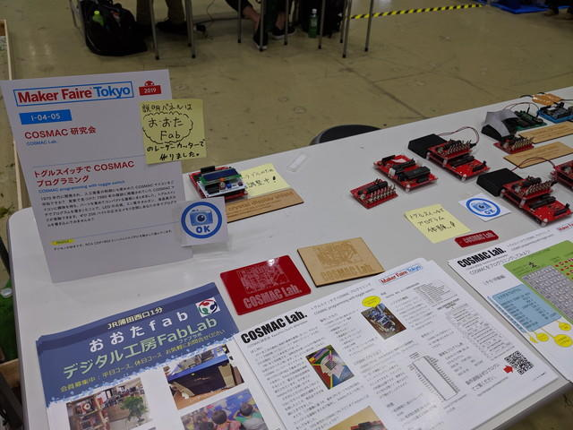
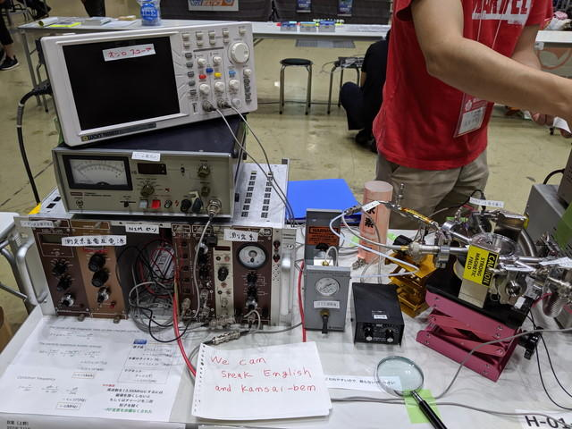
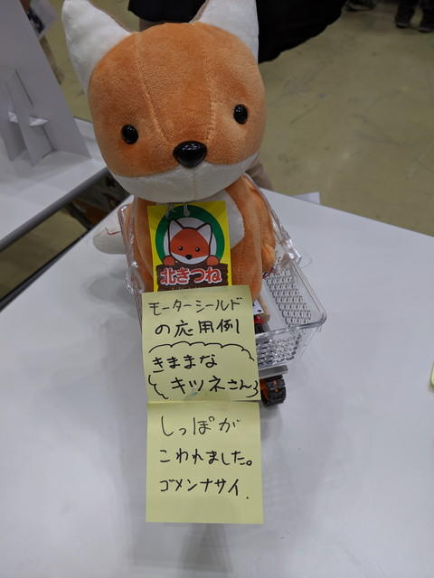
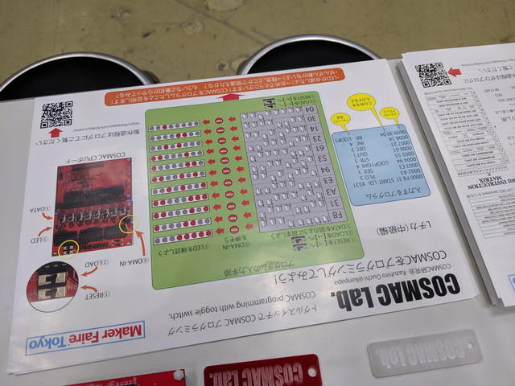
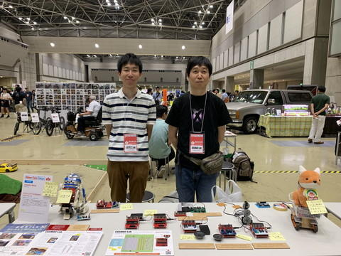

[COSMAC研究会](https://makezine.jp/event/makers-mft2019/m0098/ "COSMAC研究会")で[Maker Faire Tokyo 2019](https://makezine.jp/event/mft2019/ "Maker Faire Tokyo 2019")に出展しました。[1日目のレポート](https://kanpapa.com/cosmac/blog/2019/08/cosmac-maker-faire-tokyo-2019-4.html "1日目のレポート")に続いて、2日めの様子のまとめです。

### フライヤーの増刷

ビックサイトに向かう前に、操作マニュアルがもうすぐなくなるので、朝7時に川崎のKinko'sに行ってモノクロで100部印刷しました。これぐらいあれば足りるかなと。

あと、[おおたFab](https://ot-fb.com/ "おおたFab")さんからも追加のフライヤーを届けてもらいました。

これで大丈夫かなと思ったのですが・・・。

### ２日目の設営

１日目と同じレイアウトで設営しました。メモリはバッテリーバックアップしているから、電源を入れれば終わりと思ったのですが、いくつかのボードはうまく動かなかったため、再度プログラムを入れなおしました。おかげで30分ぐらい準備に時間がかかりました。

### 出展者向け内覧会

１日目は全く他の展示を見ることができなかったので、残りの30分で開場前の会場をぐるりと回りました。これだけはと思っていた[FlashAir同人誌6](https://flashair-developers.com/ja/documents/books/#sixth "FlashAir同人誌6")と秋月電子のお楽しみ袋を購入できました。

あとは1日目に私のブースに来ていただいた[自作加速器](https://makezine.jp/event/makers-mft2019/m0066/ "自作加速器")のかたのブースにお邪魔して詳しいお話を聞くことができました。

そうこうしているうちに開場の10時になり、自分のブースに戻りました。

### ２日目の反応

1日目に比べるとやや落ち着いている感じでしたが、COSMACマイコンをみて、「世界初のCMOSのマイコンですよね。」と言われたかたもいらっしゃいました。層の厚さを感じます。

小学生ぐらいの人がトグルスイッチでプログラムを入力しましたが、その入力の速いこと速いこと・・・。お話を聞くと[大人の科学の4ビットマイコン](http://otonanokagaku.net/magazine/vol24/index.html "大人の科学の4ビットマイコン")で遊んでから、16進数なども理解して、こういうマイコンに興味をもっているとのことで、将来が楽しみです。

ただ1日目よりはトグルスイッチでプログラミングを体験されるかたは少し減ったかもしれません。

この日もトラブルも発生し、キツネさんが転落して、クランク機構のプラスチックが破損、しっぼが動かなくなってしまいました。

フライヤーも順調に配布できて、操作マニュアルのカラー版は午前中に配布を終了しました。

このあとKinko'sで増刷したモノクロ版に切り替えたのですが、こちらもどんどんなくなっていき、結局２回ほど席をはずして、[ビックサイトのビジネスセンター](http://www.bigsight.jp/services/services/business_support/ "ビックサイトのビジネスセンター")で追加で100部ほど印刷しました。

質問もたくさんありました。内容は1日目とあまり変わりませんでしたが、販売はしないのかという質問が多かったように思います。

また、要望としてアドレス表示があるとよいのではとか、入力スイッチをどのような形にするのが良いのか、LEDは7セグメントにしてみてはなど、有識者からのご意見もいくつかいただき参考になりました。

### 出展を終えて

500部用意したフライヤーですが、実際は300部程度の配布になりました。操作マニュアルも100部に加え200部増刷してほぼ配りきった状況です。予想以上に反応は良かったように思います。

残念なのはモーター系の展示が２つともトラブってしまったこと。またどこかで動かせればと思います。

また、2日目はほぼ１人での対応だったので、なかなかスナップ写真が撮れませんでした。１人出展はなかなか大変です。

セットアップ時にバッテリーバックアップしているはずのメモリが消えていた件は、電池の電圧が低下していたためのようです。前日に電池電圧を確認すべきでした。

反省点はいろいろありますが、今回の出展を通してIllestratorやPhotoshopといった普段使わないツールを使いこんだり、オンラインでの印刷発注など初めての経験もできました。いろんなかたとも交流をすることができましたので、またこういう機会があれば出展してみたいと思います。

