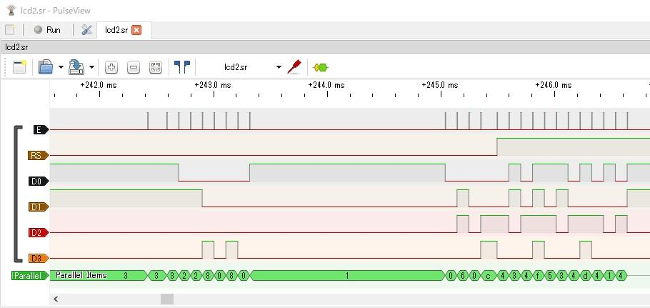
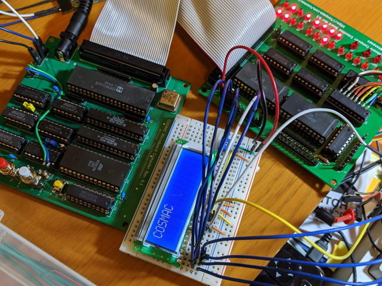

COSMAC MBC拡張ボードに実装されている入出力ポート[CDP1852](http://www.cosmacelf.com/publications/data-sheets/cdp1852.pdf "CDP1852")に[LCD](http://akizukidenshi.com/catalog/g/gP-02985/ "LCD")を接続してみました。

回路図は以下のようになります。

プログラムは[Toy ComputerのLCDシールドのプログラム](https://kanpapa.com/2019/05/rca-cdp1802-cosmac9-lcd.html "Toy ComputerのLCDシールドのプログラム")を参考にして作成しました。変更した点はOUT 5に変更した点とLCDのRS(Register Select)をDO7に接続することで、書き込むデータの最上位ビットをONにすることでRSをONにするようにしました。E信号はCDP1852で出力されるDATA READY信号(SR)をそのまま使用しています。

<!--more-->

プログラムリストは長くなりますので、GitHub.comに置きました。

- [lcd2\_1852.lst](https://github.com/kanpapa/cosmac/blob/master/ut4/lcd2_1852.lst "lcd2_1852.lst")

CDP1852から正しいデータが出力されているかの確認は[格安ロジアナ](https://www.amazon.co.jp/gp/product/B01N0KMLHX/ "格安ロジアナ")で行いました。

タイミングを確認したところ、LCDのレジスタ書き込み時に少々WAITが必要だったのでNOPで調整し、プログラムを実行したところLCDに文字が表示できました。

Toy Computerとは違ってUT4モニタで長いプログラムも容易に書き込めるので開発は非常に楽になりました。
