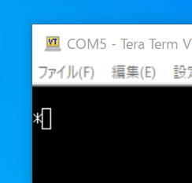

新たなプロジェクトである[COSMAC MicroBoard Computer](https://kanpapa.com/cosmac/blog/2019/09/cosmac-mbc-1.html "COSMAC MicroBoard Computer")のプリント基板が届きました。

早速実装しました。EEPROMに[UT4](http://www.retrotechnology.com/memship/UT4_rom.html "UT4")モニタを書き込んだものを載せています。

UT4モニタはソフトウェアでシリアル通信を行い、ターミナルを接続できます。今回はUSB-シリアル変換でPCに接続しました。

UT4のマニュアルによると、最初にCRを入力すると＊のプロンプトが表示され、UT4のコマンドが入力できるとのことでした。試作なので一発では動かないと思ったのですが・・・

300bpsでCRを入力したところ、プロンプトが表示されました。でもこの先コマンドを入力しても反応がありません。UT4自体は動いているようですが、何か問題があるようです。

これからトラブルシューティングを始めますのでお楽しみに。
