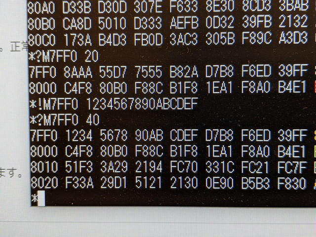

COSMAC MBC CPUボード Rev. 0.2の製作を行いました。完成品は写真のようになりました。


早速電源を投入したのですが、UT4モニタが動いていないように見えます。

<!--more-->

拡張基板を取り付けてLEDで各信号を見てみましたが、今動いているものと光り方が違います。Rev0.1と比べて回路的にはメモリ、ROMとも32KByteに拡張したという違いはありますが、REGISTER STORAGEに書けなくてもUT4は動くことも確認していますし、原因がよくわからないので、まずはテストプログラムをROMに書き込んで動かしてみました。

```
0000- 1             *
0000- 2             * Oscillator program 1 for COSMAC
0000- 3             * SB-Assembler
0000- 4             *
0000- 5             .CR 1802    ;To load the 1802 cross overlay
8000- 6             .OR $8000
8000- 7             .TF osc1rom.hex,HEX
8000- 8       *
0000- 9       R0    .EQ 0
8000- 10       *
8000-C4     11  ( 2) START NOP
8001-F8 80  12  ( 2)       LDI $80
8003-B0     13  ( 2)       PHI R0    ;R0.1 <- $80
8004-7B     14  ( 2) LOOP1 SEQ       ;Q <- 1
8005-7A     15  ( 2)       REQ       ;Q <- 0
8006-30 04  16  ( 2)       BR LOOP1  ;Branch to LOOP1
8008- 17
8008- 18 .EN
```

RUN-Uのボタンを押すとROMが0000番地に配置されるので、プログラムカウンタのR0の上位バイトにROMの上位アドレスの$80を入れることで、ROMで実行するようにプログラムカウンタを変更します。あとはQ出力のHigh/Lowの繰り返しなので、Q出力の信号を確認すれば動作確認ができます。

Rev0.1基板では想定した動きをしましたが、Rev0.2基板では全く動きません。もしかと思って、Rev0.2基板のCPUをRev0.1基板に移して動かしたところ、Rev0.1基板でも動かなくなりました。原因はRev0.2基板に実装したCPUの不良だったのです。これに気付くのにかなりの時間をかけてしまいました。再生品のCPUではまれにこのようなことがあるようです。

CPUを交換して問題なくUT4が起動し、32Kbyteのメモリも正常に読み書きできました。



ここまで動作を確認したところで、拡張基板と合体させました。今回のCPU基板で操作スイッチを横向きに実装できるようにしたのは、このように二段重ねにしたかったためです。これまでのように縦型のスイッチも実装できますので、ここはお好みで。

これでRCA社の評価ボード CDP18S020相当のものが動くことになります。


ソフトウェアについてはUT4しか載せておらず、ROMもほとんど空いていますので、様々なプログラムを組み込んで遊べると思います。UT4は手を入れてメモリフィルとかメモリブロック転送とか拡張すると良いでしょう。

これでCOSMAC Microboard Computerのハード製作はいったん区切りをつけます。まだ改善したいところも残っているのですが、これから年末まではちと忙しく。今回作成したガーバーデータは[COSMAC MBCのページ](https://kanpapa.com/tag/cosmac-mbc "COSMAC MBCのページ")に掲載しておきました。
