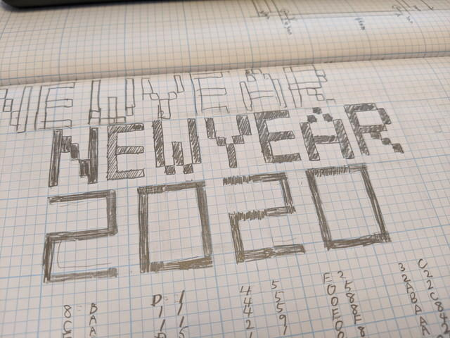
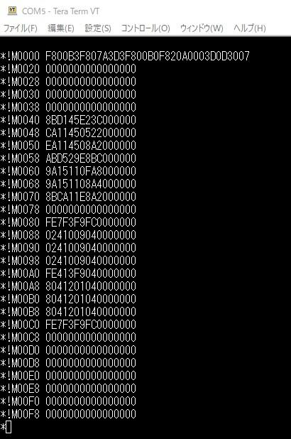

あけましておめでとうございます。

去年は[クソマゾLEDマトリックス バッヂで書き初め](https://kanpapa.com/2019/01/led16p-newyear2019.html "クソマゾLEDマトリックス バッヂで2019年の書き初めをしてみた")をしましたが、今年はCOSMAC CPUボードと実験中のTVディスプレイ回路で書き初めをしてみました。

今回の実験風景です。足元には普通のテレビを置いて、TVディスプレイ回路から出力されるコンポジット信号をテレビのビデオ入力端子に接続しています。

 <!--more-->

実験回路の詳細については[COSMAC研究会のページ](https://kanpapa.com/cosmac/blog/2019/12/cosmac-tv1.html "COSMACでTVディスプレイの実験をしてみた")でご覧ください。

まずは書きぞめのデータの作成です。愛用のMAKER'S NOTEBOOKの方眼を使ってデザインしていきます。この方眼は８マス単位で区切られているのでこの手の用途には使いやすいです。

作成したデザインはこんな感じです。これを見ながら表示用のバイナリデータを作成しました。

この表示データと表示プログラムをCOSMAC CPUボードのUT4モニタを使って表示メモリに書き込みます。

プログラムとデータの書き込みが完了したあとにTVディスプレイ回路からのDMA OUTの信号を、COSMAC CPUボードに接続しリセットをして表示プログラムを実行すると、

今年の書き初めの完成です。

本年もよろしくお願いします。
