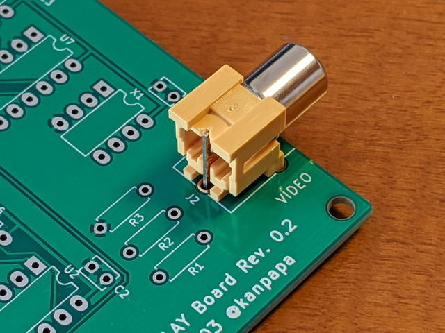

先日[発注したCOSMAC MBC用 TVディスプレイボード Rev. 0.2](https://kanpapa.com/cosmac/blog/2020/01/cosmac-tv-pcb-order.html "COSMAC TVディスプレイボードを発注しました")のプリント基板が到着しました。

<!--more-->

今回は[Seeed FUSION PCB](https://www.fusionpcb.jp/prototype-pcb-sale.html "Seeed FUSION PCB")さんの12.9$基板試作サービスを利用しましたが、土曜日に発注して翌週の木曜日に手元に到着というスピードで驚きました。また、実験的に空いているエリアをユニバーサル基板にしてみましたが、思ったようにできあがりました。

秋月の[基板用RCAコネクタ](http://akizukidenshi.com/catalog/g/gC-06508/ "基板用ＲＣＡジャック（黄）")の取り付けもバッチリです。（@kuninetさん、ありがとうございます。）

明日[パーツを実装して動作確認](https://kanpapa.com/cosmac/blog/2020/01/cosmac-mbc-tv-rev02-finished.html "COSMAC MBC用 TVディスプレイボード Rev. 0.2が完成しました。")をしてみようと思います。
