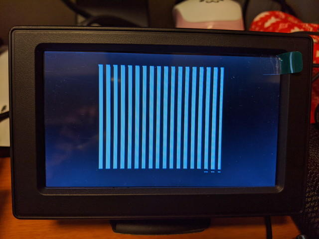
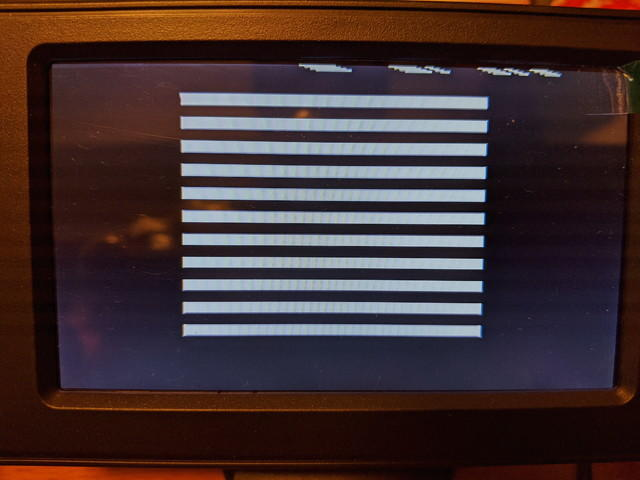
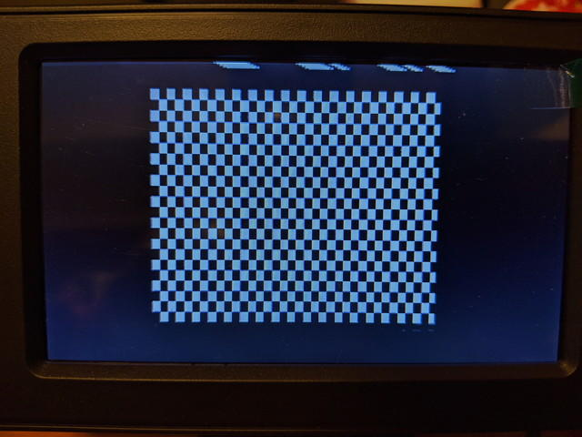

[製作したCOSMAC TVディスプレイボード](https://kanpapa.com/cosmac/blog/2020/01/cosmac-mbc-tv-rev02-finished.html "COSMAC MBC用 TVディスプレイボード Rev. 0.2が完成しました。")で書籍に掲載されているサンプルプログラムを使っていろんなパターンを表示してみました。プログラムとUT4モニタで流し込めるバイナリデータはGithubに置きました。

### パターン１：あらかじめ作成した表示用データをそのまま表示

- [プログラムリスト](https://github.com/kanpapa/cosmac/blob/master/tv2.lst "tv2.lst")
- [バイナリデータ](https://github.com/kanpapa/cosmac/blob/master/tvdata/tv2_cosmac_3x.hex "tv2_cosmac_3x.hex")

<!--more-->

### パターン２：縦線表示

- [プログラムリスト](https://github.com/kanpapa/cosmac/blob/master/tv3.lst "tv3.lst")
- [バイナリデータ](https://github.com/kanpapa/cosmac/blob/master/tvdata/tv3_vertical_line.hex "tv3_vertical_line.hex")

### パターン３：横線表示

- [プログラムリスト](https://github.com/kanpapa/cosmac/blob/master/tv4.lst "tv4.lst")
- [バイナリデータ](https://github.com/kanpapa/cosmac/blob/master/tvdata/tv4_horizontal_line.hex "tv4_horizontal_line.hex")

### パターン４：格子模様を表示

- [プログラムリスト](https://github.com/kanpapa/cosmac/blob/master/tv4_checkered.lst "tv4_checkered.lst")
- [バイナリデータ](https://github.com/kanpapa/cosmac/blob/master/tvdata/tv4_checkered.hex "tv4_checkered.hex")

### パターン５：カウントアップしているカウンタをデータとして表示

- [プログラムリスト](https://github.com/kanpapa/cosmac/blob/master/tv5.lst "tv5.lst")
- [バイナリデータ](https://github.com/kanpapa/cosmac/blob/master/tvdata/tv5_counter.hex "tv5_counter.hex")

カウンタの値は変わっていくので実際は画面が変化し続けます。

もっと手軽に表示できるようにCHIP-8などのインタプリタを移植してみようかなと思います。
