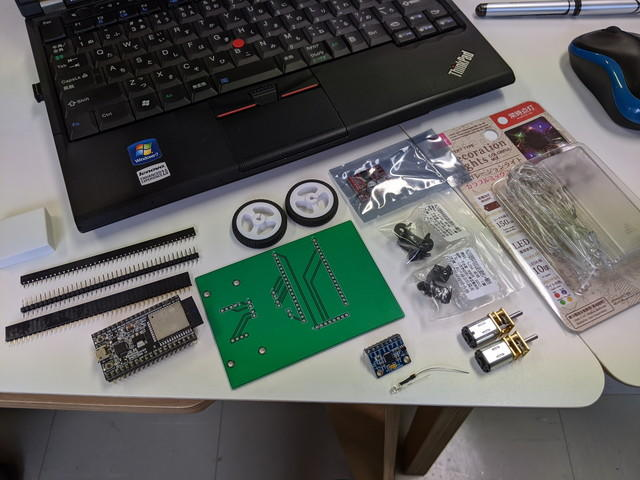

[おおたFab](https://ot-fb.com/ "おおたFab")さんでバランスカーの製作セミナーがありましたので参加してみました。

組み立て前のパーツはこんな感じです。

ESP32の開発ボードを中心として、MPU-6050 3軸ジャイロ加速度センサー、モータードライバ、ギヤ付きの小型モータ、車輪、ベースとなる基板、電池ボックスといったシンプルなものです。

組み立てるとこのようになります。

動かすにはプログラムで重心など調整が必要ですが、少しいじって動かしてみました。

https://youtu.be/7oUTjPUwlfk

なんとかバランスを保とうとはしているようですが、もう少し調整を行ってみます。
