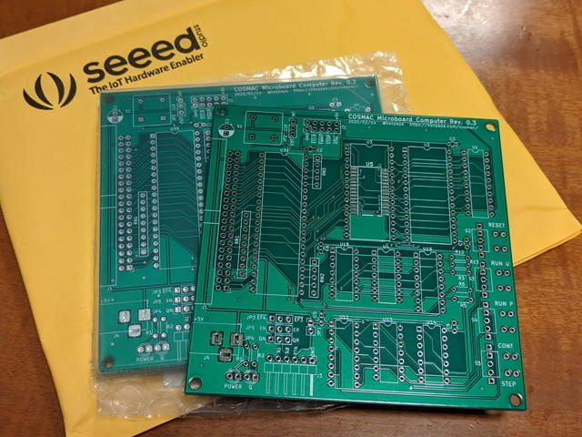
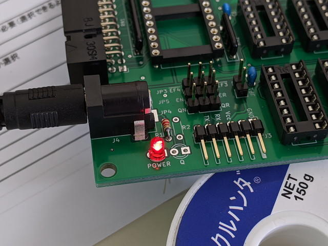
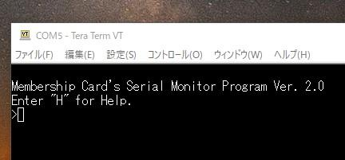

COSMAC MBC CPUボードRev. 0.3の基板が[Seeed Fusion PCB](https://www.fusionpcb.jp/ "Seeed Fusion PCB")さんから到着しました。いつもより少し時間はかかりましたがPCBの製造が再開してよかったです。

CPU基板を製作する前に、まずは今回使用するモニタプログラムをEEPROMに書き込みました。

今回の基板では@yanatokuさんから動作報告をいただいた、[The 1802 Membership Card](http://www.sunrise-ev.com/1802.htm "The 1802 Membership Card")のモニタプログラム MCSMP20.binを使ってみることにします。

- [The 1802 Membership Card](http://www.sunrise-ev.com/1802.htm "The 1802 Membership Card")

Rev.0.2との違いはシリアル入力をEF4とEF3から選べるようにしたことで、Membership Cardのモニタも使えるようになっています。さらにテスターの意見から、電源LEDとQ出力のLEDをつけました。Q出力にLEDをつけたことで、このCPUボードだけでLチカができますし、シリアル通信の様子もわかります。このLEDの明るさの調整のため抵抗を仮付けして確認しましたが、想定していた1KΩではやや眩しかったので2.2KΩにしたところ、目に優しくなりました。この値ではんだ付けを行いました。

完成したCPUボード Rev.0.3です。

シリアルポートにUSBシリアル変換ボードを取り付けてPCに接続し、Teratermで1200bps/8bit/noneで、Enterキーをたたいたところ、

無事モニタプロンプトが表示されました。"H"を入力すると、長いHelpメッセージが表示されました。

Membership Cardのモニタは転送機能や逆アセンブラ、BASICまで実装されている高機能モニタでした。通信速度も1200bpsもでますし、これまで使ってきた[UT4](http://www.retrotechnology.com/memship/UT4_rom.html "UT4")と比べてはるかに強力なものになっているので、各機能を試してみようと思います。

(追記) [ガーバーデータを掲載](https://kanpapa.com/tag/cosmac-mbc "https://kanpapa.com/today/tag/cosmac-mbc")しました。
