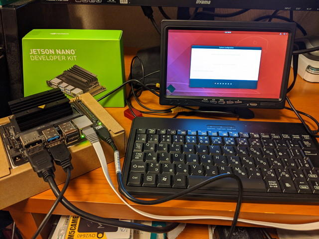
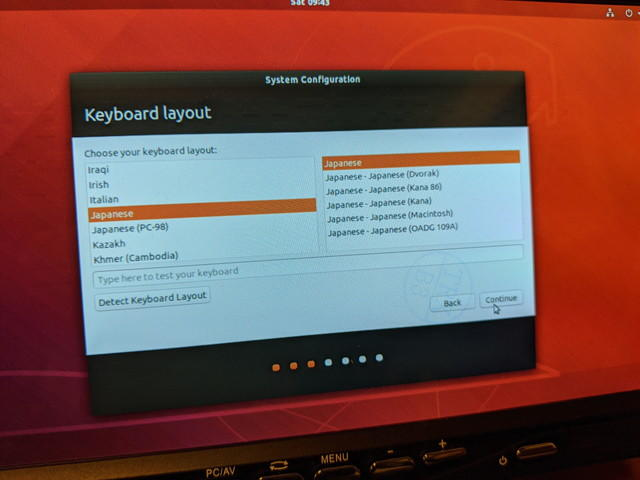

最近[NVIDIA Jetson Nano Developer Kit](https://developer.nvidia.com/embedded/jetson-nano-developer-kit "NVIDIA Jetson Nano Developper Kit")がアップデートされたようなので、試しに購入してみました。128Core Maxwell GPUを搭載しているAIのトレーニング用のプラットフォームです。GPIOとかカメラも接続できるので、AIをつかったモノが作りやすそうです。

まずは、microSDカードにNVIDIAから提供されている[NVIDIA JetPack SDK](https://developer.nvidia.com/embedded/jetpack#install "NVIDIA JetPack SDK")のJetson Nano用のイメージを書き込みます。このあたりは、[Getting Started With Jetson Nano Developer Kit](https://developer.nvidia.com/embedded/learn/get-started-jetson-nano-devkit "Getting Started With Jetson Nano Developer Kit")に書いてある通りに進めました。

セットアップのためにディスプレイ、キーボード、マウス、イメージを書き込んだmicroSDカードが必要です。有線LANもサポートしています。私のところではHDMI対応のミニディスプレイとミニキーボード、無線マウスを接続しコンパクトな環境にしました。

OSのセットアップはubuntuと同じようにすすめます。キーボードも日本語キーボードが設定できます。

セットアップが終わるとデスクトップ画面が表示されました。

ターミナルを立ち上げて、割り振られたIPアドレスに対して他のPCからsshで接続することもできました。Jetson Nanoに接続しているミニキーボードだとやや操作しにくいので、PCからログインして使うのもよいと思います。

この後はSDKに含まれているサンプルプログラムを動かしてみようと思います。
