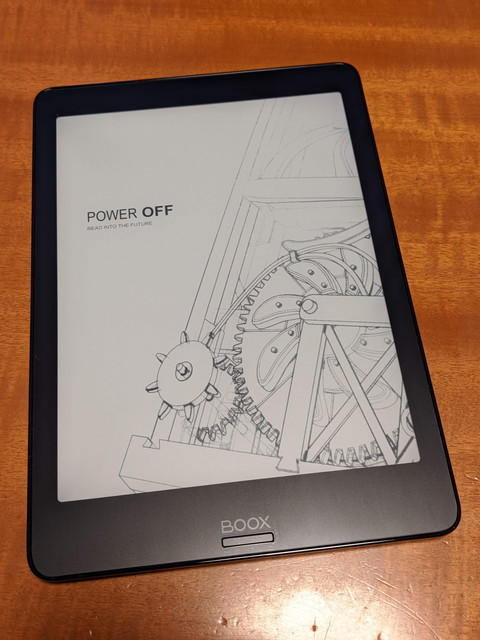
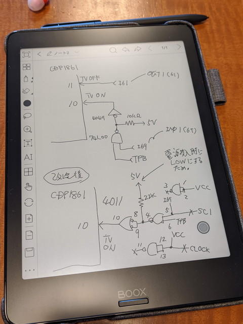

@ina\_aniさんのブログで興味あるガジェットが紹介されていました。

- [電子ペーパー手書きタブレット BOOX Nova Pro のススメ - inajob's blog](https://inajob.hatenablog.jp/entry/boox-nova-pro "電子ペーパー手書きタブレット BOOX Nova Pro のススメ - inajob's blog ")

電子ペーパータブレットはkindleとかkoboとかで見かけてはいましたが、iPadを持っているので特に魅力は感じていませんでした。しかし、この記事をみたところ、Wacomのペンが使え、かなり細かい書き込みができるようで、とても便利に見えました。

この記事にもあるように電子工作を行っているかたはちょっとしたメモが溜まるのではないかと思います。私の場合は小さい付箋紙を使っていましたが、いつのまにかこんなにたまってよくわからない状態です。

 <!--more-->

というわけで、自分への誕生日プレゼントということで[BOOX Nova Pro](https://www.boox.com/ja/boox-nova-pro/ "BOOX Nova Pro")を思い切って購入です。

これが電源オフの状態です。非常に綺麗です。

この機種は最初にファームウェアのアップデートとやや複雑な初期設定が必要です。

私の場合は、ここではまってしまい自宅のWiFiにうまくつながらないのです。でも、スマホのテザリングでは問題なくつながります。そのためWiFiのセキュリティ設定を少し変えてみたところ、つながるようになりました。ここは第一のハードルかもしれません。

アップデートも完了したところで、さっそくたまっているメモを書き写したり、新しいメモを作ってみました。

なかなか使えそうな感じです。Android端末としてみるとややもっさりした感はありますが、メモ書きとしては全く問題なく使えます。カバーを開けるとすぐ使える状態になりますし、電池の持ちもよく手元においておきたいガジェットです。

@ina\_aniさんご紹介ありがとうございました。
