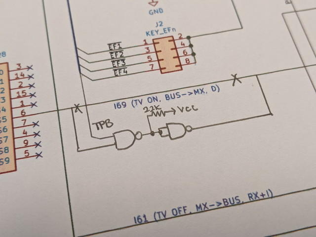
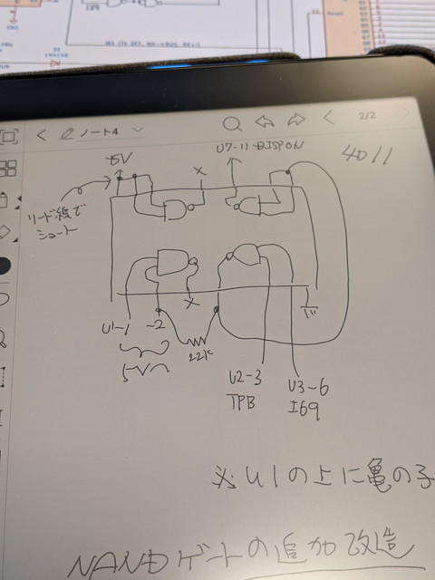
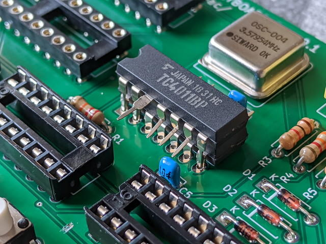

先日発注した[COSMAC STG1861 DISPLAY/HEX KEYBOARD Rev.0.1](https://kanpapa.com/cosmac/blog/2020/04/cosmac-mbc-stg1861-keyboard-rev01.html "COSMAC MBC STG1861 DISPLAY/HEX KEYBOARD Rev.0.1の基板を発注しました")のプリント基板が到着しました。国際輸送に時間がかかってしまい、いつもよりは一週間以上遅かったのですが、無事到着しました。

<!--more-->

早速製作しようと思ったのですが、すでにゲートの実装漏れが分かっていたので、いきなり回路図の修正とパターンカットが必要になりました。

このゲートICの追加実装ですが、基板には空きスペースはありませんので、ICを二段重ねにして実装することにしました。先日購入した[BOOX Nova Pro](https://kanpapa.com/2020/04/boox-nova-pro-memopad.html "BOOX Nova Pro 電子ペーパータブレットで思いっきりメモ書きをしてみた")で配線を考えます。

実際の実装ですが、電源を確保するためにピン数が同じ74HC74の上に載せました。

あとは、空中配線で邪魔にならないような形でゲートICに接続します。

これでゲートの追加ができました。これで問題ないでしょう。

完成したSTG1861+HEX KEYBOARD基板は以下のようになりました。

早速バス基板にとりつけて動作確認です。

COSMAC VIP OSが無事動作しました。

残念ながらこの基板は修正が必要ですが、しばらくはこの基板でいろいろ試してみようと思います。
