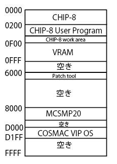
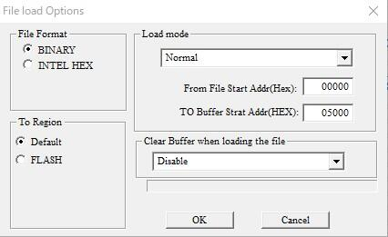
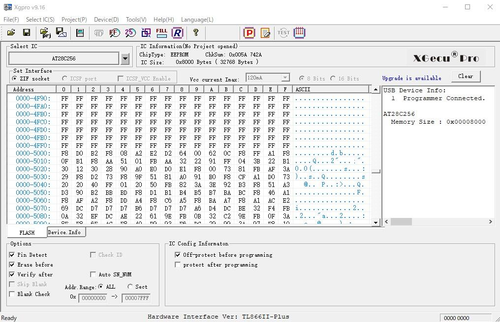
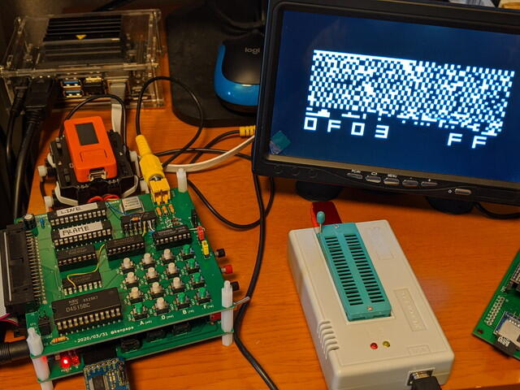

[CHIP-8インタプリタを動かす](https://kanpapa.com/cosmac/blog/2020/04/cosmac-vip-chip-8-startup.html "COSMACでCHIP-8インタプリタを動かしてみました")際にはあらかじめCOSMAC VIP OSをRAMにロードしなければなりませんが、それだと不便なのでモニタROMの空きエリアで動かすようにしてみました。

## 書き込み先ROMアドレスの検討

現在使用しているモニタプログラムのMCSMP20.binは$8000-$C99Aまで使用しているので、その先の空きエリア$D000-$D1FFにVIP OSを書き込むことにします。メモリマップは以下のようになります。

## VIP OSをROMに書き込み

RAMエリアで動かしたときと同様にこのアドレスで動くようにVIP OSのバイナリにパッチを当てます。

- $7001 $80 → $D0 (モニタの上位アドレスを設定）

- $7022 $36 → $30 ("C"キーをチェックせずにモニタにJUMP)

- $7056 $81 → $D1 (モニタの上位アドレスを設定)

- $719F $3E → $3F (キーボード入力をEF3 から EF4に変更)

- $71AA $36 → $37 (キーボード入力をEF3 から EF4に変更）

ROMライターで、あらかじめMCSMP20.binを書き込みバッファに読み込んだあとに、パッチをあてたVIP OSを書き込みバッファに読み込みます。オフセットは$5000になりますので、こんな感じの設定でしょうか。

指定したバッファアドレス($5000-)に読み込めているようです。

この状態でEEPROMに書き込みます。

## COSMAC CPU実機での動作確認

CPUボードのROMと差し替えます。

モニタでROMの状態を確認します。

$D000-$D1FFにVIP OSのバイナリが見えるので問題なさそうです。起動用のBR命令を$0000に書き込み、RESET後にRUN Pを押すと。

VIP OSが無事動きました。これで毎回VIP OSをロードする必要はなくなりました。

あとは、このROMに配置されたVIP OS用にCHIP-8にパッチを当てることにします。
