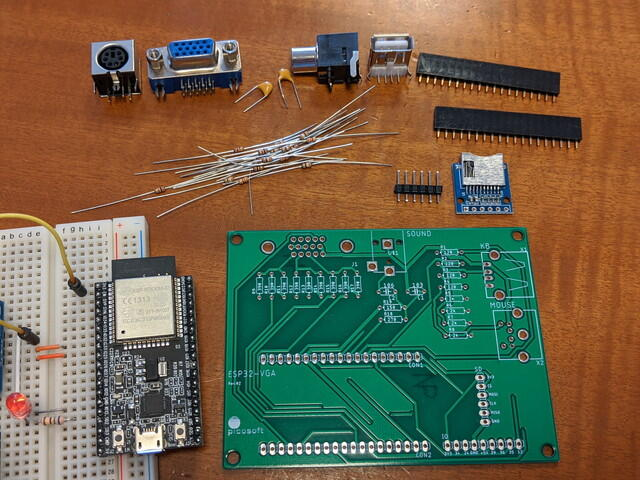
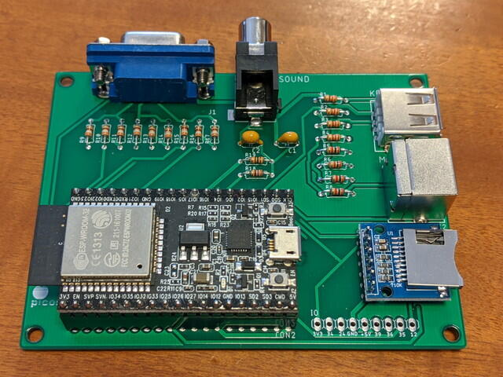
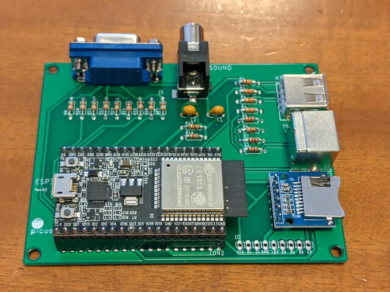

[オレンジピコショップ](https://store.shopping.yahoo.co.jp/orangepicoshop/ "オレンジピコショップ")さんから新発売の[小さなIoTパソコン ORANGE-ESPer](http://www.picosoft.co.jp/ESP32/index.html "小さなIoTパソコン ORANGE-ESPer")を組み立てました。

ESP32-DevKitC付のキットは売り切れのようですが、私は手持ちのESP32-DevKitCがありましたので、CPUなし版を買いました。

到着したキットの内容です。

非常にシンプルだなという感想を持ちました。これでVGA出力、キーボード、マウス、SDカード、Soundが使えるESP32はすごいなと思います。

<!--more-->

早速組み立てです。久しぶりにキットを作りましたが、パーツがすべてそろっているので楽ですね。

あっという間に完成です。

さて、ESP32-DevKitCにUSBケーブルを接続して・・・あれ、ケーブルが接続できないなと思ったらESP32-DevKitCの向きが逆でした。危ない危ない。

ESP32-DevKitCを正しい向きに取り付けて、こちらが正しい実装写真です。

VGAモニタに接続し、Arduino IDEからサンプルプログラムを書き込んだところ

問題なくゲームのスタート画面が表示されました。

もう少しいじろうかとおもったのですが、PS/2キーボード・マウスが行方不明です。この連休で探しておくことにします。

今後提供予定の[ORANGE OS](https://kanpapa.com/2020/05/orange-os-startup.html "BASICでtelnetが書けるというORANGE-OSを動かしました")が楽しみです。

P.S. キットに組み立て説明書がついていたのに後で気がつきました。結局それを見ないで組み立ててしまいましたが。
